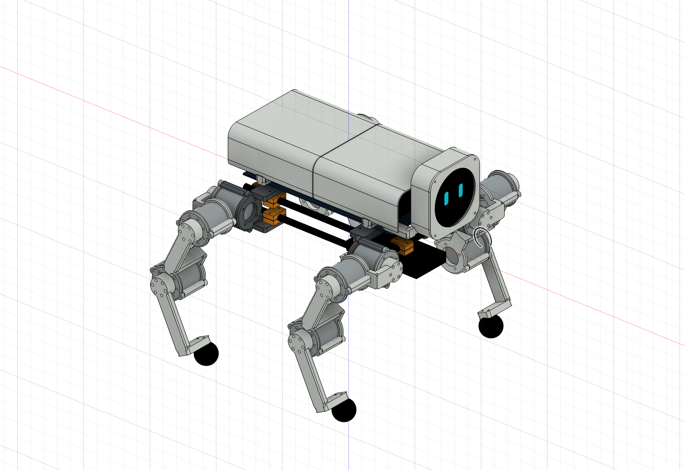
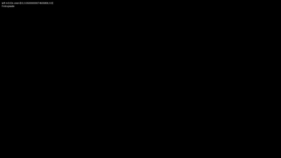
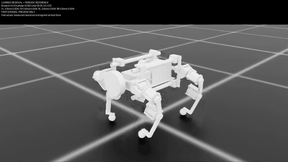
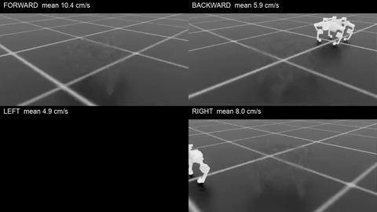
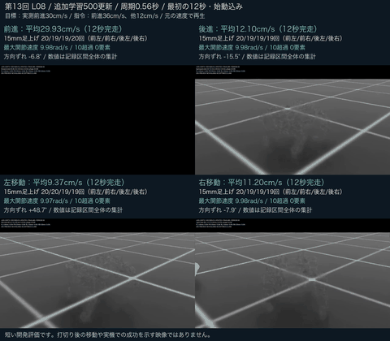
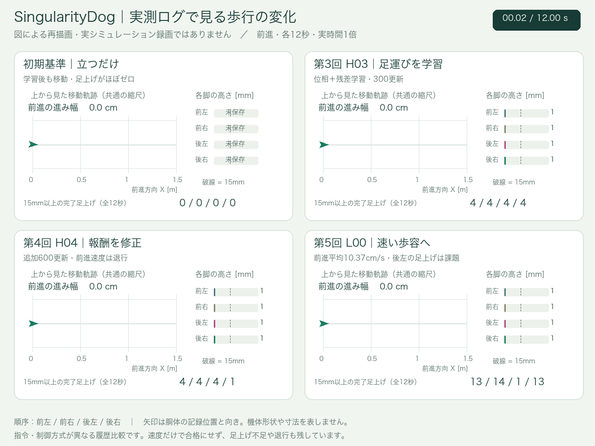

# SingularityDog

**確認できた直近の改善系列は15回です。** 初期立位基準を除くH01〜H04とL00〜L10を数えています。診断・失敗も含み、成功が15回という意味ではありません。全開発の通算回数は未確定です。

DIY四足ロボットの設計・強化学習で得た、独自のノウハウと検証ツールを公開しています。**第15回・L10**は左右旋回を追加して**500更新**を実施。前進は**32.16cm/s（変位/12秒）**、後進・左移動の向き保持と右移動速度が改善しました。**開発基準をすべて満たしたのは前進・後進・右移動の3/6ケース**です。左移動は8.36cm/sで未達。左旋回0.155rad/s、左右旋回の位置ずれ28.3/19.2cm、前進の前左足滑り14.0cmが残ります。

[第15回の結果・課題・次の判断](docs/l10-evaluation.md) · [6方向の結果動画](docs/media/l10-six-directions.mp4) · [同じ初期化のL09比較動画](docs/media/l10-matched-l09-four-directions.mp4) · [第14回の履歴](docs/l09-evaluation.md)

## 映像でたどる開発履歴

個別に公開を指定された**CAD画像1点と、実際のシミュレータ録画・比較動画15本**を掲載しています。元のMP4は全フレーム・50fpsのまま保存。下のGIFは全区間を等速で表示する縮小プレビューです。段階ごとに形状・物理設定・指令・制御方式が異なる履歴で、同条件の性能比較ではありません。

<details>
<summary>CADで検討した外観を見る</summary>



[type00：元のCAD画像](docs/media/cad-type00.png)。設計イメージです。最新の学習モデル・完成した実機を示す画像ではありません。

</details>

| 段階 | 実際の録画・全区間プレビュー | 結果と残った課題 |
|---|---|---|
| 旧形状・方向応答の試行<br>保存番号2197<br>直近15回より前 | <br>[元MP4・5.98秒](docs/media/archive-joystick2197-left.mp4) | 外装付きモデルで左移動を試行。当時の別評価では速度・姿勢条件を満たしたが、後の足別診断では15mm以上の完了足上げは全脚0回。すり足が課題。 |
| 形状・接触表現を更新<br>保存番号250<br>直近15回より前 | <br>[元MP4・11.98秒](docs/media/archive-dev250-left.mp4) | 左へ5cm/sの指令。別の4環境評価では平均約0.16cm/s、全脚の完了足上げ0回。姿勢は保てても移動は未達。 |
| B0・初期の立位基準<br>回数外 | <br>[元MP4・12秒](docs/media/baseline-left.mp4) | 左移動を指示してもほぼ立位に留まる。全脚の完了足上げ0回。ここから荷重移動・参照歩容を検討。 |
| 第4回 H04<br>追加学習後の前進 | <br>[元MP4・12秒](docs/media/h04-forward.mp4) | 足は動くが、前進速度は前段階から退行。世界X速度平均約0.85cm/s、15mm足上げ4 / 4 / 4 / 1回。 |
| **第5回 L00**<br>速い対角歩容・4方向 | <br>[元MP4・12秒](docs/media/l00-four-directions.mp4) | **前10.37・後5.90・左4.89・右7.98cm/s**。前進は改善したが、後脚の足上げ不足・滑り・偏向が残る。 |
| **第10回 L05**<br>修正モデル・500更新・4方向 | <br>[元MP4・12秒](docs/media/l05-four-directions.mp4) | **前16.54・後6.23・左8.05・右6.54cm/s**（変位/12秒）。20cm/s未達。後左脚不足、後進の滑り、右の約50度の偏向が残る。 |
| **第11回 L06**<br>足上げ・接地報酬を強化 | <br>[元MP4・12秒](docs/media/l06-four-directions.mp4) | **前16.99・後6.65・左7.06・右9.08cm/s**。前進は微増、左は低下。前進の後左15mm足上げ0回、後退の後脚は両方0回。20cm/s・歩行品質は未達。 |
| **第12回 L07**<br>制御の再設計・15ケース<br>追加学習0更新 | <br>[元MP4・12秒](docs/media/l07-wide20-four-directions.mp4) | 足幅20mmで**前18.64・後10.66・左9.69・右9.43cm/s**。4方向で各脚13〜14回の15mm足上げ。ただし後退・左の速度超過により共通制御として不採用。足幅追加なしの補正案を比較基準に保持。 |
| **第13回 L08**<br>周期短縮・追加学習500更新 | <br>[元MP4・12秒](docs/media/l08-four-directions.mp4)<br>[学習前後の前進比較](docs/media/l08-forward-progress.mp4) | **前29.93・後12.10・左9.37・右11.20cm/s**。各方向の各脚19〜20回の15mm足上げ。30cm/s未達、左の方向ずれ48.74°が課題。同条件の前進は27.48→29.93cm/s。 |
| **第14回 L09**<br>方向保持・滑りの報酬を変更、500更新 | <br>[元MP4・12秒](docs/media/l09-four-directions.mp4) | **前31.87・後10.59・左7.63・右9.23cm/s**。前進は短区間の全基準達成。後進の向き−23.97°、左の向き+29.63°と左右速度は未達。これは当時の元評価。 |
| **第15回 L10**<br>左右旋回と向き保持を追加、500更新 | <br>[元MP4・12秒](docs/media/l10-six-directions.mp4)<br>[同じ初期化のL09比較4方向](docs/media/l10-matched-l09-four-directions.mp4) | **前32.16・後10.67・左8.36・右11.65cm/s**。3/6ケースが開発基準達成。旋回は左+106.78°・右−148.29°、平均0.155/0.216rad/s。最大位置ずれ28.3/19.2cmで、その場旋回は未達。 |

旧2本の数値は同じ方策の**別評価**で、この録画から直接測った値ではありません。2197・250は保存番号で、改善ループの回数ではありません。H04・L00は既存15回に含まれ、B0・旧2本・CAD画像を今回の掲載だけで追加計上しません。ファイル名の「(1)」は元ファイルと同じ内容でした。[対応関係・日時・評価条件](docs/video-history.md)も記録しています。

<details>
<summary>実測チャートで4段階の移動・足上げを比較する</summary>

## 立位から足運びへ：実測データで見る4段階



[全600フレーム・50fps・12秒のMP4](docs/media/forward-history.mp4) · [静止画](docs/media/forward-history.png)

これは**実測した移動XY・向き・足上げを図として再描画した可視化**です。実機やシミュレータ画面の録画ではなく、メーカーの外観・形状を表示していません。初期立位基準→第3回H03→第4回H04→第5回L00を、共通の観測時刻0.02〜12.0秒で並べています。段階ごとに指令速度と制御方式が異なるため、同一条件の公平なA/B比較ではありません。

| 表示段階 | 観測区間の前進変位（世界X） | 前進評価で分かったこと |
|---|---:|---|
| 初期立位基準・回数外 | 0.48cm | 姿勢を維持したが、全脚の完了足上げは0回 |
| 第3回 H03 | 15.62cm | 参照運動＋残差学習で足運びが生まれ、15mm以上の足上げは各脚4回 |
| 第4回 H04 | 10.63cm | 追加学習後も足は動くが、移動速度は退行。前進の足上げは4 / 4 / 4 / 1回 |
| 第5回 L00 | 124.37cm | 元速度記録の平均で前進10.37cm/s。足上げは13 / 14 / 1 / 13回で、後左脚が課題 |

変位は最後の位置（12.0秒）から最初の観測位置（0.02秒）を引いた世界X方向の差です。足上げ回数の順は前左 / 前右 / 後左 / 後右です。10.37cm/sは元の速度記録を平均した値で、図の始点・終点の位置差を12秒で割り直した値ではありません。見た目の移動や学習の正常終了だけで歩行合格とは扱いません。

</details>

## 実行・評価を確認した15回

1回は「仮説・設定・診断→有限GPU実行→結果評価→次の判断」の一組です。同じvariantの複数条件はまとめ、起動前失敗・CPU検討・形状検査・同じ学習中のcheckpoint違いだけは加算しません。

| 回 | ID | 変更・試験 | 結果と次の判断 |
|---:|---|---|---|
| 1 | H01 | 92秒の荷重移動と4脚上げ | 31区間完了→周期化へ。手順で動かす診断で、学習歩行ではない |
| 2 | H02 | 周期化C1参照を3条件で検証 | 全脚で15mm以上を3回→残差学習へ |
| 3 | H03 | 61観測・300更新 | 部分移動。後左脚不足・右の非足接触→報酬と終了条件を見直し |
| 4 | H04 | 追加600更新 | 4方向を完走したが速度は退行→速い対角歩容へ |
| 5 | L00 | 69観測・対角歩容を250更新 | 前進10.37cm/s、後脚と方向保持が未達→20cm/s段階へ |
| 6 | L01 | 前進指令・報酬を変更 | 約60更新で速度定義域の例外→記録付き再現へ |
| 7 | L02 | 受動記録を追加した再現診断 | 同時点の停止を再現し接地前後を取得→数値設定を比較 |
| 8 | L03 | 速度ソルバ反復数を増加 | 別軌道で再び停止→反復数変更だけの案は不採用 |
| 9 | L04 | 相対回転慣性の計上を修正 | 96更新完了→500更新試験へ。速度改善は未評価 |
| 10 | L05 | 修正モデルで500更新・4方向評価 | 前進16.54cm/s、4方向12秒完走。後左脚不足と後進の滑り・右の偏向が残る |
| 11 | L06 | 足上げ・接地の報酬係数を4倍、500更新 | 前進16.99cm/s。右は改善、左は低下。報酬強化だけでは全脚の足上げを解決できず |
| 12 | L07 | 学習済み方策を固定し足上げ・足幅を再設計、15ケース評価 | 前進18.64cm/s。全脚の足上げは改善。20mm足幅の後退・左は仮速度上限を超過し、全方向共通には不採用 |
| 13 | L08 | 周期0.56秒と前進指令を段階拡大、500更新・14開発ケース | 前進29.93cm/s。全脚の足上げ改善、30cm/s未達。左の方向保持は退行し、次は方向保持・滑りと参照遷移を改善 |
| 14 | L09 | 指令配分・旋回速度報酬・滑り報酬を変更、500更新 | 前進31.87cm/sで短区間基準達成。後進と左の向き、左右速度は未達。比較時の初期状態差も記録 |
| 15 | L10 | IMU方位誤差と左右旋回を追加、500更新。同じ初期化で旧4方向・新6方向を評価 | 前進32.16cm/s、後進と右移動も基準達成。左8.36cm/sと旋回時の位置保持は未達。前進滑りの増加も次の課題 |

**L07は1回の再設計検証です。15条件を15回の改善や15回の学習として数えません。** 全ケースは同じ学習済み方策と物理モデルを使用し、制御と指令を比較しました。

第12回時点の四方向用の比較基準は「足幅追加なし＋35mm足上げ＋補正」です。**前17.46・後10.92・左9.94・右10.61cm/s**、各脚13〜14回の15mm足上げを確認しました。速度は起動2秒を含む初期位置から12秒後までの固定世界方向の変位/12秒です。

第12回の動画に示す20mm足幅案では前進18.64cm/sに達しましたが、後退と左で実関節速度が最大13.22rad/sとなり、仮上限10rad/sを超えました。完走・トルク制限内というだけで歩行合格にしません。新しい足パッドの形状は別に検査しましたが、この動画・速度は従来形状の結果です。[15ケースの測定値と判断](docs/l07-evaluation.md)を参照してください。

**L08の14開発ケースと500更新は第13回の一組です。** 学習前後の同条件比較では前進が約8.9%改善しましたが、左移動は退行しています。指令37/38cm/sの追加評価も30cm/s未達として残しています。

**L09は第14回、L10は第15回です。** L10内で撮り直したL09比較4方向は、リセット後の初期状態を一致させた別評価です。第14回当時のL09数値を置き換えず、比較動画の追加も新しい改善回数には数えません。L10では前進の前左足滑りが比較用L09の4.74cmから14.03cmへ増えました。方向保持の改善と滑り・軌道の改善は分けて評価します。

## 読む順番

- [現在地と実測値](docs/current-status.md)
- [検討と判断の記録](docs/decision-log.md)
- [改善回数・日時・可視化の定義](docs/improvement-loops.md)
- [15回の機械可読な履歴](evidence/learning-history.json)
- [ツールの対応範囲](docs/toolkit.md)
- [公開する情報の範囲](docs/publication-scope.md)

## Skills

| Skill | 使う場面 |
|---|---|
| [singularitydog-design-study](skills/singularitydog-design-study/SKILL.md) | 荷重経路、重量配置、脚形状、CAD と物理モデルを見直す |
| [singularitydog-rl-iteration](skills/singularitydog-rl-iteration/SKILL.md) | 学習実験を比較し、失敗を観測して次の変更を決める |
| [singularitydog-gait-evaluation](skills/singularitydog-gait-evaluation/SKILL.md) | 速度・各脚の足上げ・滑り・動画から到達点を判定する |
| [singularitydog-experiment-ops](skills/singularitydog-experiment-ops/SKILL.md) | 遠隔 GPU 実験の継続、証跡の固定、知識の引継ぎを行う |

各フォルダを対応するエージェントの skill 検索場所へ配置できます。リポジトリ内の相対リンクと `tools/` も使用するため、まずはリポジトリ全体を取得し、対象の `SKILL.md` を指定して使う方法が確実です。

```text
skills/singularitydog-gait-evaluation/SKILL.md を使って、
今回の実験ログから各脚の足上げと目標速度の達否を確認してください。
```

## 動作確認

基本の6ツールとテストは Python 3.10 以降の標準ライブラリで動きます。追加のアニメーション描画には Pillow・imageio-ffmpeg と日本語フォントを使用します（[描画手順](docs/toolkit.md#readmeのアニメーション)）。

```bash
python -m unittest discover -s tests -v
python tools/audit_urdf.py examples/synthetic_robot.urdf --expected-actuated 1
python tools/evaluate_trace.py examples/synthetic_trace.json
python tools/check_publication.py --root . --files RELEASE_FILES.json
python tools/artifact_manifest.py verify --root . --manifest evidence/release-manifest.json
```

`examples/` はツール検証用の合成入力です。実ロボットのモデル・歩行ログ・学習成果ではありません。

この公開パッケージは設計・学習の知識と共通検証層です。編集可能なCAD・モデルファイル、学習済み重み、メーカーの仕様・部品データ、第三者実装、接続先や認証情報を含みません。モデルとシミュレータ環境は利用者が適切な権限で別途用意します。
