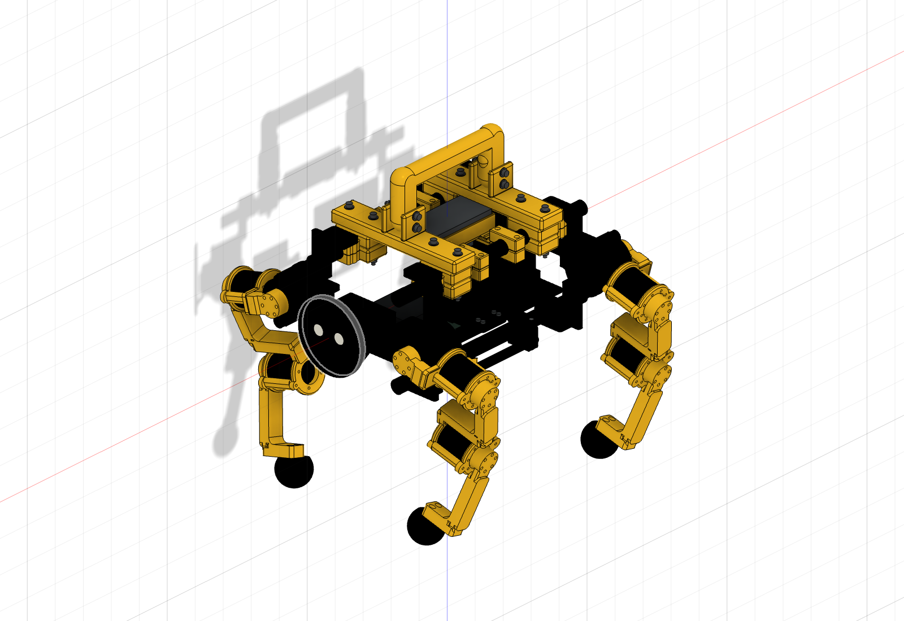

# SingularityDog

**GPT-6 Astraが、3D CADの設計・強化学習・評価・改善を進めるロボット犬プロジェクト。**

<a href="docs/media/cad-yellow-assembly-20260914.png"></a>

*黄色の脚・取手と黒いBody・顔を反映したCAD全体像（2026-09-14の全体更新版）。その後の共通底板・顔固定・左右連結部・足先の改訂は、[最新STL部材一覧](docs/stl-parts.md)で確認できます。*

**[BOM・部品表](docs/bom.md)** · **[色別STL・ダウンロード](docs/stl-parts.md)** · [動画で見る進捗](#動画で見る進捗) · [実機Deploy](#実機deployの状況) · [現在の課題](#現在の課題) · [ハードウェアライセンス](#ハードウェアライセンス)

## GPT-6 Astraと、実物を作りながら開発する

SingularityDogは、**GPT-6 Astraを開発エージェントに据え、人と一緒にロボット犬を作る**FaBoのプロジェクトです。GPT-6 Astraが機構・固定具の設計変更、STLの準備、制御・学習コード、Isaac Labでの実験と結果整理を進めます。人は目標を決め、部品の採寸・調達・印刷・組立を行い、割れや嵌合などの現物情報を返します。

**設計 → シミュレーション・学習 → 動画と数値で評価 → 印刷・現物合わせ → 実機計測 → 改善**を繰り返します。うまくいかなかった試行も記録し、次の設計と学習に反映する開発記録です。

2026-09-18更新。**第37回まで評価済み、実機の印刷完了。現在は実機Deployの初回立上げを優先しています。** 前進の最終目標は40cm/sです。

## 機体とBOM

| 構成 | 現在の設計 |
|---|---|
| 駆動 | 4脚×3軸、QDD 12個。設計・学習用はRobStride RS05 |
| フレーム・外装 | カーボンポールとPLA印刷部品。脚・取手・上部は黄色、Body・顔枠・足先は黒 |
| 計算・姿勢計測 | Jetson Orin Nano、USB-CAN、IMU（機種未選定） |
| 電源 | Makita 40V 2.5Ahとモバイルバッテリー。MakitaとJetsonは共通底板へ固定 |
| 顔 | φ96mmディスプレイ＋ESP32-S3。前面リングを4本のネジで固定 |

**[BOM全件：数量・寸法・重量・未確定項目](docs/bom.md)**<br>
**[STL一覧：黄色44個・黒45個の候補構成](docs/stl-parts.md)**

STLは個別に取得できます。89個は1台の候補構成数で、これから印刷する残数ではありません。現在の選定は、PLA補強、左右連結部の補強、K1 Max用の共通底板、顔の前面固定、外側でナットをセットできる足先r3を含みます。実際に装着した版と、荷重・嵌合の確認結果はこれから記録します。

## 動画で見る進捗

**第1・2・3・10・20・30回**をたどります。プレビューをクリックすると動画ファイルを開けます。第1・2回は公開録画がなく、第3回は計測チャート、それ以降の掲載映像はシミュレーション録画です。

| 第1回 — まず1本ずつ足を上げる | 第2回 — 周期運動へ進む |
|---|---|
| 92秒・31区間の荷重移動を実行し、4脚それぞれ約20mmの足上げを保持。<br>**公開動画なし** · [記録](evidence/learning-history.json) | 周期参照を3条件で比較。全脚が15mm以上の足上げを各3回。<br>**公開動画なし** · [記録](evidence/learning-history.json) |

| 第3回 — 参照運動に学習を加える | 第10回 — 慣性を修正して再学習 |
|---|---|
| <a href="docs/media/forward-history.mp4"></a><br>300更新で部分的な移動を確認。左後脚の足上げと右移動の接触が課題。<br>[第3回を含む計測チャート動画](docs/media/forward-history.mp4) · [記録](evidence/learning-history.json)<br>※実録画ではなく、初期の複数条件の測定値を再描画。 | <a href="docs/media/l05-four-directions.mp4"></a><br>前進16.54cm/s。当時の20cm/s目標と足上げの基準は未達。<br>[MP4を見る](docs/media/l05-four-directions.mp4) · [評価](docs/video-history.md#l05第10回の結果動画) |

| 第20回 — 伏せと起立に挑戦 | 第30回 — 9動作を比較 |
|---|---|
| <a href="docs/media/l15-model499-stationary-prone.mp4"></a><br>伏せを2秒ずつ2回保持。起立保持・位置・方位に課題。<br>[MP4を見る](docs/media/l15-model499-stationary-prone.mp4) · [評価](docs/l15-evaluation.md) | <a href="docs/media/l25-a-nine-motions.mp4"></a><br>A/B/C各7/9合格。移動6方向とお座りを達成し、伏せ・挨拶は未達。<br>MP4：[A](docs/media/l25-a-nine-motions.mp4) / [B](docs/media/l25-b-nine-motions.mp4) / [C](docs/media/l25-c-nine-motions.mp4) · [評価](docs/l25-evaluation.md) |

第30回は条件Aの14秒プレビューです。動作名は各画面の左上、先に終了した枠は最後のカラー画像を保持します。合否は全評価区間で判定し、静止表示の時間は成功時間に数えません。9動作は専門方策ごとの個別評価です。

第31〜37回は、伏せ・挨拶の位置や方位の保持を中心に改善を試しました。最新の第37回も位置ずれ50mm以下の基準には届かず、新しい合格モデルはありません。[第37回の結果](docs/l32-evaluation.md)

[全47本の録画・比較動画](docs/video-history.md) · [全1〜37回の履歴](docs/improvement-loops.md) · [節目ごとの結果一覧](docs/milestone-history.md)

## 実機Deployの状況

**現在地：実機の印刷完了、初回立上げ準備。** 実機で歩行に成功した記録はまだありません。

| 段階 | 状況 | 次に確認すること |
|---|---|---|
| 印刷 | 完了の報告あり | 装着した部品の版、足先の嵌合、PLA補強部の強度、組立後の重量 |
| 組立・配線 | 完了確認待ち | 電源、Jetson、12個のQDD、CAN、IMUの接続 |
| 校正・停止 | 実機確認待ち | 関節ID・原点・回転方向・可動域、通信断時の停止 |
| Jetson上の推論 | 実機確認待ち | モーター出力なしで、センサー入力と方策出力・処理時間を照合 |
| 立位・歩行 | 未検証 | 支持補助付き立位から低速前進・停止へ進む |

以後は **実機計測 → 原因の切り分け → 制御・構造の修正 → 必要なGPU再学習 → 実機再確認** を優先します。[実機移行計画](docs/real-world-deployment.md)

## 現在の課題

| 優先 | 課題 | 次の取り組み |
|---|---|---|
| 1 | 実機の入力・関節・停止処理が未確認 | CAN／IMU受信、12軸の校正、通信断・異常時の停止を検証 |
| 2 | 最新の印刷部品と学習時モデルに差がある | 補強部品・電池配置・質量を現物と照合し、シミュレーションへ反映 |
| 3 | 伏せ・挨拶で位置がずれる | 第37回Bの挨拶は最大60.509mmで、50mm基準に未達。支持脚・接地・姿勢制御を再検討 |
| 4 | 複数動作の連続切替と実機での再現が未検証 | 立位と低速歩行を安定させ、動作切替・外乱・長時間運転へ段階的に広げる |

PLAの割れやナットの入れにくさは設計へ反映済みですが、修正版の印刷・装着・荷重試験の結果をもって解決を判断します。[現在地の詳細](docs/current-status.md)

## ハードウェアライセンス

**本プロジェクト独自の現行機構部品と設計資料を、[CERN-OHL-S-2.0](LICENSE-HARDWARE.md)で公開します。** 製作・改変・販売を認め、改良した設計や製品を配布する際も設計を共有する方式です。改良が公開設計へ還元されることを重視して、Strongly Reciprocal版を選びました。[CERN公式](https://cern-ohl.web.cern.ch/)

対象は[適用ファイル一覧](evidence/hardware-license-scope.json)に明記します。市販モーター・Jetson・電池・ディスプレイの内部設計や商標、第三者のCAD、ソフトウェア、学習済み重み、写真・録画へ一括適用するものではありません。

**現在公開しているのはSTL・BOM・選択した設計資料です。編集用CAD／生成ソースと組立・配線資料の公開は未完了です。** [OSHWAの定義](https://oshwa.org/definition/)に沿った、改変可能な完全ソースの公開を今後の課題として明示します。

<details>
<summary>過去の進捗・資料</summary>

- [節目1・2・5・10・15・20・25・30・35・40の一覧](docs/milestone-history.md)（第40回は未実施）
- [最初に掲載した旧保存番号2197の動画](docs/media/archive-joystick2197-left.mp4)
- [よちよち歩き・第4回](docs/media/h04-forward.mp4)
- [第35回](docs/l30-evaluation.md) · [第36回](docs/l31-evaluation.md) · [第37回](docs/l32-evaluation.md)

保存番号2197は第1回を意味しません。実験回数、学習更新数、動画本数、成功数は別に記録します。

</details>

<details>
<summary>検証ツール・Skills・開発者向け情報</summary>

## Skills

| Skill | 使う場面 |
|---|---|
| [singularitydog-design-study](skills/singularitydog-design-study/SKILL.md) | 荷重経路、重量配置、脚形状、CAD と物理モデルを見直す |
| [singularitydog-rl-iteration](skills/singularitydog-rl-iteration/SKILL.md) | 学習実験を比較し、失敗を観測して次の変更を決める |
| [singularitydog-gait-evaluation](skills/singularitydog-gait-evaluation/SKILL.md) | 速度・各脚の足上げ・滑り・動画から到達点を判定する |
| [singularitydog-experiment-ops](skills/singularitydog-experiment-ops/SKILL.md) | 遠隔 GPU 実験の継続、証跡の固定、知識の引継ぎを行う |

各フォルダを対応するエージェントの skill 検索場所へ配置できます。リポジトリ内の相対リンクと `tools/` も使用するため、まずはリポジトリ全体を取得し、対象の `SKILL.md` を指定して使う方法が確実です。

```text
skills/singularitydog-gait-evaluation/SKILL.md を使って、
今回の実験ログから各脚の足上げと目標速度の達否を確認してください。
```

## 動作確認

基本の6ツールとテストは Python 3.10 以降の標準ライブラリで動きます。追加のアニメーション描画には Pillow・imageio-ffmpeg と日本語フォントを使用します（[描画手順](docs/toolkit.md#readmeのアニメーション)）。

```bash
python -m unittest discover -s tests -v
python tools/audit_urdf.py examples/synthetic_robot.urdf --expected-actuated 1
python tools/evaluate_trace.py examples/synthetic_trace.json
python tools/check_publication.py --root . --files RELEASE_FILES.json
python tools/artifact_manifest.py verify --root . --manifest evidence/release-manifest.json
```

`examples/` はツール検証用の合成入力です。実ロボットのモデル・歩行ログ・学習成果ではありません。


</details>

[検討と判断の記録](docs/decision-log.md) · [公開範囲](docs/publication-scope.md) · [PLA換算重量の過去資料](docs/pla-parts-mass.md)

私物写真・認証情報・接続先は公開していません。
