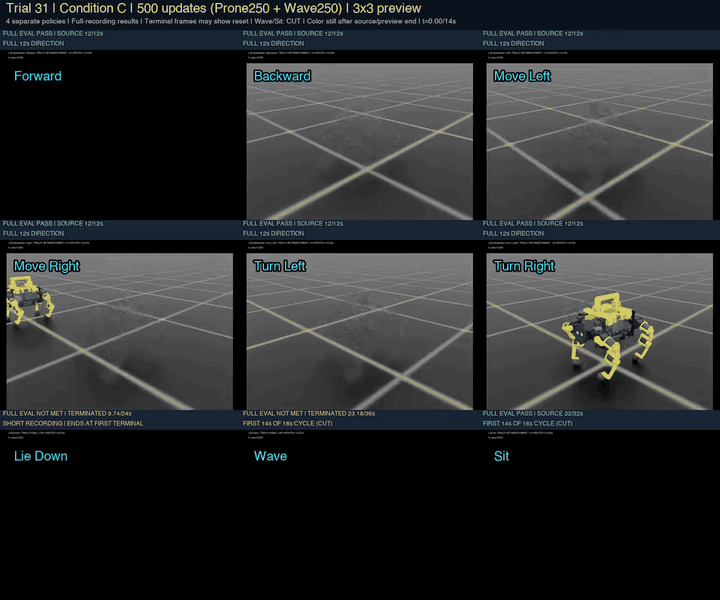

# SingularityDog

**第31回を2026-09-14 02:20:06 JSTに完了しました。** A・B・Cの各500更新、合計1,500新規主更新を実施し、全条件で**7/9動作が合格、新たな合格動作は0**でした。移動6方向とお座りを維持し、伏せと挨拶は総合未達です。

各条件は伏せ250・挨拶250・歩行0・お座り0更新。同じ選択親・seed42から独立に学習した4専門方策の結果で、単一方策の9技能習得や連続切替ではありません。API動作確認の計12更新は主更新に含めません。

| 第31回の結果 | 維持・改善と残った課題 |
|---|---|
| 移動6方向・お座り | A/B/Cすべて合格。追加学習0で保持し、前進41.08cm/sを維持 |
| Aの伏せ | 24秒、伏せ・復帰各2秒×2を維持。方位21.38→6.26°へ改善、位置57.5→92.8mmへ悪化。5°/50mm基準は未達 |
| B/Cの伏せ | 学習前は24秒完走、学習後は初回起立で禁止接触し9.68/9.74秒で終了 |
| 挨拶 | Aは位置61.5mmで未達。Bは方位・復帰保持も未達。Cは23.18/36秒で終了 |

27最終評価と親を含む54評価を照合し、保存モデル6本のCPU検査・手元保存を完了しました。最終の伏せ・挨拶6件は原400Hz配列を凍結した数値評価器で再計算。保持した7動作は元summary・SHAの照合で、今回の原配列再計算とは区別します。短い記録を全長完走と扱わず、3条件を実機用の確定モデルには採用しません。

[第31回の結果・比較・残課題](docs/l26-evaluation.md) · [選択値JSON](evidence/l26-evaluation.json) · [第30回の結果](docs/l25-evaluation.md) · [現在地](docs/current-status.md)

## 最新の公開動画：第31回A/B/Cを3×3で比較

各条件の9動作を**14秒**で表示します。英語名はシミュレーション画面の左上、終了した枠は最後のカラー画像を保持します。移動6方向とAの伏せは先頭12秒、B/Cの伏せは実終端まで。挨拶とお座りは第1周期の途中の14秒までです。

**条件A** — 左右差1倍・支持移動45mm。7/9合格。伏せは2周期の保持・復帰を維持しましたが、方位改善と位置悪化が同時に起きました。


[条件AのMP4・14秒](docs/media/l26-a-nine-motions.mp4)

**条件B** — 左右差0.5倍・支持移動40mm。7/9合格。伏せは9.68秒で禁止接触終了、挨拶の第1復帰は1.9975秒で未達。


[条件BのMP4・14秒](docs/media/l26-b-nine-motions.mp4)

**条件C** — 左右差0.25倍・支持移動35mm。7/9合格。伏せは9.74秒、挨拶は23.18秒で終了。挨拶の終端は14秒抜粋に映らないため、全記録の途中終了を画面にも示しています。



[条件CのMP4・14秒](docs/media/l26-c-nine-motions.mp4)

FULL EVALの合否は元の全評価区間に基づきます。静止表示を成功保持時間へ数えず、終端画像が自動リセット後の姿勢や空の背景でも、成功姿勢の証明には使いません。Cの挨拶を14秒映像だけで成功と判断しないでください。

[第31回の評価と検証範囲](docs/l26-evaluation.md) · [第30回A/B/C動画を含む履歴](docs/l25-evaluation.md#abcの14秒比較動画) · [全動画の履歴](docs/video-history.md)

## 印刷用STL：黄色28部品を密に配置

**4脚分の黄色い可動部品20個＋上部クランプ8個**を、K1用4プレートへ7・6・8・7個ずつ配置しました。従来の黄色プレート5個から増やし、部品間5.2mm・ベッド端5mmを確保しています。

[黄色28部品の密配置パック・ZIPと手順](docs/printing-yellow-dense.md)

左前脚の黄色5部品は前回パックと重複します。印刷済みなら個別STLから対象を選んでください。取手は今回の28個に含まず、[前回10部品パック](docs/printing-next-10-parts.md)の黄色取手を使います。こちらには黒いBody側固定具と顔支持もあります。

まず小カラーで現物合わせを行ってください。実物適合、スライス後の材料量、脚・取手の荷重強度は未確認です。スライサーではサポートとブリムを含む収まりも確認します。

脚・取手・背中・上部PLAは黄色、顔・胴体の基部・カーボン・QDD・足先球は黒、IMUは赤、顔は黒地に白い目です。[最新仕様と機器配置](docs/next-loop-spec.md)。

## 映像でたどる開発履歴

READMEでは**最初・よちよち歩き・第5・10・15・20・25回の動画ダイジェスト**を掲載します。公開している録画・比較動画47本とCAD画像1点は引き続き保持し、[全動画の履歴](docs/video-history.md)と[31回の実行・評価履歴](docs/improvement-loops.md)からたどれます。改善回数31回と動画本数47本は別の集計です。

個別評価の元MP4は全フレーム・50fpsのまま保存。GIFは対応MP4の全区間を等速で表示する縮小プレビューです。第25回の3×3比較は14秒の抜粋で、全長の評価とは区別します。段階ごとに形状・物理設定・指令・制御方式が異なる履歴で、同条件の性能比較ではありません。

<details>
<summary>CADで検討した外観を見る</summary>


[type00：元のCAD画像](docs/media/cad-type00.png)。設計イメージです。最新の学習モデル・完成した実機を示す画像ではありません。

</details>

| 段階 | 実際の録画・プレビュー | 結果と残った課題 |
|---|---|---|
| **最初**<br>旧形状・保存番号2197<br>直近31回より前 | <br>[元MP4・5.98秒](docs/media/archive-joystick2197-left.mp4) | 外装付きの旧モデルで左移動を試行。同じ方策の別評価では速度・姿勢条件を満たしたが、後の足別診断では15mm以上の完了足上げは全脚0回。すり足が課題。 |
| **よちよち歩き**<br>第4回 H04<br>初期の前進 | <br>[元MP4・12秒](docs/media/h04-forward.mp4) | 足は動くものの、移動はまだゆっくり。世界X速度平均約0.85cm/s、15mm以上の足上げは前左・前右・後左・後右の順に4 / 4 / 4 / 1回。前段階より速度は退行し、足運びと前進の両立が課題。 |
| **第5回 L00**<br>速い対角歩容・4方向 | <br>[元MP4・12秒](docs/media/l00-four-directions.mp4) | **前10.37・後5.90・左4.89・右7.98cm/s**。前進は改善したが、後脚の足上げ不足・滑り・偏向が残る。 |
| **第10回 L05**<br>修正モデル・500更新・4方向 | <br>[元MP4・12秒](docs/media/l05-four-directions.mp4) | **前16.54・後6.23・左8.05・右6.54cm/s**（変位/12秒）。20cm/s未達。後左脚不足、後進の滑り、右の約50度の偏向が残る。 |
| **第15回 L10**<br>左右旋回と向き保持を追加、500更新 | <br>[元MP4・12秒](docs/media/l10-six-directions.mp4)<br>[同じ初期化のL09比較4方向](docs/media/l10-matched-l09-four-directions.mp4) | **前32.16・後10.67・左8.36・右11.65cm/s**。3/6ケースが開発基準達成。旋回は左+106.78°・右−148.29°、平均0.155/0.216rad/s。最大位置ずれ28.3/19.2cmで、その場旋回は未達。 |
| **第20回 L15**<br>その場での伏せ・起立、500更新・最終499 | <br>[元MP4・24秒](docs/media/l15-model499-stationary-prone.mp4)<br>[測定値と未達](docs/l15-evaluation.md) | **伏せ2秒を2回達成、全基準は未達**。第2起立の高さ条件1.9375/2秒、最大方位ずれ21.46°・位置ずれ6.93cm・起立傾き7.92°。72秒評価はスキップ。 |
| **第25回 L20**<br>9動作を3×3で比較、計500更新 | <br>[3×3比較MP4・14秒](docs/media/l20-nine-motions.mp4)<br>[全長の個別動画・評価結果](docs/l20-evaluation.md) | **全基準合格2/9：後退・お座り**。4つの専門方策を評価。前進39.35cm/s、伏せ第2復帰0.0175秒、挨拶の最大位置ずれ6.45cmなどが課題。 |

「最初」は以前の一覧の先頭にあった旧形状の動画です。保存番号2197は改善回数ではなく、直近31回へ加算しません。「よちよち歩き」は既存の第4回H04で、新しい実験回数ではありません。第20回のプレビューは24秒全区間で、終端の自動リセットも含みます。間の回や初期の試行、同条件の比較動画は[全動画の履歴](docs/video-history.md)に残しています。

第25回は6方向移動と伏せの先頭12秒、挨拶・お座りの先頭14秒を表示します。挨拶・お座りは第1周期の途中までです。短い枠は最後のカラー画像を保持し、この静止時間を成功保持へ数えません。合否は個別動画の全評価区間に基づきます。

<details>
<summary>実測チャートで4段階の移動・足上げを比較する</summary>

## 立位から足運びへ：実測データで見る4段階


[全600フレーム・50fps・12秒のMP4](docs/media/forward-history.mp4) · [静止画](docs/media/forward-history.png)

これは**実測した移動XY・向き・足上げを図として再描画した可視化**です。実機やシミュレータ画面の録画ではなく、メーカーの外観・形状を表示していません。初期立位基準→第3回H03→第4回H04→第5回L00を、共通の観測時刻0.02〜12.0秒で並べています。段階ごとに指令速度と制御方式が異なるため、同一条件の公平なA/B比較ではありません。

| 表示段階 | 観測区間の前進変位（世界X） | 前進評価で分かったこと |
|---|---:|---|
| 初期立位基準・回数外 | 0.48cm | 姿勢を維持したが、全脚の完了足上げは0回 |
| 第3回 H03 | 15.62cm | 参照運動＋残差学習で足運びが生まれ、15mm以上の足上げは各脚4回 |
| 第4回 H04 | 10.63cm | 追加学習後も足は動くが、移動速度は退行。前進の足上げは4 / 4 / 4 / 1回 |
| 第5回 L00 | 124.37cm | 元速度記録の平均で前進10.37cm/s。足上げは13 / 14 / 1 / 13回で、後左脚が課題 |

変位は最後の位置（12.0秒）から最初の観測位置（0.02秒）を引いた世界X方向の差です。足上げ回数の順は前左 / 前右 / 後左 / 後右です。10.37cm/sは元の速度記録を平均した値で、図の始点・終点の位置差を12秒で割り直した値ではありません。見た目の移動や学習の正常終了だけで歩行合格とは扱いません。

</details>

## 実行・評価の全履歴

直近31回は、H01〜H04とL00〜L26の有限な試験を数えたものです。同じ学習のcheckpoint違い、追加動画、次回準備は加算しません。L07の15条件も1回の再設計検証にまとめています。

各回の変更・日時・測定値・次の判断は[31回の実行・評価履歴](docs/improvement-loops.md)、録画と比較条件は[全動画の履歴](docs/video-history.md)、集計用データは[履歴JSON](evidence/learning-history.json)を参照してください。

## 読む順番

- [現在地と実測値](docs/current-status.md)
- [検討と判断の記録](docs/decision-log.md)
- [改善回数・日時・可視化の定義](docs/improvement-loops.md)
- [31回の機械可読な履歴](evidence/learning-history.json)
- [次ループの配色・素材・500更新方針](docs/next-loop-spec.md)
- [PLA部品別のCAD換算重量](docs/pla-parts-mass.md)
- [ツールの対応範囲](docs/toolkit.md)
- [公開する情報の範囲](docs/publication-scope.md)

## Skills

| Skill | 使う場面 |
|---|---|
| [singularitydog-design-study](skills/singularitydog-design-study/SKILL.md) | 荷重経路、重量配置、脚形状、CAD と物理モデルを見直す |
| [singularitydog-rl-iteration](skills/singularitydog-rl-iteration/SKILL.md) | 学習実験を比較し、失敗を観測して次の変更を決める |
| [singularitydog-gait-evaluation](skills/singularitydog-gait-evaluation/SKILL.md) | 速度・各脚の足上げ・滑り・動画から到達点を判定する |
| [singularitydog-experiment-ops](skills/singularitydog-experiment-ops/SKILL.md) | 遠隔 GPU 実験の継続、証跡の固定、知識の引継ぎを行う |

各フォルダを対応するエージェントの skill 検索場所へ配置できます。リポジトリ内の相対リンクと `tools/` も使用するため、まずはリポジトリ全体を取得し、対象の `SKILL.md` を指定して使う方法が確実です。

```text
skills/singularitydog-gait-evaluation/SKILL.md を使って、
今回の実験ログから各脚の足上げと目標速度の達否を確認してください。
```

## 動作確認

基本の6ツールとテストは Python 3.10 以降の標準ライブラリで動きます。追加のアニメーション描画には Pillow・imageio-ffmpeg と日本語フォントを使用します（[描画手順](docs/toolkit.md#readmeのアニメーション)）。

```bash
python -m unittest discover -s tests -v
python tools/audit_urdf.py examples/synthetic_robot.urdf --expected-actuated 1
python tools/evaluate_trace.py examples/synthetic_trace.json
python tools/check_publication.py --root . --files RELEASE_FILES.json
python tools/artifact_manifest.py verify --root . --manifest evidence/release-manifest.json
```

`examples/` はツール検証用の合成入力です。実ロボットのモデル・歩行ログ・学習成果ではありません。

この公開パッケージには設計・学習の記録、共通検証ツール、個別に選んだ動画と個別に指定した印刷用STLを含みます。編集可能なCADアセンブリ、学習用ロボットモデル、学習済み重み、メーカーの元資料、第三者実装、接続先や認証情報は含みません。シミュレータ環境は利用者が適切な権限で別途用意します。
