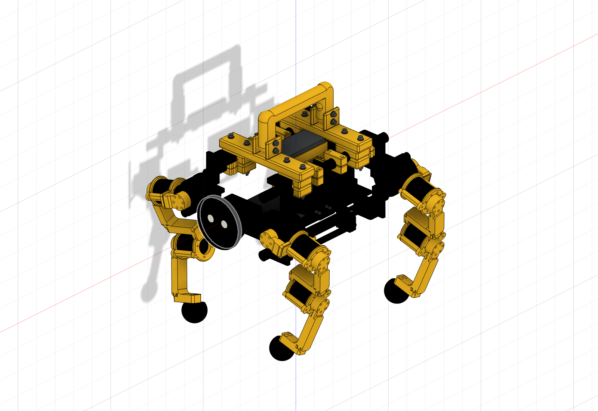
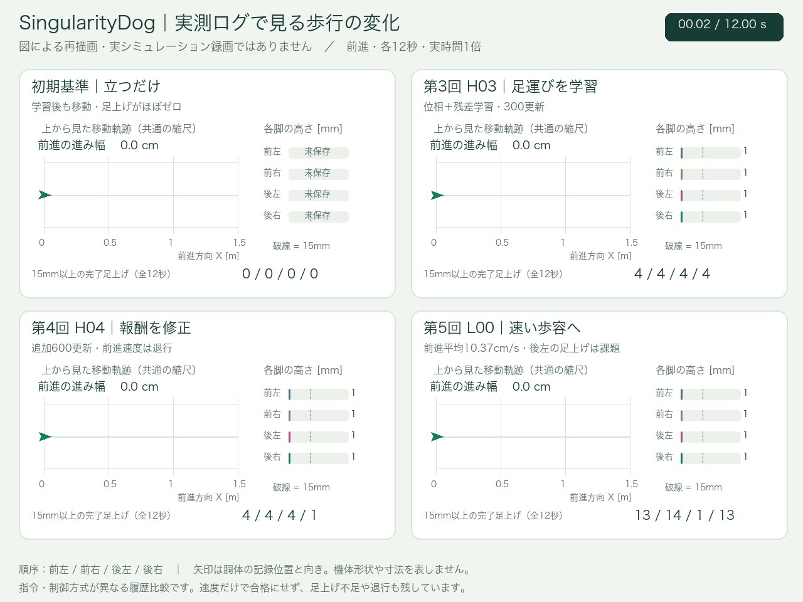
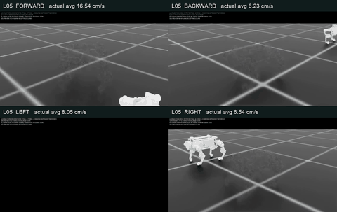
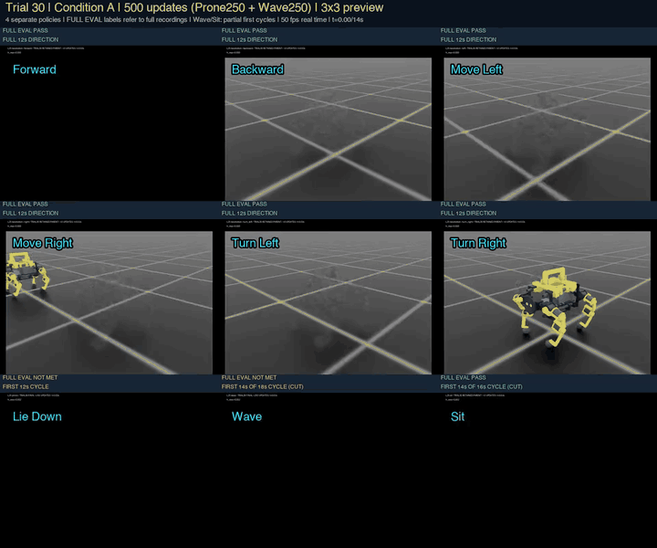

# SingularityDog

**GPT-6 Astraが、3D CADの設計・強化学習・評価・改善を進めるロボット犬プロジェクト。**

<a href="docs/media/cad-yellow-assembly-20260914.png"></a>

*黄色の脚・取手と黒いBody・顔を反映したCAD全体像（2026-09-14の全体更新版）。その後の共通底板・顔固定・左右連結部・足先の改訂は、[最新STL部材一覧](docs/stl-parts.md)で確認できます。*

**[BOM・部品表](docs/bom.md)** · **[色別STL・ダウンロード](docs/stl-parts.md)** · [動画で見る進捗](#動画で見る進捗) · [実機向けソフトウェア開発](#実機向けソフトウェア開発) · [実機Deploy](#実機deployの状況) · [現在の課題](#現在の課題) · [ハードウェアライセンス](#ハードウェアライセンス)

## GPT-6 Astraと、実物を作りながら開発する

SingularityDogは、**GPT-6 Astraを開発エージェントに据え、人と一緒にロボット犬を作る**FaBoのプロジェクトです。GPT-6 Astraが機構・固定具の設計変更、STLの準備、制御・学習コード、Isaac Labでの実験と結果整理を進めます。人は目標を決め、部品の採寸・調達・印刷・組立を行い、割れや嵌合などの現物情報を返します。

**設計 → シミュレーション・学習 → 動画と数値で評価 → 印刷・現物合わせ → 実機計測 → 改善**を繰り返します。うまくいかなかった試行も記録し、次の設計と学習に反映する開発記録です。

シミュレーションは**第37回まで評価済み**です。実機ではRS05全12軸を公式FW 0.5.0.13へ更新し、前後2系統のCANで保持・停止を確認しています。前進の最終目標は40cm/sです。

## 実機向けソフトウェア開発

**2026年9月29日時点：無駆動の5回×定常500周期と、箱支持の学習目標送信97周期で20ms以内・全12軸STOPを確認しました。その後の12cm支持・5秒試験は返信欠落で中断。STOP待機と起動処理を修正しましたが、5秒の安定通信、荷重立位・自立・歩行は未達です。** 日付ごとの作業と詳細記録を以下にまとめます。`r`／`R`番号は各ツール・試験内の改訂番号で、上記の学習評価回数とは別です。

| 日付（2026年） | 版・作業記録 | 成果・状況 |
|---|---|---|
| 9月20日 | [診断 r2・r4](docs/hardware-bringup-20260920.md) | 12軸の位置・速度・電流・電圧とIMUを取得。60秒診断でCANタイムアウト0回。 |
| 9月21日 | [関節試験・推論環境](docs/hardware-results-20260921.md) | 支持台上で右前脚の動作・停止を確認。12軸の逐次取得は中央値81.20ms。 |
| 9月22日 | [FW照会・校正準備](docs/hardware-results-20260922.md) | 全12台の版数を照会し、設定読取り失敗を切り分け。試験前の設定確認を一括化。 |
| 9月23日 | [前後2系統CAN・交換後の試験](docs/hardware-results-20260923.md) | USB2CANを前脚・後脚に分割。交換後の脚別動作・停止と4脚のL字基準を記録。 |
| 9月24日 | [保持 r1〜r6](docs/hardware-results-20260924.md)・[20ms化の方針](docs/control-20ms-strategy-20260924.md) | 右後脚の追従とゲインを比較。位置・速度の複合返信、並列取得・送信の改善方針を整理。 |
| 9月25日 | [FW更新・実機結果](docs/2026-09-25-26-hardware-status.md#9月25日)・[C++化 r10／r8](docs/hardware-native-host-processing-20260925.md) | 全12軸をFW 0.5.0.13へ更新。取得→実推論→最終ホスト送信は3回中最良19.785ms、最大20.136ms。連続20msは未達。 |
| 9月26日 | [音声案内・12軸保持](docs/2026-09-25-26-hardware-status.md#9月26日)・[4軸同時試験](docs/role-thigh-mirrored-20260926.md) | 「テスト開始します」の発話と12軸保持・STOPを確認。前脚付け根の10°軌道は未完了。 |
| 9月27日 | [並列取得・無出力推論 r3・r4](docs/learned-policy-deploy-status-20260927.md) | 前後CAN・IMUを並列化し、単発の実推論に成功。r4はCAN取得中央値22.183msで、20ms未達。 |
| 9月27日夜 | [翌日の一括検証キット](docs/overnight-validation-20260927.md) | 360°ずれの補正、IMU校正、C++送受信・推論を統合。保存通信492件の一致と模擬20周期を確認。 |
| 9月28日 | [速度改善 r6〜r13](docs/hardware-native-cycle-20260928.md) | 複合返信、スレッド事前起動、コピー削減、ログ後処理化。r13は無出力500周期の全工程最大21.640ms、16回超過。 |
| 9月28日 | [CPU・推論比較 r14〜r17・R20〜R22](docs/latency-alternatives-20260928.md) | Super Modeと推論の準備手順を改善。**R22で無出力500周期すべて20ms以内（全工程最大19.695ms）を達成。** |
| 9月28日 | [実出力 V2／V3](docs/policy-output-validation-20260928.md)・[立位〜低速歩行ツール](docs/ground-trials-20260928.md) | 滑らかな開始・停止、C++送受信、関節監視を実装。V3は周期内の要求を28→26へ削減。 |
| 9月28日夜 | [角度・IMU照合、指令断確認 r4](docs/walking-residuals-20260929.md)・[40V再投入5回](docs/power-cycle-repeat-20260928.md) | 水準器で4脚L字とIMU水平を記録。ゼロゲインの指令断保護・終了STOPを12軸で確認。加速度ノルム約9%の偏差は残る。 |
| 9月28日夜 | [⑤ 最終入力の無出力診断](evidence/final-input-diagnostic-20260928.json) | **取得→実推論→STOP返信・後処理まで、初回1＋定常500周期すべて20ms以内を達成。全工程最大19.555ms、超過0回。** |
| 9月29日未明 | [⑥ 箱支持の実出力試行](evidence/supported-policy-attempt-20260928.json) | 開始保持2周期後、指令計算間隔の上限で中断。学習目標は未送信。終了STOPは10軸確認・2軸未確認となり、40V Off・現物異常なしを確認。 |
| 9月29日未明 | [朝の再開手順・修正版](docs/morning-restart-20260929.md) | 指令間隔の記録とSTOP返信処理を修正し、CPU配置の比較設定を追加。**2,303件成功・5件スキップ**。修正版の実機再試験は未実施。 |
| 9月29日 | [実出力と20ms比較](docs/20ms-fast-voltage-benchmark-20260929.md)・[推論のC++候補](docs/20ms-model-hotpath-20260929.md) | 箱支持で学習目標を混ぜる2秒試験を95周期完走・全軸STOP。数値計算スレッドを起動時に制限した無駆動診断は、初回を除く**3回×500周期で20ms超過0回**（各回最大19.392／19.303／19.910ms）。同じCPU4で追加の定常500周期も最大19.663ms・超過0。新設定の実出力は初回ゼロゲイン周期で返信が欠け、学習目標送信前に中断。 |
| 9月29日 | [STOP再送と返信欠落の切り分け](docs/stop-retry-20260929.md) | ゼロゲインのType1比較は29周期完了後、30周期目のID4返信欠落で中断。40V Off・現物異常なし。STOP最大3回・合計500msの再送を実装し、実機での効果は未計測。 |
| 9月29日 | [STOP再送版の箱支持実出力 r1](evidence/supported-policy-stopretry-20260929.json) | 充電後、ゼロゲイン88周期と学習目標送信97周期を完走。学習目標側は全工程最大**19.575ms・20ms超過0回・全12軸STOP**。モデル混合率0.5%、最大1°の限定試験。再送は発動せず、返信欠落時の回復効果と長時間安定性は未確認。 |
| 9月29日 | [12cm支持・5秒試験 r1〜r6](docs/ground-support-rehearsal-20260929.md)・[集計](evidence/supported-policy-box120-20260929.json) | STOP初回250ms・再送最大500ms・合計1秒、有効化返信30ms、終了ランプの丸め誤差を修正。r6は32周期（学習目標12周期）後にID12返信欠落で中断。完了周期最大19.439ms。40V Off・現物異常なしを確認。5秒完走と通信欠落の解消は未達。 |
| 9月29日 | [CAN/USB欠落調査・skip試作](docs/can-usb-loss-investigation-20260929.md) | 返信全体の未着と末尾2バイトの遅着を分類。xHCIの受動監視ツールを追加。最大1周期の受信待ちを模擬検証し、Mac74件・JetsonのC++ socket3件成功。実出力のskipは未適用、欠落の物理的な発生箇所は未確定。 |
| 9月29日 | [実機Type17・USB双方向記録](docs/can-usb-loss-investigation-20260929.md)・[集計](evidence/can-usb-type17-live-20260929.json) | 箱支持・無指令で500周期を完走。xHCIは前後両CH341の送受信URBを損失なく記録。ID9の40V再投入後の約1回転枝差を診断用に照合。Type1欠落の発生箇所は未確定。 |
| 9月29日 | [ID9角度照合・推論＋STOP代理100周期](docs/can-usb-loss-investigation-20260929.md)・[集計](evidence/can-stopproxy-diagnostic-20260929-r3.json) | 現起動12軸の無出力読取りを診断用プロファイルと照合し、100周期を完走・全12軸STOP返信を確認。標準モデル経路では推論区間中央値28.729ms、全工程中央値46.191ms。高速C++モデルの指定漏れを防ぐCLIスイッチを追加し、同条件の再比較を準備。 |
| 9月29日 | [高速C++モデルの無出力再計測](docs/can-usb-loss-investigation-20260929.md)・[集計](evidence/can-stopproxy-fastscalar-20260929-r5.json) | CPU周波数を計測中だけ固定し自動復元。初回1＋定常500周期を完走し、定常の取得→実推論→12軸STOP返信・後処理は中央値18.831ms、最大19.482ms、20ms超過0回。Type1指令とモーター有効化はゼロ。実出力と厳密な開始間隔20ms以内は未確認。 |

表の「全工程20ms以内」は、取得・実推論・STOP代理送信・返信・後処理を含む無出力診断の処理時間です。周期開始間隔とは別に計測し、初回1周期と観測済みの開始ジッターは[採用条件](docs/accepted-angle-timing-policy-20260928.md)に従います。

[朝の再開手順](docs/morning-restart-20260929.md) · [学習モデルで歩くまでの残件](docs/walking-residuals-20260929.md) · [一括試験の実施方法](docs/today-test-plan-20260928.md)

## 機体とBOM

| 構成 | 現在の設計 |
|---|---|
| 駆動 | 4脚×3軸、RobStride RS05×12。実機も全個体RS05と操作者が確認 |
| フレーム・外装 | カーボンポールとPLA印刷部品。脚・取手・上部は黄色、Body・顔枠・足先は黒 |
| 計算・姿勢計測 | Jetson Orin Nano、RobStride USB2CAN（CH340）×2（前脚／後脚）、GY-ICM20948V2（I2C） |
| 電源 | Makita 40V 2.5Ahとモバイルバッテリー。MakitaとJetsonは共通底板へ固定 |
| 顔 | φ96mmディスプレイ＋ESP32-S3。前面リングを4本のネジで固定 |

**[BOM全件：数量・寸法・重量・未確定項目](docs/bom.md)**<br>
**[STL一覧：黄色44個・黒45個の候補構成](docs/stl-parts.md)**

STLは個別に取得できます。89個は1台の候補構成数で、これから印刷する残数ではありません。現在の選定は、PLA補強、左右連結部の補強、K1 Max用の共通底板、顔の前面固定、外側でナットをセットできる足先r3を含みます。実際に装着した版と、荷重・嵌合の確認結果はこれから記録します。

## 動画で見る進捗

**第1・2・3・10・20・30回**をたどります。プレビューをクリックすると動画ファイルを開けます。第1・2回は公開録画がなく、第3回は計測チャート、それ以降の掲載映像はシミュレーション録画です。

| 第1回 — まず1本ずつ足を上げる | 第2回 — 周期運動へ進む |
|---|---|
| 92秒・31区間の荷重移動を実行し、4脚それぞれ約20mmの足上げを保持。<br>**公開動画なし** · [記録](evidence/learning-history.json) | 周期参照を3条件で比較。全脚が15mm以上の足上げを各3回。<br>**公開動画なし** · [記録](evidence/learning-history.json) |

| 第3回 — 参照運動に学習を加える | 第10回 — 慣性を修正して再学習 |
|---|---|
| <a href="docs/media/forward-history.mp4"></a><br>300更新で部分的な移動を確認。左後脚の足上げと右移動の接触が課題。<br>[第3回を含む計測チャート動画](docs/media/forward-history.mp4) · [記録](evidence/learning-history.json)<br>※実録画ではなく、初期の複数条件の測定値を再描画。 | <a href="docs/media/l05-four-directions.mp4"></a><br>前進16.54cm/s。当時の20cm/s目標と足上げの基準は未達。<br>[MP4を見る](docs/media/l05-four-directions.mp4) · [評価](docs/video-history.md#l05第10回の結果動画) |

| 第20回 — 伏せと起立に挑戦 | 第30回 — 9動作を比較 |
|---|---|
| <a href="docs/media/l15-model499-stationary-prone.mp4"></a><br>伏せを2秒ずつ2回保持。起立保持・位置・方位に課題。<br>[MP4を見る](docs/media/l15-model499-stationary-prone.mp4) · [評価](docs/l15-evaluation.md) | <a href="docs/media/l25-a-nine-motions.mp4"></a><br>A/B/C各7/9合格。移動6方向とお座りを達成し、伏せ・挨拶は未達。<br>MP4：[A](docs/media/l25-a-nine-motions.mp4) / [B](docs/media/l25-b-nine-motions.mp4) / [C](docs/media/l25-c-nine-motions.mp4) · [評価](docs/l25-evaluation.md) |

第30回は条件Aの14秒プレビューです。動作名は各画面の左上、先に終了した枠は最後のカラー画像を保持します。合否は全評価区間で判定し、静止表示の時間は成功時間に数えません。9動作は専門方策ごとの個別評価です。

第31〜37回は、伏せ・挨拶の位置や方位の保持を中心に改善を試しました。最新の第37回も位置ずれ50mm以下の基準には届かず、新しい合格モデルはありません。[第37回の結果](docs/l32-evaluation.md)

[全47本の録画・比較動画](docs/video-history.md) · [全1〜37回の履歴](docs/improvement-loops.md) · [節目ごとの結果一覧](docs/milestone-history.md)

## 実機Deployの状況

**現在地：採用条件の無駆動計測は計5回の定常500周期で20ms超過0回。新設定の箱支持・学習目標送信も2秒枠で97周期完走し、全工程最大19.575ms・全12軸STOPを確認しました。** 同じ設定で返信欠落による中断履歴もあり、長時間の通信安定性やSTOP再送による回復は未確認です。今回の実移動は最大約0.066°、読取りトルクは最大約0.040Nmで、脚が胴体荷重を受けた証拠にはなりません。四足自立・歩行は未確認です。USB物理切断試験は操作者の指示で今回省略しました。

| 段階 | 状況 | 次に確認すること |
|---|---|---|
| 印刷 | 完了の報告あり | 装着した部品の版、足先の嵌合、PLA補強部の強度、組立後の重量 |
| 組立・配線 | RS05×12とI2C IMUを確認。USB2CANを前脚／後脚に分割。12軸をFW 0.5.0.13へ更新 | 自動報告を6軸同時に安定して開始できるか再検証 |
| 校正・停止 | 4脚の水準器L字記録、IMU水平・3方向照合、12軸ゼロゲイン指令断保護を確認 | 絶対角精度・実可動域の確定、実出力終了STOPの再確認。USB物理切断は未実施 |
| 駆動・保持 | 4脚の脚別動作と、前脚上脚の顔側約10°・前脚付け根約5°の限定動作を確認。12軸の現在位置保持を前後各100周期完走し、全12軸STOPを確認 | 前脚付け根の10°軌道を再検証し、目標追従と接触の有無を確認 |
| Jetson上の推論 | 新設定で箱支持の学習目標送信97周期を20ms以内で完走・全12軸STOP。別の無駆動診断では定常2000周期も20ms超過0 | 長時間のType1返信安定性、欠落時のSTOP再送効果、荷重を受ける立位と自立を確認 |
| 立位・歩行 | 未検証 | 支持補助付き立位、荷重移行、低速前進を段階的に検証 |

9月25日の単発3回の実測は、最古入力の取得開始から最終ホスト送信まで**中央値20.063ms・最大20.136ms**、最後の返信まで中央値22.791msでした。送信はSTOP命令による代理測定で、推論した目標角は記録のみです。9月26日の前脚付け根ID3・6の10°試験は、最初の周期で返信の鮮度判定により中断し、完了周期は0でした。全12軸STOPを確認し、操作者に動き・異常・接触は見えませんでした。[9月25〜26日の記録](docs/2026-09-25-26-hardware-status.md) · [9月27日の更新](docs/learned-policy-deploy-status-20260927.md)

9月27日の旧Type17経路は、周期同期後もCAN取得だけで中央値22.183msでした。9月28日のType17並列取得中央値14.93ms、および複合返信を使う100周期の全工程診断とは、経路と測定範囲を分けて記録しています。

以後は **実機計測 → 原因の切り分け → 制御・構造の修正 → 必要なGPU再学習 → 実機再確認** を優先します。[実機移行計画](docs/real-world-deployment.md)

## 現在の課題

| 優先 | 課題 | 次の取り組み |
|---|---|---|
| 1 | 最終入力の記録は反映済み。水準器の絶対精度、加速度ノルム約9%偏差、全可動域には未確定部分が残る | 相対1°の支持付き試験と全域の校正を区別し、限られた試験結果を歩行承認に流用しない |
| 2 | ⑥が指令間隔21msの監視で中断し、終了STOPもID1・2が期限内未確認 | 取得間隔と指令間隔を分けて記録し、停止返信の待ち時間を修正して再確認する |
| 3 | 支持台から四足への荷重移行と学習済み目標送信が未検証 | 箱上の有限保持・停止復帰を照合し、独立した落下受けか補助者を用意して段階的に荷重を移す |
| 4 | 前脚の一部軌道で黄色い部材がカーボンポール固定具に接触 | 接触しない付け根・上脚の経路を現物とCADで確認する |
| 5 | 最新の印刷部品と学習時モデルに差がある | 補強部品・電池配置・質量を現物と照合し、シミュレーションへ反映 |

PLAの割れやナットの入れにくさは設計へ反映済みですが、修正版の印刷・装着・荷重試験の結果をもって解決を判断します。[現在地の詳細](docs/current-status.md)

## ハードウェアライセンス

**本プロジェクト独自の現行機構部品と設計資料を、[CERN-OHL-S-2.0](LICENSE-HARDWARE.md)で公開します。** 製作・改変・販売を認め、改良した設計や製品を配布する際も設計を共有する方式です。改良が公開設計へ還元されることを重視して、Strongly Reciprocal版を選びました。[CERN公式](https://cern-ohl.web.cern.ch/)

対象は[適用ファイル一覧](evidence/hardware-license-scope.json)に明記します。市販モーター・Jetson・電池・ディスプレイの内部設計や商標、第三者のCAD、ソフトウェア、学習済み重み、写真・録画へ一括適用するものではありません。

**現在公開しているのはSTL・BOM・選択した設計資料です。編集用CAD／生成ソースと組立・配線資料の公開は未完了です。** [OSHWAの定義](https://oshwa.org/definition/)に沿った、改変可能な完全ソースの公開を今後の課題として明示します。

<details>
<summary>過去の進捗・資料</summary>

- [節目1・2・5・10・15・20・25・30・35・40の一覧](docs/milestone-history.md)（第40回は未実施）
- [最初に掲載した旧保存番号2197の動画](docs/media/archive-joystick2197-left.mp4)
- [よちよち歩き・第4回](docs/media/h04-forward.mp4)
- [第35回](docs/l30-evaluation.md) · [第36回](docs/l31-evaluation.md) · [第37回](docs/l32-evaluation.md)

保存番号2197は第1回を意味しません。実験回数、学習更新数、動画本数、成功数は別に記録します。

</details>

<details>
<summary>検証ツール・Skills・開発者向け情報</summary>

## Skills

| Skill | 使う場面 |
|---|---|
| [singularitydog-design-study](skills/singularitydog-design-study/SKILL.md) | 荷重経路、重量配置、脚形状、CAD と物理モデルを見直す |
| [singularitydog-rl-iteration](skills/singularitydog-rl-iteration/SKILL.md) | 学習実験を比較し、失敗を観測して次の変更を決める |
| [singularitydog-gait-evaluation](skills/singularitydog-gait-evaluation/SKILL.md) | 速度・各脚の足上げ・滑り・動画から到達点を判定する |
| [singularitydog-experiment-ops](skills/singularitydog-experiment-ops/SKILL.md) | 遠隔 GPU 実験の継続、証跡の固定、知識の引継ぎを行う |

各フォルダを対応するエージェントの skill 検索場所へ配置できます。リポジトリ内の相対リンクと `tools/` も使用するため、まずはリポジトリ全体を取得し、対象の `SKILL.md` を指定して使う方法が確実です。

```text
skills/singularitydog-gait-evaluation/SKILL.md を使って、
今回の実験ログから各脚の足上げと目標速度の達否を確認してください。
```

## 動作確認

基本の6ツールとテストは Python 3.10 以降の標準ライブラリで動きます。追加のアニメーション描画には Pillow・imageio-ffmpeg と日本語フォントを使用します（[描画手順](docs/toolkit.md#readmeのアニメーション)）。

```bash
python -m unittest discover -s tests -v
python tools/audit_urdf.py examples/synthetic_robot.urdf --expected-actuated 1
python tools/evaluate_trace.py examples/synthetic_trace.json
python tools/check_publication.py --root . --files RELEASE_FILES.json
python tools/artifact_manifest.py verify --root . --manifest evidence/release-manifest.json
```

`examples/` はツール検証用の合成入力です。実ロボットのモデル・歩行ログ・学習成果ではありません。


</details>

[検討と判断の記録](docs/decision-log.md) · [公開範囲](docs/publication-scope.md) · [PLA換算重量の過去資料](docs/pla-parts-mass.md)

私物写真・認証情報・接続先は公開していません。
