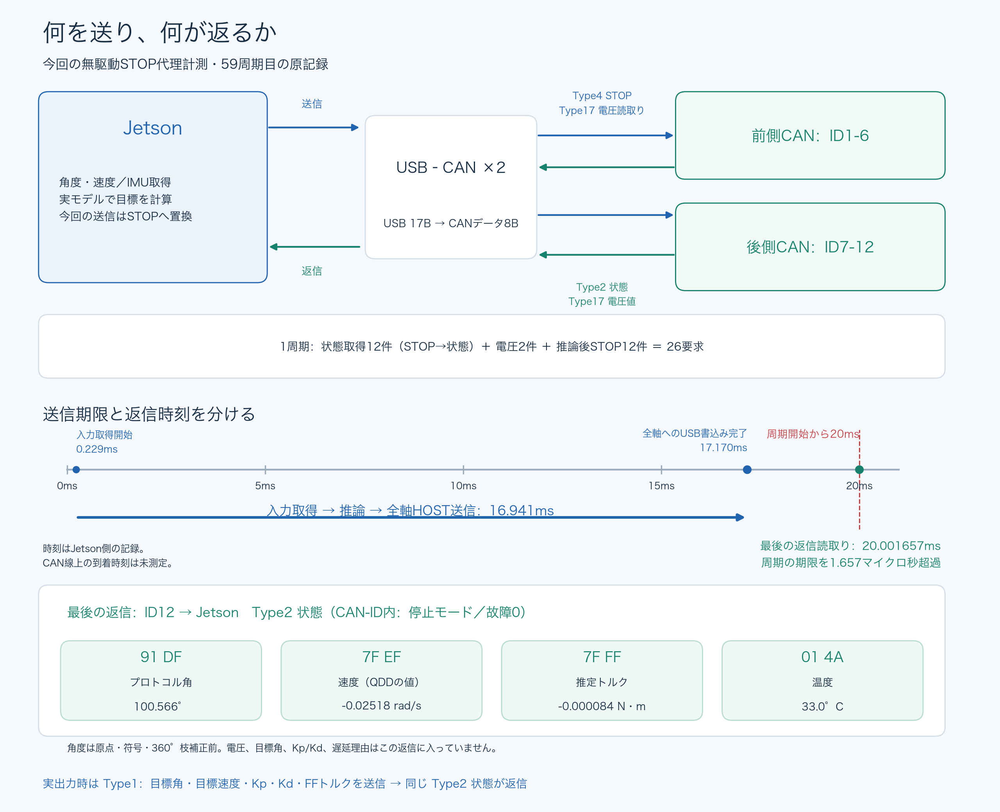

# 10月7日：箱支持2・10・30秒試験の報告

依頼された今回の2・10・30秒実出力は、いずれも未実施。10分時点の中間報告でも未実施と報告した。その後の前段診断は58周期完了後に返信の期限で停止し、再測定のSSH接続もタイムアウトした。再測定コマンドはリモートで開始しておらず、追加のモーター有効化や学習目標送信は行っていない。過去の別ソース・別起動の成功を、今回の成功には数えない。

| 項目 | ○△× | 今回の結果 |
|---|---|---|
| 現起動の識別・角度・電圧読取り | ○ | 全12軸の原返信を保存・照合 |
| ゼロゲインの通信断保護 | ○ | 全12軸で保護と終了STOPを確認 |
| 新R9ソースの無出力5周期 | ○ | 5周期完走。定常4周期最大19.590596ms。初回20.327957msを別保存 |
| 新R9ソースの無出力501周期 | × | 58周期完了後、59周期目の返信待ちで停止。完了した定常57周期最大19.695411ms。未完了周期の原通信も保存 |
| 2秒の実出力 | × | 今回は未実施 |
| 10秒の実出力 | × | 今回は未実施 |
| 30秒の実出力 | × | 今回は未実施 |
| 事前許可による2→10→30秒の判定コード | ○ | ファイル専用の生成入口を追加。既存を含む94件、最終専用16件、別担当の専用16件が成功。実機での動作成功は未確認 |
| R10ソースキット | ○ | 747ファイルとアーカイブのSHAを別担当が照合。実機配置・新ソースの再計測は未完了 |

## 59周期目の原因

入力取得開始から全12軸の最後のHOST書込み完了まで **16.941274ms**。取得・実推論・送信の20ms条件は、このSTOP代理の周期では満たしている。周期開始からの送信完了は17.170367msだった。

最後のID12返信のHOST読取り完了は、周期開始から **20.001657ms**。20ms期限を1.657マイクロ秒超過した。Pythonの停止判定は期限から69.434マイクロ秒後だった。全26要求と全12軸のSTOP代理返信は原通信に残り、故障ビットは0、停止モードだった。CAN線上の到着時刻は測定しておらず、CAN自体の遅れかUSB・HOST読取りの遅れかは断定しない。

これは学習目標の代わりにSTOPを送る無駆動計測であり、実Type1目標の送信・追従の資格には読み替えない。初回・開始間隔・完了周期・未完了周期を分けて保存し、停止結果を成功へ書き換えない。

最後のType2返信には、角度、速度、推定トルク、温度と、CAN-ID内の機体ID・モード・故障情報が入る。電圧は別のType17返信で取得する。Type2は目標角やKp/Kdのエコー、遅延理由、指令の通し番号を含むACKではない。

## 修正した内容と再開条件

無出力診断の局所角度補正を現起動の保存読取りへ結んだ際、派生校正の起動情報だけが過去の起動のまま残る不具合を修正した。元の原点・符号・原通信は変更せず、歴史情報を別に保持した。新R9の5周期で開始時の不具合が解消したことを確認した。

新R10には、ユーザーがすでに許可した箱支持2→10→30秒を扱う入口を追加した。確認の返答を再度求める代わりに、各段階の新しい読取り、同一ソースの先行実測、全12軸の原STOP返信、設定復元を照合する。将来の「音声が聞こえた」「現物異常なし」「支持が維持された」は未確認のまま保存する。

900マイクロ秒の要求間隔、window3、モデル、20ms送信期限、最大1°、学習目標0.5%、Kp3/Kd0.15は維持。新ソースの実測は未実施であり、SSH応答の復帰後に現起動・電源・姿勢と結んだ診断から再開する。箱の撤去・荷重支持・自立・歩行の成功は今回の報告に含まれない。
