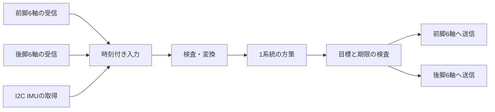

# 取得・推論・送信を20ms以内にする方針

2026-09-24。**通信の待ちを削り、1つの方策を実行し、前後2系統へ並行送信する構成を目指します。** 最新の停止中CAN単独測定は全20巡が20ms以内です。IMU・推論・指令送信を含む全工程は未達成のため、統合と短縮を進めます。再起動原因の調査は操作者指定により対象外です。

## 20msの定義

合格とする対象は「QDD・IMUの新しい入力の取得開始から、最後の関節指令の送信完了まで」です。20msごとに推論を起動できても、古い入力を繰り返し使った場合は、この目標の達成にはなりません。

各入力の要求／読取開始・完了、方策開始・終了、前後それぞれの送信開始・終了を同じ単調時計で記録します。センサー内部の変換時刻が不明な場合は、ホストの取得時刻を使った測定であることを明示します。

`serial.write()`が返った時刻はホスト側の書込み完了です。アダプター内のCAN待ちやモーターへの到着を保証しないため、ホスト書込完了・CAN線上の送信完了・対応するモーター返信を区別します。線上の送信完了を取得できない基板では、対応を確認できる返信までの時間を保守的な確認値にするか、CAN計測器で照合します。

## 時間配分の設計案

**実処理17ms以内＋余裕3ms**を初期設計案とします。以下は実績ではなく、最適化する箇所を決める予算です。実測で配分を見直しても全工程の20ms条件は維持します。

| 工程 | 予算案 | 構成 |
|---|---:|---|
| QDD・IMU取得 | 6ms | 前6軸、後6軸、IMUの3担当を並行実行。各入力の時刻を保持 |
| 入力検査・変換 | 1ms | 静的情報は開始時に検証、毎周期は動的情報を検査 |
| AI計算 | 7ms | ウォームアップした1つの状態付き方策を実行 |
| 全12軸へ送信 | 2ms | 前後バスへ並行送信、期限切れ指令は破棄 |
| 終了判定・キュー処理 | 1ms | ログのファイル書込みは別処理 |
| 余裕 | 3ms | スケジューリング・転送の揺らぎを吸収 |

取得6msは特に厳しい目標です。現在の個別読取り数・0.5ms送信間隔・USB往復のままで達成できるとは見積もっていません。要求数削減や通信経路変更までを候補に含めます。平均だけでなく最大と期限超過数を測ります。

## 根拠となる現在の実測

最新の通常CPU・無出力記録を再解析しました。実機を再計測した数値ではなく、保存された生イベントの監査です。

| 指標 | 結果 | 意味 |
|---|---:|---|
| 完了した8巡の12軸取得時間 | 中央値33.507ms、最大38.365ms | 最初の要求から最後の返信。8巡は方策計算前で、取得自体が20ms超過 |
| 設定した送信間隔 | 0.5ms | 送信完了から次の送信開始までの下限設定 |
| 実際の送信間隔の中央値 | 前1.847ms／後1.760ms | 設定値より遅い理由をCPU処理・待ちに分けて調べる |
| 1要求の往復時間の中央値 | 前4.127ms／後4.040ms | USB・基板・CAN・ホスト処理を含み、原因別には未分解 |
| IMU読取り／開始間隔の中央値 | 2.020ms／14.212ms | 読取り後の固定待ちに処理時間が加わっている |
| 取得済み入力の検査・変換・AI計算 | 13.867ms／15.391ms | h=0／h=1の各1件。純粋なAI部分だけの時間ではない |

最新tickに採用した入力の取得幅37.698msは、上の「完了8巡の中央値33.507ms」と別の指標です。2仮説の終了まで34.388msだった旧試験も、未達の結果として保存します。通信取得と計算は一部並行しているため、それぞれの値を足したものを実測の全工程時間にはしません。

## 実施順と機器変更への判断

### 1. 小さい修正を同じ条件で比較

pySerialは同じtimeout値を代入してもポートを再設定します。JetsonのpySerial 3.5でもソースを確認しました。同じ値の再設定を省く修正を用意し、変更が必要な期限直前の短縮は維持します。CANのgap0.5ms、窓4、応答照合、絶対期限は変えません。

まずCANだけを各20巡、変更前後で比較します。両方とも492要求／492有効返信、残留データなし、終了・排他解放を条件とし、取得中央値・最大と空読取り・設定呼出し・送信待ちの時間を比較します。その後にIMUを追加します。1度に複数の条件を変えません。

### 2. 待ちと計算を分けて最適化

方策側は入力コピー、検査、変換、記録用ハッシュ、tensor生成、モデル実行、結果変換を区間計測します。比較用h=0/1を別実行できるようにし、1条件の連続処理を検証します。hは負荷履歴の仮説であり、実機用の更新処理を作るまでは無出力診断です。

通信ではtimeout設定、空readを含む受信待ち、送受信処理、デコード、lock待ちを分けます。CPU処理が支配的ならその部分をC++化し、I/O待ちが支配的なら設定を一度だけ行う非同期FD＋poll/select構成を比較します。言語変更だけでUSB待ちが短くなるとは扱いません。通信担当と方策担当の競合が実測された場合に、処理プロセスやCPUの担当を分離します。

IMUは「処理後10ms待つ」構造から、絶対時刻の10ms周期を候補とします。遅れた枠のまとめ読取りはせず、元の取得時刻を保持します。I2Cの頻度増加がCANへ与える影響も別比較します。

### 3. 通信する情報を整理

位置と速度を毎周期別々に問い合わせる方法から、制御返信に含まれる両方の値を利用できるか確認します。公式SDKのoperation feedbackは位置・速度・トルク・温度を返す構成です。ただし現在のRS05には資料間の換算差があり、適用FW・倍率・更新時刻を既存のType17読取りと照合してから利用します。[RobStride公式SDK](https://github.com/RobStride/Python_Sample#api-overview)

電圧・温度などの低速監視は必要な監視頻度を決めて別周期へ分けます。位置・速度・IMUの鮮度検査や、故障通知・停止監視を削って速くする方法にはしません。

CAN側1MbpsとUSBシリアル側921600bpsは別です。現物のCAN設定を裏付ける情報を確認し、UARTを推測で1Mbpsへ変更しません。[既存の通信調査](jetson-usb2can-1mbps-research-20260922.md)

### 4. USB・基板待ちが残れば通信機器を変更

小修正と区間計測を行ってもUSB／アダプター待ちが支配的で、取得予算を満たす方法が見つからなければ、RS05の拡張CAN・1Mbpsに対応するSocketCAN機器へ比較対象を移します。LinuxのCANネットワーク経路を利用する方式です。[Linux SocketCAN](https://docs.kernel.org/networking/can.html)

同じCH340基板を追加するだけで解消するとは仮定しません。既に前後2系統化した状態で33.5msなので、基板追加はUSB経路の競合と遅延内訳を測ってから判断します。

### 5. 全工程の連続確認

無出力で入力処理・方策・指令生成を連続計測し、その後、既存の支持下の有限駆動条件で実際の送信負荷と全12軸停止を確認します。無出力試験からモーター送信時間を推定して合格にはしません。

初期の提案は10秒→60秒の有限測定です。20ms周期、最古入力から最終送信までの遅延、入力時刻差、欠測、期限超過数、停止を別々に集計します。取得と推論を非同期にする場合も古い標本の再利用を明記し、同じ遅延をシミュレーションへ反映して妥当性を評価します。

## この方針に向けて準備した変更

- 同一timeout再設定の省略：実装・回帰テスト済み。下記の実機CAN単独比較まで完了。
- h=0／h=1の単独無出力診断：実装・スケジューラーのテスト済み。既定の2条件比較と20ms判定を維持。
- observerの8区間プロファイル：実装・テスト済み。既定は無効で、入力・出力と検査を維持。

現在の2バス実行ツールへの単独仮説・区間計測オプションの組込みと実機への配置は、次の比較計測前に実施します。汎用CLIの収集部分は単一CAN構成のため、そのまま現在の機体へ適用しません。

方針作成時はSSHとpySerialソースの確認だけを実施しました。その後、操作者の「実機で早速計測」に従い、次のCAN単独比較を行いました。単独仮説・区間計測の2バス統合、連続50Hz、送信込み20msの達成は未確認です。

## 実機での比較結果（21:38 JST）

同じ起動セッションで、変更前→最適化版を各20巡実行しました。両方とも前後2バス同期、各6台、位置・速度の24項目、window4・gap0.5ms・UART921600bpsです。差分は、同じtimeout値の再設定を省く2か所だけです。モーター駆動、IMU取得、AI計算は行っていません。

| 指標 | 変更前 | 最適化版 |
|---|---:|---:|
| 最初の要求→最後の返信・中央値 | 24.221ms | 22.044ms |
| 同・最大 | 25.683ms | 23.039ms |
| 20ms以内 | 1/20巡 | 1/20巡 |
| 次巡の取得開始まで・中央値 | 25.219ms | 22.784ms |
| 要求／返信 | 492／492 | 492／492 |

**今回の中央値は2.177ms、約9%短縮しました。ただしCAN取得だけでも20msに未達です。** 変更前後各1回の短い比較で、実行順やCPUスケジューリングなどの影響を分離した因果推定ではありません。以前の33.507msはIMU等を含む別収録の監査なので、この比較の変更前値には使いません。

独立した生ログ検算で、正規のType0／17要求だけ、全12個体一致、位置・速度の各返信、元の単調時計、期限、ログハッシュ、各492返信を確認しました。記録上は残留0、両ポート終了、取得スレッド終了、共通排他解放、ログ保存も正常です。終了後の別SSH確認では同じ起動セッションで、測定プロセスの残留もありませんでした。

次は受信待ちとホスト処理を分け、設定を一度だけ行うFD＋poll/select受信や、位置・速度をまとめる返信経路の有効性を比較します。今回の短縮だけでIMU・AI・12軸送信が20msへ収まるとは判断しません。

### CAN 1Mbps・MIT方式との関係

既存の有限駆動試験は、run_mode=0を読み取ってから、位置・速度・Kp・Kd・フィードフォワードトルクを含むType1指令を送り、Type2返信を検査する方式です。MIT方式へ新しく切り替えるだけで今回の読取り待ちが消える状況ではありません。MIT方式は位置・速度のフィードバック項も使えるため、純トルク指令へ変更する必要もありません。[RobStride公式SDK](https://github.com/RobStride/Python_Sample#api-overview)

今回の492件は識別とType17の位置・速度取得だけで、現在のrun_modeやCANビットレートの確認は含みません。UART921600bpsを1000000へ書き換えても、基板のCANビットレートは変更されません。別途読取り確認したJetsonのcan0は内蔵mttcanでDOWN、2台のUSBアダプタはch341-uartのttyUSB系です。`ip link set can0 ...`は、この2台を設定するコマンドではありません。

最適化後も、write終了から次のwrite開始までの中央値は前1.195ms・後1.137ms、各巡の隙間合計は約14.35msでした。設定値0.5msより長い待ちの内訳を先に分解します。将来のType2複合返信利用では、位置と速度を別々に問い合わせる24要求＋24返信を減らす余地がありますが、駆動指令・返信の時刻関係、RS05の換算係数、停止監視を照合してから切り替えます。通信が半分になっても遅延が必ず半分になるわけではありません。

## 位置と速度を同じ返信から取得する

操作者から紹介された[EduLite 05／SocketCANの記事](https://zenn.dev/kaz1110/articles/20260810-edulite05-robstride05-socketcan)は、innomaker USB2CAN-CとRobStride公式SDKを利用した実機例です。現在のCH340経由とは通信経路が異なります。記事のCLIで`get all`と表示しても、[実装の`print_all_status()`](https://github.com/gasawara1110/edulite05-python-socketcan/blob/main/examples/interactive_motor_cli.py)は位置・速度等を別々に問い合わせています。

一括取得に使えるのは、[公式SDKのType2返信](https://github.com/RobStride/EDULITE_A3/blob/main/el_a3_sdk/el_a3_sdk/can_driver.py)です。8バイトの中に位置・速度・トルク・温度が各16ビットで格納されます。1つの受信フレームから両方を取り出せる一方、モーター内での同時サンプリング時刻は提供されません。

| 方法 | 12台分の位置・速度取得 | 留意点 |
|---|---|---|
| 現行Type17個別取得 | 24要求＋24返信 | 位置と速度を別に取得 |
| 停止中のType4→Type2診断 | 12停止要求＋12返信 | **停止命令を送る**。保持中の読み取りには使わない |
| 制御中のType1→Type2利用 | 12制御指令＋12返信で位置・速度等も取得 | 別のType17要求を省ける候補。駆動試験・入力の鮮度検証は別途必要 |

[RS05公式マニュアル](https://github.com/RobStride/Product_Information/blob/main/Product%20Literature/RS05/RS05User%20Manual260713.pdf)§4.1.3／4.1.5に基づき、最初はID1に限り、個体照合→Type17位置・速度→データ8バイトが全0のType4停止→Type17位置・速度の順で計6要求を照合します。有効化、故障クリア、原点変更、Type24自動配信、Type25プロトコル変更は含めません。停止返信の状態0・故障0と生の16ビット値を保存し、換算値は候補として扱います。

制御時はType1返信を時刻付きで収集し、次の方策入力に利用する構成を検討します。受信キャッシュを読むだけでは新しい取得にはならないため、最古データの年齢、12軸の時刻差、欠測を検査します。停止中の速度ゼロ付近だけでは速度倍率を検証できません。なお、ここでいう5パラメータのMIT方式相当制御と、Type25で切り替える別のMIT通信プロトコルは区別し、後者へは変更しません。

### ID1の実機一括返信確認

上記の6要求を実行し、Type2の1返信から位置・速度・トルク・温度の生値を取得しました。Type4は1回、停止状態0・故障0、位置の前後変化なし、残留データ0で終了。励磁・駆動・設定変更は行っていません。専用ツールの12テストはMacとJetsonで合格し、独立レビュー後に実行しました。終了後に同じ起動セッションと共通・ポート排他の再取得も確認しました。

| 項目 | Type17個別取得・前／後 | Type2一括返信 |
|---|---:|---:|
| 位置（出力軸rad、校正後関節角ではない） | 5.556276／5.556276 | 候補5.556042 |
| 速度（rad/s） | +0.002252／−0.006475 | 候補+0.038911 |
| 要求開始から一括返信まで | — | 3.321ms（1件） |

位置差は約0.01345°でした。速度差は約0.03666〜0.04539rad/sあり、読取り時刻も異なるため、倍率・フィルター・更新時刻の検証は未完了です。位置・速度を同じ返信から取得できることは確認しましたが、1台・1件の停止診断であり、12台の取得時間、動的速度換算、IMU・AI・送信込み20ms、連続50Hzの合格には使いません。次は前後2系統・12台で同じ照合を行い、速度の動的検証を経て方策入力へ接続します。

### 全12台の事前照合

続く全12台の照合では、前1〜6・後7〜12の指定ポートを使い、各台で個体識別→位置・速度→停止返信→位置・速度を取得しました。72要求／72返信、個体一致12台、全ゼロType4停止12回、Type2返信12件すべて停止状態0・故障0。生ログの独立監査に合格し、同一起動、残留0、両ポート閉鎖・排他解放を確認しました。

一括返信の位置候補と、直前・直後のType17位置との差は最大0.02630°でした。速度差は最大0.15554rad/sで、異なる時刻の静止付近の値です。全12台で1返信内の位置・速度取得は確認できましたが、速度換算・動的な更新時刻の検証は引き続き必要です。この照合は順次取得であり、周期制御の所要時間として扱いません。

### 全12台・前後並行・20巡ずつの比較

全12台の照合後、同じ比較ツールで個別取得→一括取得を各20巡実行しました。両条件とも前後6台ずつ、巡ごとの開始同期、window4・gap0.5ms・UART921600bps、取得中のファイル書込みなしです。個体識別を全12台で終えるまで取得を開始せず、一括側は全ゼロType4停止だけを送ります。通常の駆動指令は送りません。

| 指標 | Type17位置・速度の個別取得 | Type4→Type2の一括取得 |
|---|---:|---:|
| 1巡の取得時間・中央値 | 36.698ms | **18.154ms** |
| 同・95パーセンタイル | 37.669ms | 19.531ms |
| 同・最大 | 37.700ms | **20.724ms** |
| 取得時間が20ms未満 | 0/20巡 | **19/20巡** |
| 開始同期の待ちを含む中央値 | 39.076ms | 20.294ms |
| 同・最大 | 40.489ms | 23.210ms |
| 要求／返信（初期識別を含む） | 492／492 | 252／252 |

取得時間は前後両バスの最初の要求開始から最後の有効返信をホストが受信するまでです。開始同期を含む値は、2担当のうち先にその巡の同期点へ到着した時刻から最後の返信までを測っています。CAN上の直接計測やモーター内部の標本時刻ではありません。

**今回の取得中央値は約50.5%短縮しました。** ただし一括取得にも20ms超過が1巡あり、同期待ちを含む中央値も20msを超えます。IMU・AI計算・駆動指令送信を加えた20msの達成ではありません。速度換算もまだ動的検証前で、方策入力へ採用していません。

両条件とも同一起動で全20巡が完了し、残留0・両ポート閉鎖・担当スレッド終了・排他解放を記録しました。別接続で起動番号が同じこと、計測プログラムの残留なし、共通・両ポート排他を再取得できることも確認しています。比較用コードは12テストに合格しました。

これは実行順固定の短いA/B比較です。21:38のtimeout最適化比較とは計測ツール・検査処理が異なるため、当時の22.044msを今回の個別取得の対照値には使いません。今回の36.698msと18.154msが同じ比較ツールの組です。異常終了時の記録処理を修正する前の個別取得1回は予備収録として保存し、上表には修正版r2の両条件だけを使用しました。

次の短縮対象はホスト側の検査・受信待ちです。一括返信の速度換算と鮮度の検証を進め、IMU並行取得・単一方策計算・送信を接続したときにも、最古入力から最終送信までの20msを別途測ります。

## 期限付き受信の実装・実機比較（22時台）

`serial_deadline_reader.py`を追加しました。POSIXの非ブロッキングFDを`select`で待ち、次回送信の絶対時刻を通常復帰用、要求・全体の絶対期限を異常終了用に分けます。タイムアウト設定は開始時の一度だけです。受信直後の時刻を保持し、部分返信は既存パーサーへ引き継ぎます。期限超過、切断、予期しない返信は失敗扱いのままです。

pySerial自体も内部でselectを使っています。今回の変更点は「selectを初めて使う」ことではなく、相対待ち時間へ後続の確認処理が上乗せされる構造と、受信ごとのポート設定変更を除くことです。公開の単独・前後2バス読取りベンチマークで`--receive-mode select`を明示指定できます。既定値は従来の`serial`です。公開ツールの送信制限は識別Type0／パラメーター読取りType17のままです。

実機では一括返信を使う専用の有限STOP診断で、条件ごとに20巡・252要求（識別12＋停止240）を比較しました。以下はすべて**位置・速度を一括取得する同じ条件**です。

| 起動状態の確認方法 | 受信方式 | 12台取得の中央値 | 最大 | 20ms以内 |
|---|---|---:|---:|---:|
| 毎回ファイルを開閉（r3） | 従来serial | 17.611ms | 18.939ms | 20/20 |
| 毎回ファイルを開閉（r3） | 期限付きselect | 21.695ms | 27.320ms | 7/20 |
| FDを所有し毎回fresh pread（r4） | 従来serial | 13.118ms | 15.319ms | 20/20 |
| FDを所有し毎回fresh pread（r4） | 期限付きselect | **13.085ms** | **14.082ms** | **20/20** |

最初は確認コールバックの負荷で悪化したため、既存の`BootIdentityGuard`を専用診断にも適用しました。起動IDは毎回読み直し、確認頻度も落としていません。r4での受信方式だけの中央値差は約0.25%で、明確な優位とまでは言えません。各比較1回ずつ、CPU周波数や実行順序の影響を分離していないため、改善をselectだけの効果とは扱いません。

r4 selectは開始同期待ち込み中央値14.749ms・最大17.014ms、実際の巡回開始間隔中央値14.284ms・最大15.366msでした。送信完了から次送信開始までの中央値は前1.411ms／後1.272msで、設定0.5msにはまだ余分な時間があります。2スレッドのCPU時間合計中央値14.173msはCPU需要の合計で、壁時計時間ではありません。確認用preadだけでも各バス約2ms/巡のCPU時間を使います。

両条件で識別照合、全252返信、240件のType2 mode0・fault0、残留受信ゼロ、ポート・ロック解放を検証しました。最後に同一起動・計測プロセス終了・全ロックの再取得を確認しました。励磁・駆動・設定書換えは行っていません。**IMU、方策推論、駆動指令送信は測定に含まれません。今回の受信部のC++化はまだ実施していません（方策の補正計算には既存のC++版があります）。**

## 追加の高速化候補と優先順位

| 優先 | 対策 | 現状・実施内容 | 確認する指標 |
|---|---|---|---|
| 1 | ログ整形・証跡生成を周期外へ | 計測中のディスク書込みは既に除外。一方、イベントのdeepcopy、辞書生成、入力のJSON/SHA生成が残る。固定サイズのレコードを上限付きバッファへ渡し、別担当で整形する。入力のID・期限・故障判定は周期内に残す | CPU区間時間、ログ満杯時の検出、元データとの一致 |
| 2 | 起動時に決まる情報の事前計算 | UID確認は開始時に既に集約。関節の順序・換算係数・校正情報・定数テンソルを準備時に確定し、毎周期は新しい値と状態だけ処理する。動的な故障・鮮度検査は維持 | 配列確保数、入力生成時間、同一ログでの数値一致 |
| 3 | CAN・IMU・方策の非同期化とCPU競合の分離 | 並行取得の基盤は既存。採用する方策1つと一括返信を接続し、受信担当の所有する時刻付き最新値を周期側へ渡す。2条件比較用の同期待ちは運用経路へ持ち込まない | 最古入力から最終送信までの時間、入力時刻差、古い標本の再利用回数 |
| 4 | 重いCPU区間のみC++へ | 辞書・コピー・監査処理と通信待ちを分けて測る。必要なら通信・デコード・最小限の検査をC++ワーカーへまとめ、1フレームごとのPython往復を避ける | wall/thread CPU、送信可能時刻から実送信までの遅れ、出力・異常処理の一致 |
| 5 | 単一方策の推論を詰める | warmupとinference_modeは実装済み。テンソルを再利用し、CPUスレッド数・CPU割当を比較する。小さいモデルではGPU転送・同期が逆効果になる可能性があるため、CPUとGPUを実測で選ぶ | 初回を除く推論p95・最大、コピー時間、通信との同時実行時の悪化 |
| 6 | IMUの周期と読取りを整理 | 読取り時間に固定sleepが加算されない絶対周期へ。レジスタをまとめて読める箇所を確認し、I2C速度変更は対応と電気条件を確認してから比較する | 実サンプル更新間隔、読取り時間、欠測、CANとの時刻差 |
| 7 | USB経路・ハードウェアを比較 | 2アダプターは同じUSBコントローラー配下。別ルートへの接続やSocketCAN対応機器は、ソフト改善後の残る待ちを比較対象とする | 実測USB待ち、バスごとのp95・最大、欠測と停止応答 |

過去の0.25ms設定では3返信の欠落がありました。0.5msの設定をさらに縮める前に、現設定の余分な待ちと欠落の原因を解消します。受信欠落をタイムアウト短縮や判定の省略で隠しません。非同期化でも、20ms周期の起動だけを成功条件にはしません。

### 保存ログによるCPU処理の切分け

Jetson上でr4の保存ログを再生し、ファイル読込みを計測外にした純CPU診断も実施しました。1バス・6台・1巡あたりの中央値は、ATフレーム解析0.0240ms、Type2の値変換0.0342ms、イベントdeepcopy1.2944msでした。実機I/Oの計測や、そのまま削減できる時間の保証ではありません。

この範囲ではパーサーだけをC++化しても削れる時間が小さく、先にログ構造とコピーを見直します。単純な浅いコピーは参照先が後から変わる危険があるため、固定サイズ・不変のレコードや所有権移譲を使い、既存証跡との一致を検証します。動的な入力の期限・ID・故障判定は省略しません。

保存した1,199イベントでは、JSON構造専用の深いコピー候補は内容一致・内部コンテナーの非共有を検証し、約0.3082ms/バス巡でした。現行との差約0.99msはオフライン比較であり、実機の壁時計時間の改善や任意の実行時データへの適用は未検証です。

## ログのコピーと毎周期の準備の削減（22:36以降）

ログ用の汎用`deepcopy`を、組込みJSON型だけを扱う`event_snapshot.py`へ置き換えました。数値・文字列は再利用し、辞書・配列は独立したコピーを作ります。有限値、循環参照、深さ、件数、サイズの上限を検査し、不正なイベントは公開前に拒否します。キューの容量、到着時刻の確定順、停止・ログ保存失敗の扱いは維持しました。対象はCANイベント、ライブ診断の受付、ログ書込み担当の複製です。

方策側は、固定の校正データのハッシュ、関節順序・換算係数、IMU回転とバイアスを開始時に準備します。現在の入力値、入力全体のハッシュ、鮮度・角度範囲・順序の検査は毎周期行います。外部から書き換えられるテンソルや返却辞書の共有は導入していません。動的入力を古いキャッシュで代用する変更ではありません。

### Jetsonでの同条件比較

| 測定範囲 | 変更前・中央値 | 変更後・中央値 | 変更後の最大 |
|---|---:|---:|---:|
| ログ複製のCPU時間／6台・1巡相当 | 1.300ms | **0.426ms** | 0.428ms※ |
| 入力検査・変換・証跡準備、h=0 | 1.145ms | **0.522ms** | 0.604ms |
| 入力準備・推論・結果変換の全体、h=0 | 5.056ms | **4.422ms** | 4.860ms |
| 同、h=1 | 5.076ms | **4.406ms** | 4.863ms |
| 実機12台CAN取得：最初の要求→最後の返信 | 12.401ms | **12.122ms** | 15.826ms |
| 実機CAN取得：開始の同期待ちも含む | 14.244ms | **14.143ms** | 18.567ms |

※ログ行は保存した1,189イベントを10回ずつ5組再生したオフラインCPU診断で、最大も「1組の平均を1巡へ換算した値」です。実機の1巡ごとの最大時間ではありません。内容と可変コンテナーの非共有を全イベントで確認しました。コピー処理だけで約67%減少しましたが、その全量が通信実時間の短縮になるわけではありません。

方策比較は同じC++補正入りモデルを使用し、1つの保存入力の数値を50ステップ連続処理しました。h=0/1、変更前/後の計200計算で、全記録・目標・観測・内部状態が一致し、返却値や呼出し元設定を変更しても次の計算へ影響しないことを確認。時刻は比較用に20msずつ移した**保存データ再生**で、新しい実機センサー値やCANとの同時実行ではありません。CPU周波数設定は変更していません。

実機CANは両条件ともselect受信、同じ送信間隔・窓・確認処理で、変更はログコピーのみです。各20巡とも20ms以内、252要求・252返信、全12個体照合、240停止返信がmode0/fault0でした。開始同期を含めても20/20巡が20ms以内で終了。両ポート終了・残留なし・排他再取得まで確認しています。**中央値の短縮は約2.3%に留まり、最大は14.733→15.826msへ増えました。** 短い1組の比較であり、最悪時間や揺らぎが改善したとは判断しません。

関連184テストはMac・Jetsonとも合格。専用CAN比較ツール71テスト、保存入力比較ツール2テストも両方で合格しました。終了後にログ書込み担当にも同じコピー方式を適用し、記録一致・異常行での停止・flush未完了を検証しています。この追加箇所のライブ通信時間への影響は、上のCAN比較には含めません。

### 20msへ向けた残作業

今回でコピー負荷と入力準備は短縮しましたが、**QDD・IMU取得→1方策→12軸への指令送信を通した20msは未確認です。** 別々に測った中央値を合算して合格にはしません。

次はIMU並行取得と単一方策を2バスの処理へ接続し、取得開始・最古入力・方策終了・前後の送信完了を1本の記録で測ります。一括返信の速度換算は未検証の候補として区別し、Type17測定に偽装したり、過去の校正候補を実機制御用へ昇格したりしません。停止命令での通信測定は、保持・歩行中の指令送信の代替にはできません。実送信までの連続計測と期限超過時の停止確認が残っています。

### IMUとQDDの並列取得について

I/O待ちを重ねる構成は有効です。前脚6台・後脚6台・IMUを独立した常駐担当で取得し、方策側は時刻の付いた一式を短いロックで受け取ります。毎周期スレッドを作り直したり、ロックを持ったままUSB/I2Cの応答を待ったりしません。PythonスレッドはI/O待ちの並行処理に適しますが、PythonのCPU処理はGILによる競合が残るため、コピー削減と併用します。[Python公式threading](https://docs.python.org/3/library/threading.html)

既存の2バス無出力診断は、前後CANの2ワーカーとIMUワーカーを並列に実行しています。最新のCAN一括返信の比較はCANだけで行ったため、今回改善した処理をその3担当構成に接続したときの時間は別に測る必要があります。理想的な取得時間は`max(前CAN, 後CAN, IMU)`に近づきますが、実際には共有CPU・USB経路・同期の負荷が加わります。

20msを判定する際は、入力が全部揃った時刻だけでなく、採用した最古の入力の取得開始から最終送信までを測ります。最新値を読み出すだけで古いデータを使い回した周期は別に数えます。IMU約2msという以前の単独読取り値と今回のCAN約12msは別条件なので、そのまま並列取得約12msが保証されるわけではありません。

## 並列取得・単一推論・送信を接続した実機計測（22:56以降）

**全工程の実時間は、最終ホスト送信まで中央値37.780ms、返信まで40.416msで、20ms未達です。** 前後CAN・IMUを同じ開始ゲートから並列取得し、新しい12台の位置・速度とIMU入力を1つのC++補正入り方策へ渡しました。推論終了後に前後2バスを同時解放し、全12台へ送信しました。異なる単独実験の時間を足した値ではありません。

ただし、送信内容は**全ゼロの停止命令（Type4）による通信代理測定**です。推論した目標角は記録だけで、Type1の駆動指令・励磁は行っていません。生角度の継続性、校正候補、Type2速度換算、実出力範囲の確認が残るため、実際の学習目標の送信時間や歩行性能へ置き換えられません。

| 測定区間 | 中央値 | 最小〜最大 |
|---|---:|---:|
| 前後CAN・IMU並列取得 | 14.483ms | 14.004〜14.659ms |
| 入力一式の組立・生データの再検査 | 3.671ms | 3.661〜3.803ms |
| 入力検査・推論・結果変換 | 9.642ms | 9.352〜9.693ms |
| 最初〜最後の停止命令のホスト送信完了 | 9.467ms | 8.532〜10.054ms |
| **最古入力の取得開始→最終ホスト送信完了** | **37.780ms** | **37.149〜39.089ms** |
| **最古入力の取得開始→最後の停止返信** | **40.416ms** | **39.960〜41.572ms** |

3回の独立した単発計測で、20ms未満は0/3回でした。全体時間には同期・入力受渡しも含まれます。表の各中央値の合算を全体時間にはしていません。開始ゲートの解放から数えると、最終ホスト送信まで中央値38.932ms、最後の返信まで41.568msです。USB書込みが戻る時刻はCAN線上の送信完了時刻ではないため、返信までの値も併記しました。センサー内部の変換時刻は未確認で、元のホスト要求／読取り区間を保持しています。

各回で起動・ファイルハッシュ・12個体のUIDを照合し、識別12＋入力用STOP12＋推論後STOP12の36要求／36応答を検証しました。入力用と推論後の24返信はmode0/fault0、欠測補完や時刻の付け替えはありません。1つの方策を事前warmup後に1回resetし、h=0の診断仮説で1回推論しています。方策内部状態を維持した連続50Hz試験ではなく、3回という少数から最悪時間の保証もしません。

3担当は計測開始前に起動し、計測中のファイル保存は行いません。終了後に全担当のjoin、前後ポート・共通排他の解放、IMU設定の復元を確認。さらに同一起動で共通・2ポート・IMUの排他を再取得し、計測プロセスが終了していることを確認しました。CPU周波数設定は変更していません。IMUは計測用に一時設定し復元しています（専用生レポートの`frequency_setting_changed=false`はCPU設定を指します）。無駆動テストはMac16件、Jetson15件合格、保存ログ再生の1件はMacのみ実行しました。

### この計測から優先する修正

1. **入力組立3.67msを削る。** 受信時に既に検証したType2の再デコード、辞書コピー、証跡ハッシュ生成が統合境界に残っています。検証済みの固定レコードを渡し、ID・期限・故障・範囲の判定を維持したまま、重複作業と証跡整形を周期外へ移します。
2. **単独時との差を測る。** 統合時のモデル呼出しだけで中央値6.882ms、検査・変換込み9.642msでした。以前の保存データ試験の4.422msとは条件が違います。同じCPU状態・入力・開始条件で比較し、周期内のテンソル準備と待機担当の負荷を切り分けます。
3. **指令返信を次周期の入力として使う経路を準備する。** 今回は測定を明確にするため入力照会12件と送信12件を分けています。実制御では通常の状態返信を継続受信し、追加照会を減らす余地があります。前周期の返信を新しい入力と偽らず、最古入力の年齢・欠測・最終送信までの遅延を測ります。Type2換算と実出力条件の確認後に試験します。

「取得→推論→その結果の送信」には依存関係があります。同じ周期の推論を入力取得より前には行えません。前後CAN・IMU間と前後送信間を並列化した今回の結果を基準に、次は重複処理と周期間の受渡しを改善します。学習目標の実送信・期限超過時の駆動停止・連続50Hzは引き続き未検証です。
