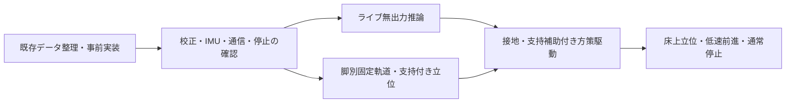

# 学習済みモデルの実機Deployまでの段取り

**9月23日の2系統CAN・4脚のL字再記録後の残作業は、[最新の実施順](deployment-next-steps-20260923.md)を参照してください。** 以下の現在欄は作成時点の履歴で、接続仕様・完了条件は引き続き参照します。

作成：2026-09-22。実測の根拠は[9月21日までの集計](hardware-results-20260921.md)と保存済みコード・記録。9月22日の新しい接続・駆動結果ではない。

**最初の実機目標は、犬のような四足立位を支持補助付きで作り、安定して保持・終了できること。その後、学習済み歩行方策へ接続する。**
事前に実装・検証を終え、現場では位置合わせと短い試験・確認に集中する。
この文書を今後の実機移行の主計画とし、[次回20分枠](hardware-test-plan-20260922.md)はその一部として扱う。

## 1. Deployの完了を4段階に分ける

| 段階 | 完了の意味 | 現在 |
|---|---|---|
| D0 配置 | 重み・対応コード・実行環境の組がJetsonにあり、ハッシュと推論結果を照合できる | 第28回Aの候補で実施済み |
| D1 ライブ無出力 | 実センサーを連続入力し、学習時の状態更新・50Hz周期で目標を作る。モーターへ出力しない | [状態を保持する無出力基盤](../runtime/POLICY_OBSERVER.md)は実装・合成入力検証済み。ライブproducer・実センサー接続・実時間50Hz検証は未完了 |
| D2 支持補助付き駆動 | 校正済みの全12軸へ限定出力し、初期姿勢への移行・保持・停止を確認する | 未実施。右前脚の固定軌道試験だけ確認済み |
| D3 床上の実用試験 | 四足立位から、短い低速前進と通常停止を反復できる | 未実施。40cm/sは後段の目標 |

モデル配置だけを起立・歩行成功とは扱わない。最初から伏せ・挨拶・お座りの切替まで一括で投入せず、四足立位と歩行の経路を先に完成させる。

## 2. 既存成果を再利用する

| 成果 | 再利用する範囲 | 次に必要な確認 |
|---|---|---|
| 全12台RS05、USB2CAN/CH340、I2C IMUの受信 | 接続・データ解読・個体照合 | 起動ごとの同一個体、現在角度、設定、エラー |
| 4脚×5姿勢の手動記録 | 原点・符号候補を作る根拠 | モデル角との一致、可動域、再通電時の角度の扱い。全20姿勢を無条件で取り直さない |
| ID11交換後の記録 | 新個体に結び付いた左後脚の候補 | 使用範囲・再通電・負荷時の値飛び。旧個体の校正を混ぜない |
| 右前脚3関節の限定駆動3回 | ID1/2/3の部位、限定条件下の動作・停止応答 | モデル符号、追従・保持。毎回同じ部位確認を最初から繰り返さない |
| 第28回A＋SwingCoreのJetson推論 | 固定した候補、変換済み推論処理、保存ログ | ライブ入力・内部状態・駆動処理との接続 |

5°指令に対する実測は約2.80〜4.63°。2段階試験の通算変位は約6.15〜6.52°で、連続10°移動の成功記録ではない。
右前脚停止後は脱力し、付け根は最後の駆動位置から約7.10°変化した。停止と保持を分けて評価する。

## 3. 課題と、解消したと判断する条件

以下の完了条件は今後の開発・試験の要求であり、すでに合格したという意味ではない。

| ID / 優先 | 明確になった課題 | 解決作業 | 完了条件・残す証拠 |
|---|---|---|---|
| R01 / 最優先 | 原点・符号は候補。ID3/9/12が候補変換でモデル範囲外 | 既存ポーズとFK・モデル図を照合し、問題の軸だけ現物で再確認 | 12軸の部位・モデル名・符号・offset・使用範囲・個体が1対1で確定。独立した角度基準で誤差を検算し、事前に決めた許容値内 |
| R02 / 最優先 | 再通電前後に約1回転分の報告角度差 | 同じ既知姿勢で起動前後を記録し、Type17/Type2の角度表現を照合 | 起動時の有効範囲を一意に判定できる。不明な枝や値飛びでは駆動を許可しない |
| R03 / 最優先 | 逐次CAN約81ms→並行読出し26.64ms。0.25ms間隔は返信欠落、駆動コードは20Hz | CAN 1Mbpsの根拠取得、受信と送信の分離、取得幅・欠落・遅延を測定。集約返信は仕様照合後に検討 | 全12軸・IMU・推論・出力処理を含む50Hz試験と、データの古さの検査が成立 |
| R04 / 最優先 | IMU加速度が約9%大きい。取付変換も候補 | 固定位置を維持し、静止基準・ジャイロbias候補・取付軸・小角度応答・姿勢推定を検証。加速度の全軸bias/scaleは未同定として分離 | 別記録で補正を検算し、機体の前後左右への傾きと回転の符号が一致。使用する角度範囲で外部基準との誤差・動作時の応答を検証 |
| R05 / 最優先 | 全12軸の停止経路が未接続。通信断の物理停止未測定 | 全軸送信管理、故障時停止、モーターwatchdog、操作者の遮断経路を統合 | 全IDの停止応答と実際の駆動解除を確認。停止要求／最終有効指令からの遅延が、事前に固定した測定方法・許容上限を満たす |
| R06 / 最優先 | 学習時の駆動制限・負荷状態が実機へ未接続。公式SDKとRS05 manualでType1/2の速度・トルク係数に差 | 適用FWの係数を確かめ、RS05へ送る目標・ゲイン・総出力制限と学習時の駆動モデルを照合 | 指令形式と単位を固定し、制限後の出力・状態更新を再現または差分をシミュレーションで再評価 |
| R07 / 最優先 | 初回モデル目標が現在姿勢から最大約45.81°離れる | 現在姿勢から検証済み立位へ移る固定軌道と、方策への滑らかな接続を実装 | 目標の飛び・使用範囲逸脱・過大追従誤差なし。途中中止を含めた記録あり |
| R08 / 脚別試験前 | FL/RR/RLは同時駆動未確認。position-v2はFR専用 | 脚別の根拠、静止判定、限定試験を準備 | 各脚の3関節で部位・指令方向・動作・停止を確認。FRの証跡を流用しない |
| R09 / 接地試験前 | 目標未到達、停止後の姿勢変化 | 移動・保持・脱力を分離し、速度・角度誤差・負荷を計測 | 使用する保持設定と出力制限を事前に固定し、反復で同じ結果を確認 |
| R10 / 脚別試験前・荷重前 | 補強部・底板・足先が学習時D17と異なる | 装着版・割れ・固定・配線・干渉は駆動前に点検。リンク寸法・機体重量・電池配置は荷重試験前に照合 | 脚別試験前の機械点検と、立位前の機体構成表・モデル差分の両方が揃う |
| R11 / セッション開始前 | 充電・SSH・カメラ・手入力で時間を消費 | 接続確認、再開可能な対話ツール、終了時の自動集計を準備 | 1回の起動から必要項目だけ提示し、失敗理由と次の1作業が表示される |

R01〜R07は学習済みモデルを実機出力へ接続する前の必須条件。R08の脚別固定軌道試験は、自身の限定条件が揃えば通信高速化と並行できる。
「進めるために閾値を緩める」「符号・原点の不整合をclipや±2π補正で隠す」は解消に数えない。

## 4. 関節・IMU・方策の接続仕様を先に固定する

### 関節

操作者申告のIDは足先側→中央→付け根の順。モデル入力候補はFL→FR→RL→RR、各脚は付け根→中央→足先側の順で、CAN順序は次のとおり。

| 脚 | 足先側 | 中央 | 付け根 | モデル入力候補順 |
|---|---:|---:|---:|---|
| 右前 FR | 1 | 2 | 3 | 3, 2, 1 |
| 左前 FL | 4 | 5 | 6 | 6, 5, 4 |
| 右後 RR | 7 | 8 | 9 | 9, 8, 7 |
| 左後 RL | 10 | 11 | 12 | 12, 11, 10 |

全体の候補順は`[6,5,4,3,2,1,12,11,10,9,8,7]`。これは[無出力診断コード](../runtime/singularitydog_hw/policy_shadow.py)の定義であり、全12軸の現物対応が検証済みという意味ではない。

- 位置：`q_model = sign × q_raw + offset`。速度：`dq_model = sign × dq_raw`。逆変換も往復検算する。
- モーターの出力軸radを用いる。ギア比を推測で追加しない。モデル関節名、軸方向、単位、offsetを1枚の表へ固定する。
- 利用範囲は「実機で確認した範囲」「モデル範囲」「周辺物・配線・自己干渉を避ける範囲」の共通部分から、試験ごとに選ぶ。
- L字は手で1脚ずつ合わせて保存すればよい。4脚同時に重力に逆らって保持する作業は求めない。
- ID3/9/12を優先して点検する。基準姿勢・軸符号・組付け角・モデル対応のどこが不一致か切り分ける。
- 既存のL字復帰差3°以内は再現性の記録で、絶対角精度ではない。基準を共有した側面写真のリンク線・水平／垂直治具・角度計などで独立に照合し、その方法の不確かさとoffset誤差を記録する。単なる目視OKを測定済みの角度へ置き換えない。

### IMU

ユーザー確認は「基板Xは犬の左、部品面は床側」。変換候補は `R_body_from_sensor = [[0,1,0],[1,0,0],[0,0,-1]]`、機体座標は前X・左Y・上Z。
基板印刷とドライバー生軸が一致するかを、前後の傾き・左右の傾き・左右旋回で検証する。
加速度のノルムを9.80665へ正規化するだけでは、約9%の偏差原因を解消したことにならない。

9月22日のユーザー指定により、**現在の固定位置を維持する**。[固定マウントの調整手順](imu-fixed-mount-20260922.md)で整定10秒＋静止30秒を2回収録し、2回目をジャイロbias候補と基準方向の検算に使う。現在姿勢を外部基準なしで水平とみなさず、一姿勢から加速度の各軸bias・scaleを確定しない。
IMUを外さず、保持方法を整えてから機体の小さな前後・左右の傾きで軸と応答を検証する。六面測定や機体の裏返しを今回の必須作業にしない。
静止加速度だけでなく、ジャイロと加速度を用いる連続姿勢推定、動作時加速度、フィルターの遅れ、取得時刻も評価する。生ノルムの偏差を監視し、候補作成に使わなかった別収録で検算してから適用する。

### 方策と駆動

初回候補は**第28回A・歩行 `model_149.pt`**。第28回では移動6方向がシミュレーションの登録基準を満たしている。
第36・37回の未合格な挨拶候補を、番号が新しいという理由で差し替えない。9動作は複数の専門方策の個別評価であり、1モデルの切替機能ではない。[選定根拠](l23-evaluation.md)

固定する一組は、重みのSHA、SwingCoreとdeploymentコードのSHA、74観測の列順・倍率・単位、12残差出力の意味、参照動作、前回出力、内部状態、dt=0.02秒、駆動制限である。
12残差を12台の角度として直接送信しない。入力不足をゼロや任意定数で埋めた無出力診断と、実機用入力が揃った制御を区別する。

観測の添字はPythonの半開区間。以下の74列と、その生成状態を連続再生で照合する。

| 添字 | 観測 |
|---|---|
| 0:3 / 3:6 / 6:9 | 機体角速度×0.25 / 機体座標の重力単位ベクトル / 速度・旋回指令 |
| 9:21 / 21:33 | 公称角との差12個 / 関節速度×0.05の12個 |
| 33:45 / 45:57 | 前回のclipped actor残差12個 / 負荷状態hの12個 |
| 57:66 / 66:68 / 68 | 指令フィルター9個 / phaseのsin・cos / bootstrap |
| 69:72 / 72:74 | yawフィルター3個 / heading errorのsin・cos |

実測の胴体並進速度・高さ・接触力は、このactorの入力ではない。未測定だからと観測列を追加しない。
ただし実機の速度・滑り・立位高さの**成績評価**には、カメラと距離目印などの外部計測を別に用意する。
指令は純並進または純旋回で、斜行・並進と旋回の同時指令は現契約の対象外。入力UIもこの範囲に限定する。
参照設定は周期0.56秒、duty0.60、足上げ0.035m、脚幅追加0.02mなど、配置済み候補の明示設定を使う。ラッパーの既定値を選び直さない。

学習時は方策50Hz・駆動評価400Hz。負荷状態`h`は温度実測ではなく、制限後のトルク履歴に基づく状態である。
実機のトルク推定・更新間隔・RS05内部制御との違いを確認し、400Hzで古い値を繰り返すだけで同等としない。
実機で同じ契約を再現できない部分は、代替方式を固定してシミュレーションで比較する。必要ならその条件で再学習する。

最初に比較する実機接続案は「RS05内部PDへ50Hzで目標を渡す方式」。ただし学習時の外部トルク制限と同等ではないため、総出力制限を実現できることと、その構成での再評価を採用条件にする。
ホストからトルクを指令する方式へ切り替える場合は、必要な制御帯域・通信・停止条件を別に設計し、20msの方策周期だけを根拠に採用しない。
どちらも未採用の設計候補であり、ゲインの数字を合わせただけで同等としない。
`h`は通常停止・指令変更・方策切替でゼロへ戻さず履歴を保つ。再起動で履歴が失われた場合の初期値・冷却待ちも先に決め、診断用の`h=0/1`を実測値へ置き換えない。実温度・電流の監視は別途必要。

通常終了は「歩行減速→検証済み立位保持→支持確認後に脱力」。異常終了は別の停止経路とする。
速度指令ゼロでもSwingCoreのphase・elapsed・残差は更新されるため、固定姿勢保持・モーター停止の代わりにはならない。

## 5. 通信と20ms周期の事前検証

CAN側は1Mbpsを目標にし、UART側の921600bpsとは分ける。すでにCAN 1Mbpsなら維持する。
現CH340基板の設定照会・変更コマンドは未確定で、SocketCANや別製品のコマンドを流用しない。[確認方針](can-readonly-timing-probe.md)

[Jetson・USB2CANの一次資料調査](jetson-usb2can-1mbps-research-20260922.md)に、現基板のUART上限921600bps、Linuxの認識確認、CAN伝送量の計算、設定確認の未解決点を整理した。CAN 1MbpsのためにUARTを1000000bpsへ変更しない。

従来の約81msは24読出し要求の逐次往復。9月22日の有限な並行試験は26.64msまで短縮したが20msは未達。0.25ms間隔で欠落したため短縮試験を終了した。[測定条件](hardware-readonly-20260922.md)。駆動コードの送信間隔5msは12軸で間隔だけでも最低55msとなり、定数を20msへ変えるだけでは成立しない。

実装は、CANを1つの処理だけが所有し、受信を継続してID・返信種別ごとに時刻付きで蓄積する方式を候補とする。
制御時点で必要な全軸が揃ったsnapshotを作り、IMU・方策・指令検査へ渡す。ログ保存は有限容量の別キューへ渡し、溢れを検出する。
キューに残った古い返信を今の時刻の観測として採用しない。Type2には要求連番がないため、遅延・重複・順序逆転の扱いを明示する。
並列要求も同じID・同じパラメーターを未解決のまま重ねない。timeout後の古い応答を再要求の応答へ付け替えない。
送信側も指令の生成時刻・有効期限を検査する。推論／制御側が止まったとき、最後の指令の再送や残留キューの追送でモーターwatchdogを更新し続けない。期限切れ指令を破棄し、停止経路へ移って明示的な新規開始を待つ。

| 試験 | 順序と内容 | 記録 |
|---|---|---|
| C0 オフライン | 分割受信、複数フレーム、欠落、重複、順序逆転、遅延、USB切断、ログ詰まり | データ採否と停止要求、他IDへの影響 |
| C1 無駆動 | Type0/17のみで短い送信間隔比較。既知の5msを基準に、失敗条件は自動反復しない | CAN設定の根拠、送受信数、欠落、RTT、取得幅、受信滞留 |
| C2 ライブ無出力 | IMU・連続推論・模擬出力検査を接続。まず60秒、通れば10分の有限計測 | 周期p50/p95/p99/最大、期限超過、各軸とIMUの古さ、推論、キュー |
| C3 出力を含む検証 | 必要な限定駆動の前提を満たした支持状態で、全12軸の実送信・返信を評価 | 指令送信幅、往復・状態の遅れ、停止時の混雑も含む |

C2の模擬出力ではUSB/CANの実送信負荷を証明できない。C3を省略して50Hzの全軸駆動成立とはしない。
CPU推論単体はウォームアップ後中央値7.13ms・最大9.33msだった。逐次実行なら残り約10.67msに通信・IMU・判定などが必要で、実際に測って成立を判断する。
初回143.60msは有効化前にウォームアップし、その後方策状態をリセットする。

**受入れ案**：有限計測内で欠落・不正返信・期限超過0件、20msごとの処理終了と必要データの鮮度が成立すること。
各軸の最大観測年齢・12軸の取得幅・IMU年齢・指令送信幅の上限は、遅延を入れたシミュレーションと実測を基に試験前に数値で固定する。未設定のまま実出力を開始しない。
これはハードリアルタイム保証ではない。pipeline化する場合は、周期だけ短く見せず、センサー取得から指令反映までの遅延を別に報告する。
性能が不足する場合はUSBブリッジ・ホスト処理を切り分け、通信経路または推論処理を改善する。学習時50Hzの方策を無検証で20Hzへ落とす回避はしない。

## 6. 停止・出力制限を1つの実行経路へまとめる

現[SafetyGuard](../runtime/SAFETY_IMPLEMENTATION_NOTES.md)は判定器であり、CAN停止送信や独立watchdogは実装しない。
現3軸runnerの100ms鮮度・80ms交換timeout・20ms書込みtimeoutは、全12軸50Hz用に検証した値ではない。
総トルク・総電流の上限も、Kp/Kdやfeed-forwardを低く設定しただけでは保証できない。

事前実装する内容：

1. 診断・校正・駆動のすべてが同じCAN所有権とlock規約を使用する。二重起動を起動前に拒否する。
2. 起動は必ず非武装。個体・校正・IMU・モデル契約・新鮮なデータが揃って初めて、今回の対象と時間に限定して出力を許可する。
3. 位置・速度・加速度／変化率・追従誤差・ゲイン・総出力・温度・電圧の上限と単位を固定する。制限が頻発する方策を「制限内だから成功」と扱わない。
4. 欠測・古い値・値飛び・NaN・故障・周期超過・操作者中断時は新しい動作指令を止める。残る全対象への停止を試み、1台の無応答で後続の停止を省略しない。
5. 各IDの新しい停止応答と、応答が得られないIDを明示する。停止通信が通らない場合は操作者による電源遮断へ移る。
6. モーター側watchdogは起動後に設定と読戻しを行い、通信断／制御プロセス停止に対する実反応を支持下で測る。停止要求→全軸駆動解除、最終有効指令→watchdog駆動解除の測定方法と許容上限を試験前に固定し、超過・判定不能なら次段階へ進まない。現在の200ms相当の読戻しを物理停止の証明にしない。
7. SSH切断・制御プロセス停止・再起動を含めて自動再有効化しない。再開は原因と現在状態を確認して新しい試験として行う。

状態遷移は、`DISARMED → READ_ONLY → READY → POSITION_TRANSITION → HOLD / POLICY`を基本とする。
通常終了は検証した`HOLD`へ戻し、支持確認後に`DISARMED`へ。異常は`FAULT`へ固定し、原因確認・非武装化を経て新規に開始する。これは今後実装する統合仕様である。
現場へ渡す制限設定には、各軸の位置・速度・変化率・追従誤差・出力、機体傾き、電圧・温度、観測の古さ、通信・停止期限を明示する。未設定や単位不明が1件でもあれば該当する駆動段階を開始しない。

通常停止・異常停止とも、脱力すると機体が下がる。支持治具・電源遮断・モーターの駆動解除が、それぞれ何を止め、何を保持しないかを試験記録に分ける。

## 7. 現場の前に作り終える成果物

以下は**準備するものの一覧**であり、完成済みコマンドの一覧ではない。

| パッケージ | 担当 | 作るもの・完了条件 |
|---|---|---|
| P1 校正整理 | 開発側、必要箇所のみ操作者 | 既存20姿勢の判定表、12軸対応表、ID3/9/12の不一致図、再確認対象を限定した案内 |
| P2 IMU | 開発側＋操作者の静止・機体方向確認 | 固定状態の静止基準2収録、ジャイロbias候補の検算、装着したままの取付軸・小角度応答・姿勢推定のテスト |
| P3 通信 | 開発側 | 単一所有者・継続受信・時刻管理、無駆動ベンチ、異常注入テスト、測定報告 |
| P4 モデル接続 | 開発側 | 固定モデル一式のmanifest、観測／出力仕様、状態を維持した再生一致、hと駆動制限の差分報告 |
| P5 限定駆動 | 開発側 | 他3脚対応、連続軌道、全軸停止、watchdog確認、総出力制限、初期姿勢への接続 |
| P6 対話ランナー | 開発側 | 共通検査→今回必要な1脚→停止→操作者OK→次脚。中断地点・不成立理由・結果を保存 |
| P7 機体差分 | 操作者が現物確認、開発側が反映 | 装着STL版、機体重量、リンク・電池配置、配線と破損点検、モデルとの差分 |
| P8 配置・復帰 | 開発側 | 版別フォルダー、ハッシュ、依存環境、前版へ戻す手順、起動時非武装、終了サマリー |

独立して進められるP1/P2/P3/P4/P7を並行する。P5/P6は検証済みの共通部品へ接続し、実機CANは常に1つのツールだけが操作する。
オフラインで済むデータ照合・故障注入・モデル変換を、操作者が待つ実機時間に持ち込まない。

## 8. 実機試験の順序と時間枠

時間は**準備済みの場合の目安**。異常がある状態で予定時刻を優先して次へ進めない。

| 回 | 前提・実施内容 | 操作者にお願いすること | 到達点 |
|---|---|---|---|
| A 無駆動確認 | P1〜P4の準備後。接続・個体・電圧・再起動情報→CAN基準計測→必要な校正だけ→固定IMUの基準確認→ライブ無出力 | 指定した脚と機体の基準姿勢を確認。IMUの取り外しや全4脚のL字保持は不要 | R01〜R04の計測とD1。静止基準だけではIMU軸・角度検証完了にしない。通信不調は別枠で扱う |
| B 脚別20分枠 | 他脚用設定・停止処理を配置済み。共通3分→FL/RR/RL各3分→条件付きFR連続軌道5分→集計3分 | 冒頭に支持・離隔・手離し・即時Offを確認。各脚終了後に1回OK／異常 | 残り3脚の限定駆動・停止。全脚RLではない |
| C 固定した立位 | 全12軸校正・停止・出力制限・干渉、IMU軸と傾き監視、固定軌道専用の12軸周期・鮮度を検証済み。脚を浮かせて軌道を確認後、足接地と胴体支持を整える | 支持状態を変更するときに確認。初回は機体荷重を補助 | 小さい区間で立位へ移行し、保持と脱力を別々に測る |
| D 方策接続 | D1、全軸実送受信周期、学習時駆動との照合、初期姿勢接続が成立 | 支持補助と遮断担当。各短時間試験の状態確認 | 最初2秒→5秒→10秒を候補に、結果ごとに延長。D2を評価 |
| E 床上 | D2の反復・通常停止と異常時対応が成立 | 開けた平坦面、支持補助、観察 | 立位→検証した低速指令で短距離前進→通常停止。D3を評価 |

C/D/Eの時間・姿勢・ゲイン・出力・傾き・追従誤差などの上限は、前段の実測とシミュレーションで試験前に固定する。
Cの固定立位は、専用に検証した低頻度の制御方式でDの方策50Hzより先行してもよい。ただしFR専用20Hzの12軸への単純拡張は不可。
上記2/5/10秒は延長手順の案であり、現在実行可能な設定ではない。
足が浮いた試験は、符号・出力経路・制限・停止の確認に使う。接地を想定する歩行方策の立位・歩行品質は、足接地と荷重条件を合わせて評価する。
低速の速度値も先にシミュレーションで成立を確認する。40cm/s指令の出力を単純に縮小して低速歩行としない。

## 9. 各回の合格・中止・再開を短く判断する

- 開始画面：今回の対象、目標、最大時間、使用版、未解決項目を1画面に表示。前提を満たさないときは駆動しない理由を具体的に出す。
- 実行中：新鮮なデータだけで判定する。通信再試行や繰り返しで都合のよい成功窓を選ばない。
- 正常終了：全対象の停止結果、指令と実測、保持誤差、最高速度・電流・温度、通信・周期、操作者所見を自動保存する。
- 不成立：その段階で停止し、原因を通信／校正／機械干渉／追従／姿勢推定／モデル差分へ分類。修正対象と再試験範囲を1つずつ決める。
- 再開：同じ構成で確認済みの部分は再利用する。再接続だけで過去の未完了駆動を再開しない。

| 変更・イベント | 再確認する範囲 |
|---|---|
| Jetsonまたは40V電源の再投入 | 個体・角度の表現・watchdog・モード・現在姿勢・新鮮な観測。方策状態は新規初期化するが、hは履歴／検証済みの再起動規則で扱う |
| モーター交換／ID変更 | 対象関節の個体・部位・符号・offset・範囲・停止。影響する脚の再試験 |
| IMUの取り外し／再取付 | 取付回転・軸符号・静止検算。必要なら補正も再取得 |
| CAN処理／速度／アダプタ変更 | 周期・欠落・時刻対応・全軸停止・通信断応答 |
| モデル／観測／フィルター／ゲイン／h更新の変更 | 接続契約・再生一致・シミュレーション比較・ライブ無出力から再確認 |
| 部材・足先・電池位置・質量の変更 | 可動域・干渉・荷重経路・質量モデル。必要な動作だけ再評価 |

写真・カメラ映像・個体UID・生ログ・接続情報・重みは非公開の記録へ保存する。公開する集計は元データの版・時刻・判定根拠と紐付け、実機の成功とシミュレーションの成功を分ける。

## 10. 直近の着手順

1. 既存20姿勢を整理し、12軸対応表とID3/9/12の再確認リストを作る。同時にモデル一式の契約を固定する。
2. 通信の単一所有者・無駆動比較・ライブ無出力経路を実装し、20msのどこに時間を使うか測れるようにする。
3. IMU補正と取付方向を実測で確定し、関節候補の不足だけを現物で補う。
4. 他3脚の限定試験・全軸停止・通信断・初期姿勢移行を検証する。
5. 固定した立位保持から方策へ接続し、支持補助付きの短い試験、床上の低速前進・停止へ進む。

次のGPU作業は、実機との差分や通信遅延、初期姿勢・低速指令・駆動制限の影響を評価するために使う。
追加学習が必要になった場合は、改善対象と比較条件を固定して実施し、学習回数の増加を実機接続の未解決項目の代わりにしない。

関連：[実機集計](hardware-results-20260921.md) · [推論環境](model-environment-20260921.md) · [通信計測](can-readonly-timing-probe.md) · [校正ツール](../runtime/CALIBRATION.md) · [既知問題](hardware-known-issues.md)
