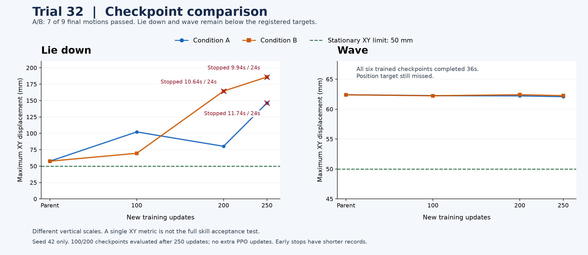

# 第32回 L27：親の動作を保つ報酬と位相別コストの比較

2026年9月14日15:11:45 JSTに、A/B両条件の学習と全評価が正常終了しました。各条件500更新（伏せ250・挨拶250）、計1,000新規主更新。API動作確認8更新は別集計です。移動・伏せ・挨拶・お座りの4専門方策を個別評価した結果で、単一方策の9技能習得ではありません。

**技能合格はA/Bとも7/9で、伏せと挨拶は未合格です。** 保持した移動6動作とお座りは合格を維持しました。技能達成とジョブの正常終了は別の結果です。

## A/Bの比較条件

| 条件 | 共通変更 | 追加の比較対象 |
|---|---|---|
| A | 同じ観測で凍結親actorとの行動差を報酬コストにする | なし |
| B | Aと同じ親・学習率・探索・予算 | 伏せ下降時のXY/yawコスト、挨拶の支持移動時のXY速度コスト |

同じseed42・256並列環境・32step/updateを使用。親actorの平均を継承し、criticとoptimizerは初期化しました。評価時の位置50mm・方位5°などの基準は変更していません。これらの静止動作基準は、移動方向ごとの歩行基準とは別です。

## 最終250更新モデル

| 条件 | 動作 | 収録秒 / 要求秒 | 最大XYずれ | 最大yaw変化 | 禁止接触サンプル | 合否 |
|---|---|---:|---:|---:|---:|---|
| A | 伏せ | 11.74 / 24 | 146.39 mm | 11.47° | 4 | 未合格 |
| A | 挨拶 | 36.00 / 36 | 62.08 mm | 4.74° | 0 | 未合格 |
| B | 伏せ | 9.94 / 24 | 185.92 mm | 10.12° | 6 | 未合格 |
| B | 挨拶 | 36.00 / 36 | 62.25 mm | 4.81° | 0 | 未合格 |

## 保存モデルの比較

下表は250更新の学習終了後に100・200更新時点の保存モデルを評価した結果です。中間評価のための追加PPO更新は0です。位置ずれの合格基準は50mmで変更していません。

| 動作 / 条件 | 親 | 100更新 | 200更新 | 250更新 |
|---|---|---|---|---|
| 伏せ A | 24.00秒 / XY 57.52mm | 24.00秒 / XY 102.14mm | 24.00秒 / XY 80.24mm | 11.74秒 / XY 146.39mm |
| 伏せ B | 24.00秒 / XY 57.52mm | 24.00秒 / XY 69.53mm | 10.64秒 / XY 164.43mm | 9.94秒 / XY 185.92mm |
| 挨拶 A | 36.00秒 / XY 62.39mm | 36.00秒 / XY 62.25mm | 36.00秒 / XY 62.21mm | 36.00秒 / XY 62.08mm |
| 挨拶 B | 36.00秒 / XY 62.39mm | 36.00秒 / XY 62.23mm | 36.00秒 / XY 62.41mm | 36.00秒 / XY 62.25mm |

伏せはA100が24秒を完走し、姿勢・復帰保持を保ちましたが、最大XYずれが約102mmで未合格です。A200では方位と復帰姿勢も悪化し、A250・B200・B250では禁止接触で早期終了しました。更新数を増やすほど良くなる傾向ではありません。

挨拶は100・200・250更新の全6評価で36秒を完走し、手の上げ下げ・往復・復帰保持は成立しました。残る不合格は位置ずれです。最小のA250も約62.08mmで、親の約62.39mmから約0.31mmの変化に留まります。単一seedの微小差を改善の確証とは扱いません。

A/Bの親は第30回Cの伏せと第30回Aの挨拶です。第31回Aの学習済みモデルを継続学習した実験ではありません。第31回Aの挨拶最大XY約61.52mmも上回っており、今回の追加報酬が位置ずれを解消したとは言えません。

次の検討では、伏せの完走・復帰を維持する保存モデルを比較基準にし、下降中の位置ずれと復帰後の崩れを分けて扱う必要があります。挨拶では持ち上げ前後の支持移動の位置ずれを優先します。今回のモデルの実機採用・追加学習は実施していません。

## 9動作の最終評価

| 動作 | A | B | 要求時間 | 今回の新規更新 |
|---|---|---|---:|---:|
| 前進 | 合格・12.00秒 | 合格・12.00秒 | 12秒 | 0・保持 |
| 後退 | 合格・12.00秒 | 合格・12.00秒 | 12秒 | 0・保持 |
| 左移動 | 合格・12.00秒 | 合格・12.00秒 | 12秒 | 0・保持 |
| 右移動 | 合格・12.00秒 | 合格・12.00秒 | 12秒 | 0・保持 |
| 左旋回 | 合格・12.00秒 | 合格・12.00秒 | 12秒 | 0・保持 |
| 右旋回 | 合格・12.00秒 | 合格・12.00秒 | 12秒 | 0・保持 |
| 伏せ | 未合格・11.74秒 | 未合格・9.94秒 | 24秒 | 250/条件 |
| 挨拶 | 未合格・36.00秒 | 未合格・36.00秒 | 36秒 | 250/条件 |
| お座り | 合格・32.00秒 | 合格・32.00秒 | 32秒 | 0・保持 |

前進は始動込み12秒平均 **41.0764cm/s** を維持しました。合否は現在の登録評価の `skill_acceptance` に基づき、`walking_acceptance` は旧評価器が常にfalseを入れる固定フィールドで、今回の合否計算には使いません。歩行の合格には `all_development_targets_met` と追加400Hzゲートの全成立が必要です。

## 回収・検証と公開範囲

A/B各75件の元JSON、親・最終36評価、学習後の中間8評価をSHA付きで照合しました。最終4モデルは手元でCPU読み込み・保存テンソルの有限性・250更新/iter249・actor89/critic122を確認済みです。中間8モデルは保存記録とSHAの一覧確認までで、本体のローカル再読み込みとは区別します。

伏せ・挨拶の100/200/250更新の計12記録は400Hz原配列から凍結評価器で再計算し、判定と件数が元の結果と一致しました。移動6方向とお座りは元summaryとSHAの照合で、この12配列の再計算には含めません。

[集計JSON](../evidence/l27-evaluation.json)には16チェックポイント比較行（親4＋学習済12）、親・最終36評価、モデル4本のSHAと検証範囲を収録しています。原配列・重み・CAD/STL・私物写真・接続情報は同梱していません。内部成果物のSHAは来歴の手掛かりで、この公開データだけで実験全体を再現できるものではありません。

第32回の動画は未回収・未掲載です。比較図は集計値から描いたチャートで、シミュレーターの録画ではありません。最新の公開動画は[第31回A/B/C](l26-evaluation.md)のまま、公開実録画・比較MP4は47本です。

学習時の物理入力はD17・8.13960048kgです。その後のPLA補強やFusion更新は今回の学習に適用していません。伏せ・挨拶は未合格で、実機向けの採用判断は保留です。

[現在地](current-status.md) · [32回の実行・評価履歴](improvement-loops.md) · [第31回](l26-evaluation.md) · [第30回](l25-evaluation.md)
