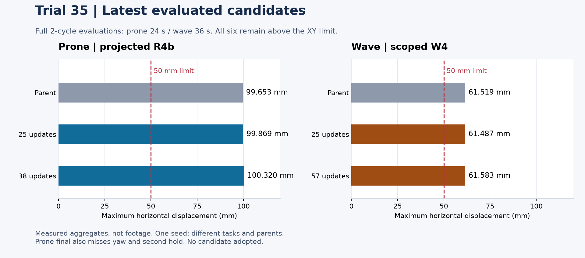

# 第35回 L30：位置ずれが残る理由を調べ、短い修正試行を比較

2026年9月15日19:35:46 JSTに最後の挨拶W4の評価を終了しました。第35回は伏せ5試行・挨拶4試行を順に確認し、実行した主更新は**277、別枠のAPI動作確認は14更新**です。事前確認で止まった試行や制御不具合も含めて記録します。最初の75更新計画を一つの方策で完了した結果ではありません。

**伏せ・挨拶とも新規合格モデルは得られず、採用していません。** 第33・34回で保持した移動6方向とお座りを置換せず、第35回の新候補で9動作全体を再評価したとも扱いません。

## 第33〜35回で改善した点と、改善しなかった点

| 回 | 実施した修正 | 分かったこと |
|---|---|---|
| [33](l28-evaluation.md) | 動作の位相ごとの追加コスト、各250更新 | 伏せB100は保持・復帰を維持したが、200・250更新では伏せ・挨拶とも接触停止。長く学習すれば改善するとは限らない |
| [34](l29-evaluation.md) | 学習率・探索幅を縮小、親の出力を保つ損失、各100更新 | 全12保存点が2周期完走。挨拶Bは親に近い動作を保ったが、位置ずれは約61.5mmのまま。伏せは第2保持が短くなった |
| 35 | 保持への移行・教師目標・探索分布・探索する関節を個別に変更 | 実2周期を経験できる学習環境は増えたが、最終評価の位置ずれを解消できなかった |

## 最新候補の親・保存点比較

| 最終候補 | 主更新 | 評価全長 | 最大XYずれ | 最大yaw変化 | 保持・復帰と未達 |
|---|---:|---:|---:|---:|---|
| 伏せ・教師投影R4b | 38 | 24秒 | 100.320mm | 5.120° | 第2伏せ1.9725秒、四足復帰2秒×2。XY・yaw・第2保持が未達 |
| 挨拶・探索範囲限定W4 | 57 | 36秒 | 61.583mm | 4.580° | 150mm挙上4秒×2、2往復×2、四足復帰2秒×2。XY50mmのみ未達 |

上表の最終決定論評価は、禁止接触・実関節速度超過とも0です。学習中の探索では違反があり、これとは別に集計します。四足復帰は接地・高さ・姿勢の成立で、元の位置への復帰ではありません。

## 伏せ：5試行の結果

| 試行 | 変更 | 主更新 / API確認 | 結果 |
|---|---|---:|---|
| 初期案 | 保持倍率への移行を平滑化 | 0 / 0 | 親の事前評価で方位条件が不成立、後続を開始せず |
| R2 | 左右ペアの補正 | 0 / 0 | 事前評価XY69.110mm・yaw22.049°。保持・復帰は維持したが方位条件で停止 |
| R3 | 共通の補正 | 25 / 2 | XY100.635mm・yaw5.089°。第2保持1.970秒、改善なし |
| R4 | 指令に反応できるhipの教師目標を境界へ投影 | 0 / 2 | API確認の16環境を256環境として照合する制御不具合で停止 |
| R4b | R4と同じ学習ソース、環境数の検証を修正 | 38 / 2 | 全256環境が実2周期を経験。最終評価は上表のとおり未達 |

伏せ計63主更新・API確認6更新です。R4の失敗を消さず、R4bは別の実行として保存しています。R3親からR4bの初期動作が変わっていないことも、原配列で確認しました。

伏せは第1下降中の位置ずれ、接地した足の移動、初期の関節指令が制限で変わらない区間を分けて診断しました。2周期を学習できても、それだけで横ずれが減るわけではありません。保持時間の不足も、連続2秒という400Hzの元基準で残しています。

## 挨拶：4条件とも動作を維持したが、位置はほぼ変わらなかった

| 試行 | 変更 | 主更新 / API確認 | 最終最大XY | 親からのXY差 |
|---|---|---:|---:|---:|
| W1 | 飽和した教師目標を境界へ投影 | 50 / 2 | 61.506mm | −0.013mm |
| W2 | 投影対象の損失だけ4倍 | 50 / 2 | 61.468mm | −0.050mm |
| W3 | 親を基準に探索分布の平均を指令境界へ移す | 57 / 2 | 61.541mm | ＋0.022mm |
| W4 | W3の可変平均・探索を挙上前の支持9関節へ限定 | 57 / 2 | 61.583mm | ＋0.064mm |

共通親31A250は61.518749mm。挨拶計214主更新・API確認8更新です。数値最小のW2と、最新のW4は別のモデルです。どの差も課題を解消する大きさではなく、単一seedの微小差から優劣を断定しません。親自体もXY50mm基準は未達です。

W1/W2では、損失が作用しても指令を上限内に収めた後の値が変わらない区間がありました。W3/W4では実際の最終関節目標にも小さな変化が届いており、下流の制限ですべて消された、あるいは親保持損失が支配した、という説明は記録から支持されません。W4の最大位置ずれ付近の支持関節目標差は平均約0.000323radでした。

探索範囲を限定したW4では、実36秒到達が**W3の1/256から194/256環境**へ増えました。残り62環境は24.12〜30.08秒に途中終了しました。学習中の禁止接触は1,128→258 lane-substep、速度超過は9→1 joint-cellへ減少。これらは異なる単位で、転倒回数ではありません。256件の終了をすべて失敗とは数えず、個別の終了理由は未記録です。

## 第36回へ持ち越す課題と修正方針

1. **実際に位置ずれを減らす補正方向を調べる。** 同じ親の全24秒／36秒評価で、位相と支持関節を限定した小さな正負の介入を比較します。生の方策出力だけでなく、最終関節目標・接地中の足の移動・機体XYの変化を確認してから学習対象を決めます。
2. **伏せの第2保持を守る。** 保持と復帰を成立させる親を比較基準にし、下降時の横ずれ対策が荷重分担や方位を壊さないかを400Hzで評価します。左右補正を一律に縮める案の再実行だけで済ませません。
3. **挨拶の探索範囲制限を基盤候補にする。** W4の対象外の親動作保持を残し、位置保持報酬と有効な指令の感度、親保持損失を掛ける範囲を確認します。過去に未達だった支持移動幅の単純短縮を、そのまま繰り返しません。
4. **保存点と終了理由を記録する。** 主更新とAPI確認を分け、途中モデルにも元の2周期評価を適用します。実周期の到達、PPO・親保持損失の勾配、学習中の終了理由を記録し、十分な経験と動作の維持を確かめてから更新数を増やします。

第36回は利用者から9月16日いっぱいのGPU利用許可を受け、修正・起動準備中です。この第35回の結果公開の時点では、第36回の学習開始や成功はまだ確認していません。合格基準を緩めず、新たな実測結果で採否を判断します。

## 検証と公開の範囲

学習完了6試行と、事前停止2件・制御停止1件の原記録を照合しました。最新R4bは37ファイル、W4は36ファイルをSHA・サイズで回収・正式検証し、保存モデルとoptimizer回数、元の評価値を確認済みです。最新各3動画は全9,000フレームを復号して代表フレームを目視しました。終端reset画像は成功根拠から除外しています。

[選択値・全試行・根拠SHA](../evidence/l30-evaluation.json)を公開します。図は集計値の可視化で、新しいシミュレーター動画はこの更新に含めません。公開動画の最新は[第31回A/B/C](l26-evaluation.md)です。重み・原配列・私物写真・接続情報は公開していません。

W3/W4は学習した学生モデルだけで再現できず、固定親・変換処理・契約との組が必要です。学習形状は固定D17で、最近のPLA補強・共通底板を遡って反映した結果ではありません。新規2動作の合格、9動作の連続切替、外乱への頑健性、実機投入は未確認です。

[第33回](l28-evaluation.md) · [第34回](l29-evaluation.md) · [現在地](current-status.md) · [学習履歴](improvement-loops.md)
