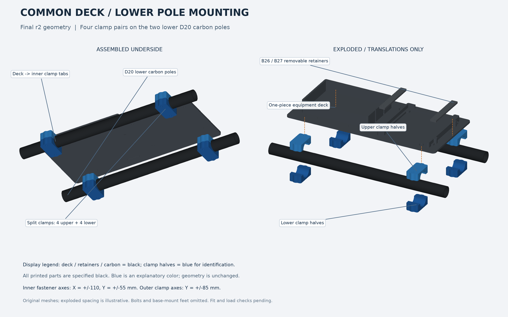

# 黒い共通底板 r2：Jetson・Makitaと下段ポール固定

2026-09-15、JetsonとMakita 40Vの固定枠を同じ底板へ一体化し、Jetson側のねじ穴を再確認しました。下段φ20カーボンポールへ取り付ける上下クランプ4組もまとめています。

**[全STL・組立手順ZIP](printing/common-deck-k1max-r2/FaBoRobotDog_Black_Deck_and_PoleClamps_K1Max_r2_public.zip)** · [詳細な部品表・ねじ一覧](printing/common-deck-k1max-r2/README.md) · [確認結果JSON](printing/common-deck-k1max-r2/validation.json)

| 印刷するもの | 数量 | 寸法 mm | 中実PLA換算 |
|---|---:|---|---:|
| [共通底板 r2](printing/common-deck-k1max-r2/printable_mm/common_equipment_plate_K1Max_r2_mm.stl) | 1 | 280×130×26 | 219.44g |
| Jetson上押さえ B26/B27 | 各1 | 各11.2×78×3 | 合計約6.36g |
| 下段クランプ B17～B24 | 各1、4組8部品 | 各40.96×22×12.75 | 合計70.63g |

クランプは[8個の配置済みSTL](printing/common-deck-k1max-r2/optional_plates/CLAMPS_ONLY_8parts_black_mm.stl)もあります。個別版とどちらか一方を使用します。11部品の合計296.43gは密度1.24g/cm³の中実計算で、実際の材料量や印刷時間ではありません。

全品黒PLA、Creality K1 Max用、mm・100%倍率です。底板は平面を下、クランプは溝を上にした姿勢です。クランプと上押さえは従来と同形状のため、適合する印刷済み品は再使用できます。

## 修正した箇所

- Jetson側の底板固定2穴は、穴の軸が通っていても頭・ワッシャーが枠に当たっていました。直径8.4mmの逃げを上側へ設け、公称3.4mmの貫通穴と床厚3mmを保持しました。
- 以前の別体Jetson棚を床に固定する4穴・皿座は、一体型では不要なため埋めました。
- 上押さえ4穴は、押さえ・支柱・底板の同軸とM3の実体通過を確認しました。元の0.2mmの組立隙間を詰める位置で、厚さ6.5mmの端部包絡との接触を確認しています。実基板の締付保持力を保証したものではありません。

Makitaは118×78×60mm・687g、側壁20mm、ベルト2本の条件です。機器取付条件は利用者の測定値・指定値で、購入品のあらゆる型式への適合を意味しません。

## 下段ポールとの固定

ポール中心は左右Y±70mm・高さZ−60mm、クランプは前後X±110mmです。底板4穴はX±110/Y±55mmでクランプ内側と同軸になります。

底板とクランプ、本体脚部をM3×45の4本で共締めし、クランプ外側はM3×40の4本、Jetson上押さえはM3×20の4本を使う寸法案です。各ねじに上下の外径7mm・厚さ0.5mmワッシャーと、二面幅5.5mm・高さ2.4mmナットを想定しています。詳しい位置と部品対応は[組立手順](printing/common-deck-k1max-r2/README.md)に記載しました。ポールへの穴開けは不要です。

底板を先に取り付け、その後Jetsonを載せます。新しい留め具を既存クランプへ重ねず、同じ位置の4組を使用します。本体側のB02/B04/B06/B08は追加補強形状で照合しましたが、それら4部品のSTLはこの電装キットには含みません。

## 確認済みと残る確認

Jetsonの9項目の幾何検査、下段固定8本のねじ・頭・ワッシャー・ナットの静的干渉、STLの閉曲面・部品数・寸法・元データとの一致を確認しました。上押さえ4本の金具も検査しています。印刷用12ファイルは「個別11部品＋クランプ8個の配置済み代替1ファイル」です。

**現物の嵌合、実際のJetsonの部品・USB端子周辺、PLAの荷重強度や長時間変形、全関節姿勢、スライスは未検証です。** このSTL修正をFusion本体や強化学習用モデルへ反映したとは扱いません。

STLと組立図は提示済み成果と同じバイト列です。公開ZIPは17個の公開ファイルから新たに作成し、個人の絶対パスを含む内部監査記録は選択値の要約に置き換えました。提供写真、編集可能なCAD、機器本体モデル、重みや接続情報は含みません。[公開manifest](printing/common-deck-k1max-r2/manifest.json)と[公開台帳](../evidence/print-publication.json)でSHAを確認できます。
