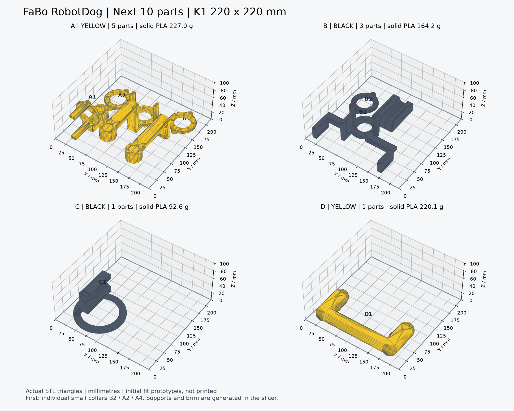

# 追加の印刷STL：左前脚・顔支持・取手

追加10部品を、Creality K1向けの個別STLと色別4プレートで公開します。前回のモバイル・Makita・Jetson固定具9部品との重複はありません。

**[10部品のSTL ZIPをダウンロード](printing/next-10-parts/FaBoRobotDog_K1_Next_STL_10parts.zip)** · [印刷手順](printing/next-10-parts/README_追加10部品の印刷.md) · [寸法・中実PLA重量CSV](printing/next-10-parts/parts_and_solid_PLA_mass.csv)

|プレート|内容|部品数|中実PLA換算|
|---|---|---:|---:|
|A・黄|左前の可動脚|5|227.0g|
|B・黒|Body側マウント・カラー、顔上クランプ|3|164.2g|
|C・黒|顔の背面支持台|1|92.6g|
|D・黄|取手|1|220.1g|

合計703.7799gはSTL体積×1.24g/cm³の中実換算です。インフィルや支持材込みの実消費量・実測重量ではありません。

全STLはmm・倍率100%で、K1の220×220×250mmに収まり、部品にはベッド端から5mm以上の余白があります。配置済プレートと同じ個別STLを同時に読み込まないでください。個別10部品と4プレートは同じ部品の読み込み方法の違いで、合計14部品ではありません。

まず**小カラーB2（黒）、A2・A4（黄）**を個別に印刷し、モーター端・ねじの適合を確認します。脚本体と顔支持台は支持材を使用し、積層プレビューを確認してください。詳細な姿勢と支持箇所は[印刷手順](printing/next-10-parts/README_追加10部品の印刷.md)に記載しています。

閉曲面・面向き・単一連結、元形状との単位・正回転・頂点照合、プレートの配置とSHAを検査しました。**現物適合・締結強度・取手の耐荷重は未確認**です。残り3脚21部品や構造固定具は後段とし、今回のZIPには含めません。これは完成一式や量産用の認定部品ではありません。

[公開manifest](printing/next-10-parts/manifest.json)と[個別公開台帳](../evidence/print-publication.json)に、14 STLと公開ZIPの内容・サイズ・SHAを登録しています。公開する形状は指定された自作の印刷部品に限り、写真・CAD原本・機器本体モデル・学習用ファイルは含めません。
