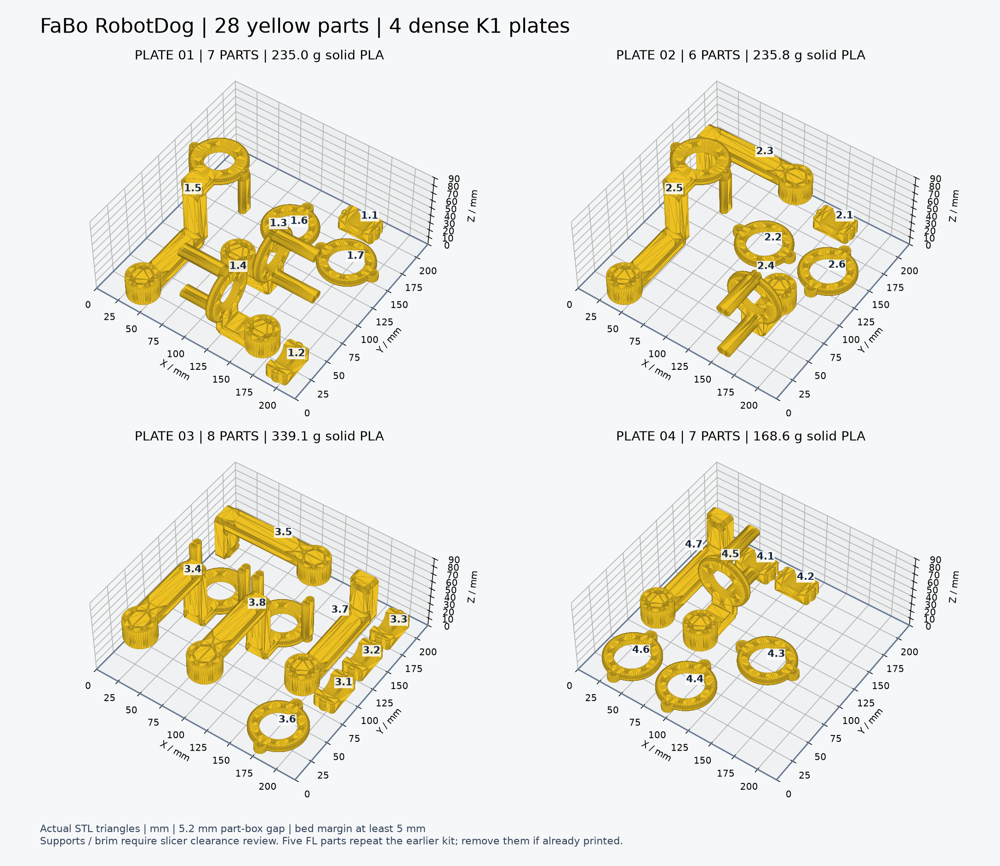
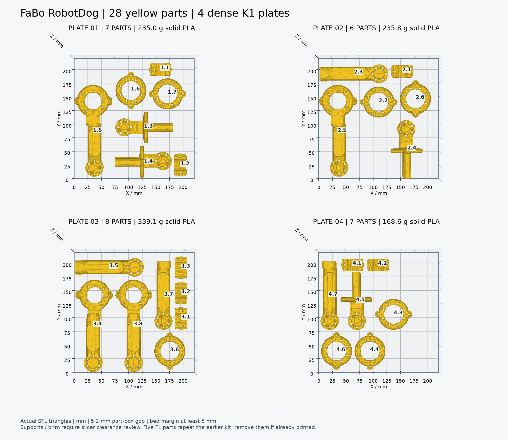

# 黄色28部品：密配置の印刷STL

4脚の可動黄色部品20個と、上側D20カーボン管クランプ8個を4枚へ配置しました。**7・6・8・7個／枚**で、従来の黄色脚プレート5個より増やしています。

**[黄色28部品のSTL ZIP](printing/yellow-dense/FaBoRobotDog_K1_Yellow_Dense_28parts.zip)** · [印刷手順と部品表](printing/yellow-dense/README_黄色28部品の印刷.md) · [寸法・重量CSV](printing/yellow-dense/parts_and_solid_PLA_mass.csv)

|プレート|部品数|中実PLA換算|
|---|---:|---:|
|01|7|235.0g|
|02|6|235.8g|
|03|8|339.1g|
|04|7|168.6g|

合計978.4682gは体積×1.24g/cm³の中実換算で、支持材・インフィル込みの実消費量ではありません。STLはmm・100%倍率、K1の220×220×250mm、ベッド端5mm以上、部品の外接枠間隔5.2mmです。

**重複注意：左前脚FLの黄色5個は[前の10部品キット](printing-next-10-parts.md)にもあります。** 既に印刷した場合は個別STLから未印刷部品だけを選び、4枚をそのまま全て再印刷しないでください。黒いBody側部品や取手はこの黄色セットには含めません。

脚のフレームは支持材ONで検討してください。5.2mmは部品本体の間隔で、支持材・ブリムの必要空間を含みません。スライスで干渉した場合は部品数を減らして別プレートへ移し、倍率は変えません。初層・締結穴・実チューブとの適合、強度・耐荷重は未確認です。

28個の形状・正回転・接地面・閉曲面・体積・配置とSHAを確認しました。32 STLファイル（個別28＋配置済4）は同じ部品の別読み込み方法です。[公開manifest](printing/yellow-dense/manifest.json)と[公開台帳](../evidence/print-publication.json)に個別SHAと37項目のZIP内容を登録しています。写真・CAD原本・機器本体モデル・学習用ファイルは含めません。
