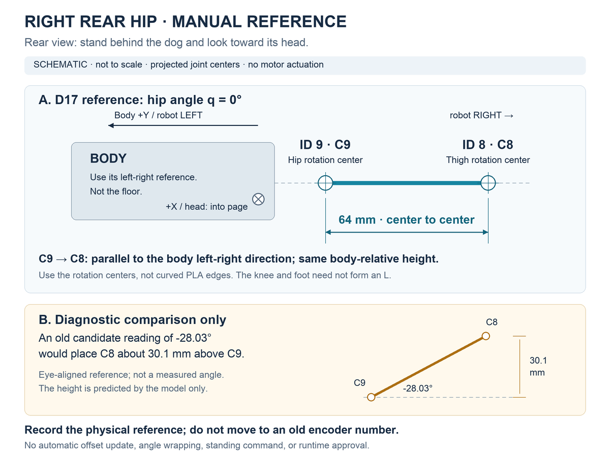

# 右後脚の付け根：基準位置を確認する

右後脚の付け根（CAN ID 9）だけを手で合わせ、原点候補との差を確認する手順です。全脚のL字校正を繰り返す必要はありません。自動駆動・原点書換えは行いません。



## 合わせる箇所

胴体を支持し、モーターが脱力している状態で行います。犬の後ろから顔の方向を見た図なので、**犬自身の右側は図の右側**です。

1. 胴体側の **ID 9の股関節回転中心 C9** と、その横にある **ID 8の上脚回転中心 C8** を確認します。曲面や段差のあるPLA外形の端を基準にしません。
2. **C9とC8を結ぶ線を、胴体の左右方向と平行にします。** 胴体に対して両中心が同じ高さになる姿勢です。床に対する水平とは区別します。胴体が傾いていれば、床に合わせると基準がずれます。
3. 2中心と胴体基準が分かる写真、または定規・直角定規による確認とともにID 9を読み取り保存します。膝や足先はL字に保つ必要がありません。接触や抵抗があれば無理に動かしません。
4. 少し離してから同じ基準に手で戻し、もう一度記録して再現性を比較します。同じ個体・同じ起動中の記録として扱います。

**以前保存したエンコーダー値へ脚を動かして合わせないでください。** 先に機械的な基準を決め、そのときの値を調べます。全脚の校正をやり直すかどうかは、この比較後に判断します。

## D17の基準と数値

学習用D17の `fabo_robotdog_d17_hardware_r1.urdf` では、右前・右後の股関節はどちらも回転軸 `+X`、原点の回転 `rpy="0 0 0"` です。違いは胴体上の前後位置だけで、後脚専用の28°の回転補正はありません。

| 定義 | 右前 FR | 右後 RR |
|---|---|---|
| 胴体から股関節までの位置（m） | `[0.155, -0.11, 0]` | `[-0.155, -0.11, 0]` |
| 股関節の回転軸 | `[1, 0, 0]` | `[1, 0, 0]` |
| 股関節の原点回転（rad） | `[0, 0, 0]` | `[0, 0, 0]` |
| 股関節から上脚回転中心まで（m） | `[0, -0.064, 0]` | `[0, -0.064, 0]` |

モデル座標は `+X` が顔側、`+Y` が犬自身の左、`+Z` が胴体上方向です。股関節角を `q` とすると、右側の2中心を結ぶベクトルは、胴体座標で次の形になります。

```text
C8 − C9 = [0, −64 cos(q), −64 sin(q)] mm
q = 0°       : [0, −64.00,  0.00] mm
q = −28.03°  : [0, −56.49, 30.08] mm
```

2026-09-22の目視水平記録は、旧校正候補で **−28.03484°** に相当しました。D17の形状に当てはめると上下差は約 **30.1mm** です。このため、回転中心と胴体基準を見れば、姿勢の違いを切り分けやすくなります。64mmはモデル上の軸間距離であり、現物寸法の測定完了を意味しません。

この差は2πの折返しではありません。±360°を加えると約+331.97°または−388.03°になり、基準には一致しません。また、図を見る前後を変えても、同じ高さという条件は変わりません。

## この確認で分かること・残ること

旧原点候補は、[手動校正コード](../runtime/singularitydog_hw/manual_calibration.py)が最初の目視L字を公称0°として保存した値です。外向きに動かした記録は符号判定に使われ、絶対角を測定した記録ではありません。今回の目視水平記録にも外部角度測定と写真はありません。

新しい機械基準が繰り返し同じ値になれば、ID 9に絞って旧基準の解釈・組付け・電源再投入前後の角度を調べられます。差が残っても、その場で原点を自動修正したり、±2π補正で範囲に押し込んだりしません。この図と確認記録は、荷重起立・学習済み方策の出力許可にはなりません。

出典：D17 URDF、SHA-256 `ba77462679268455d547848e76925dcc1f75a9b497fe4814c92ac1e7492496c8`。現物の回転中心・部品版との一致はこの確認で照合します。

図は[公開数値データ](../evidence/rr-hip-reference.json)から[描画スクリプト](../tools/render_rr_hip_reference.py)で生成した模式図です。写真・ロボットのメッシュは使用していません。角度は目視で合わせた記録を旧校正候補で換算した値であり、外部角度計による実測値ではありません。

## 同日13時台の確認結果

回転中心を指定して合わせ直した2記録は、平均差約0.039°で再現しました。旧候補との差に対応する約34.9°のソフト補正候補を保存し、実機へは未適用です。上図の−28.03°は、それ以前の最初の目視水平記録との比較例です。[2回の記録と補正候補](hardware-results-20260922.md#右後脚の基準位置を2回照合)を参照してください。
