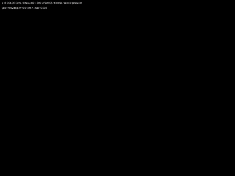
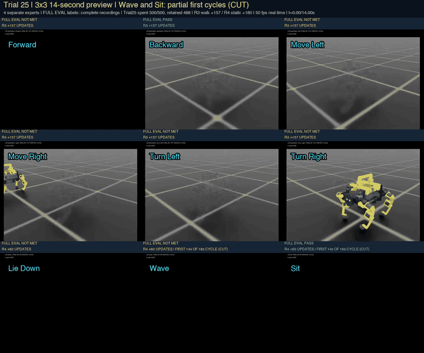
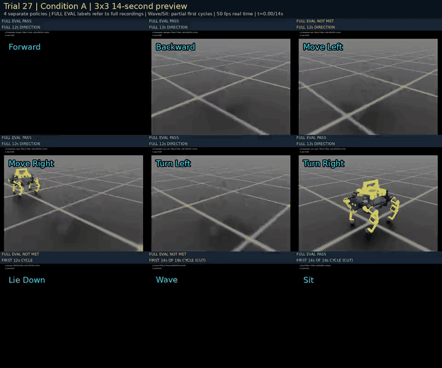
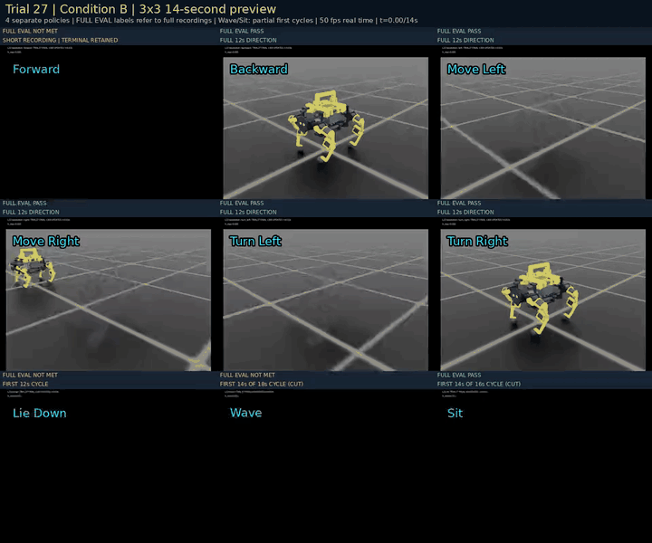

# 実際の録画で見る開発履歴

最初にユーザーが指定したCAD画像1点と録画5本を、既存プロジェクトの原本とSHAで照合して掲載しました。その後の結果動画を含め、現在は実録画・比較動画41本を公開しています。最新の評価は第30回ですが、第28〜30回の新動画の掲載はなく、最新の掲載動画は第27回A/Bの14秒比較です。CAD画像は1点、実測チャートの再描画MP4は別枠です。ファイル名だけで実験を推測していません。各項目のリンクから選択MP4とGIFプレビューを開けます。14秒比較は表示用の抜粋で、各欄の全評価時間とは区別します。[README](../README.md#映像でたどる開発履歴)では最初・よちよち歩き・第5・10・15・20・25回のダイジェストを表示します。

## 対応する段階と結果

| 指定ファイル | 対応する段階 | 結果・解釈 |
|---|---|---|
| `type00.png` | 既存のCAD外観画像 [CAD画像](media/cad-type00.png) | 設計イメージ。実機写真・歩行結果・最新学習モデルの証拠ではない |
| `joystick_v3_iter2197_left (1).mp4` / `joystick_v3_iter2197_left.mp4` | 旧形状の保存番号2197・左移動 [元MP4](media/archive-joystick2197-left.mp4) · [GIF](media/archive-joystick2197-left.gif) | 2つの名前は同一内容。当時の別評価では速度・姿勢の9条件を満たしたが、後の足別診断は15mm以上の完了足上げが全脚0回 |
| `dev250_left_iter0250.mp4` | 形状・接触表現を更新した別モデルの保存番号250 [元MP4](media/archive-dev250-left.mp4) · [GIF](media/archive-dev250-left.gif) | 同じ方策の別4環境・12秒診断で、左指令5cm/sに対して平均約0.16cm/s。全脚の完了足上げ0回 |
| `left.mp4` | B0・初期立位基準の左移動指令 [元MP4](media/baseline-left.mp4) · [GIF](media/baseline-left.gif) | 立位を維持するが、全脚の完了足上げ0回 |
| `preview (1).mp4` | 第4回H04・保存番号599の前進評価 [元MP4](media/h04-forward.mp4) · [GIF](media/h04-forward.gif) | 12秒完走。世界X速度平均約0.85cm/s、15mm足上げ4/4/4/1回。H03に対して速度は退行 |
| `four_directions_final249_12s_labeled.mp4` | 第5回L00・保存番号249の4方向評価 [元MP4](media/l00-four-directions.mp4) · [GIF](media/l00-four-directions.gif) | 方向成分平均は前10.37・後5.90・左4.89・右7.98cm/s。後脚不足・滑り・偏向が残る |

先頭の旧2本について、診断の数値は動画そのものと同一サンプルではありません。原動画と診断が同一チェックポイント・方策に対応することを記録から確認しています。短い動画の見た目だけで、実機への移行や歩行の合格を主張しません。画像・録画に映る製品や部品の権利を、本プロジェクトの独自成果とは扱いません。

## 日付と回数

旧2本の対応実験記録日は2026-09-08（日本時間）ですが、元動画ファイルの正確な撮影時刻は未確定です。B0の評価は9月8日、H04は9月9日。L00は9月9日に動画結果を確認しました。CAD画像の作成日はここでは確定していません。

これらは開発順を示す参考履歴で、モデル・指令・物理設定が異なります。旧2197・旧250を現在の直近30回へ混ぜず、H04・L00を二重に数えません。B0とCAD画像も改善回数へ加算しません。2197・250・599・249は保存番号で、改善ループ回数とは別です。全開発の通算回数は引き続き未確定です。

## 動画の扱い

最初に指定された5本の元MP4は指定ファイルと完全に同じバイト列です。その5本はいずれも50fpsで、長さは順に5.98秒、11.98秒、12秒、12秒、12秒です。短い2本を12秒に伸ばしたり、見栄えのよい区間だけを切り出したりしていません。

最初の5本のGIFは480×270へ縮小し、原則5フレームごとと最後の1フレームを表示します。元の時刻間隔を表示時間へ反映し、全体の長さを維持しています。補間・再生速度の変更・画像の切り抜き・動作の描き直しはありません。細かい足上げや接地は50fpsの元MP4と評価記録で確認してください。MP4リンクはGitHubのファイルページへ進み、Rawから元ファイルを開けます。

原本・変換後のSHA、元フレーム番号、表示時間は[個別メディア台帳](../evidence/recording-publication.json)、実験との対応は[履歴JSON](../evidence/video-history.json)にあります。接続先、認証情報、編集可能なCADやモデルファイルは同梱していません。[公開範囲](publication-scope.md)を参照してください。

## L05・第10回の結果動画

[元MP4・600フレーム・50fps・12秒](media/l05-four-directions.mp4)。ユーザーが今回の結果動画のGitHub掲載を追加指定しました。最終499方策の前後左右を、全区間・等速のまま並べています。動画冒頭の2秒の始動を含み、成功部分だけの編集はしていません。

前16.54・後6.23・左8.05・右6.54cm/sは各12秒の固定世界軸変位から算出。L00の元速度平均と同じ算出法では、L05は前16.57・後6.20・左8.01・右6.60cm/sです。モデルと指令条件が異なる履歴比較で、20cm/sや歩行品質の合格とはしません。後左脚の足上げ不足、後進の後脚の滑り、右移動の約49.7度の向きずれが残ります。L05は既存の第10回に対応し、動画掲載で第11回とは数えません。

## L06・第11回の結果動画

[元MP4](media/l06-four-directions.mp4) · [評価結果とL05比較](l06-evaluation.md)。ユーザーが今回の評価動画とGitHubコミットを指定したため追加しました。前16.99・後6.65・左7.06・右9.08cm/s、前進の後左15mm足上げ0回。第11回の結果で、動画追加自体は新しい改善ループに数えません。

## L07・第12回の再設計評価

[4方向の元MP4](media/l07-wide20-four-directions.mp4) · [前進の足幅比較](media/l07-forward-stance-comparison.mp4) · [接触停止を含む歩幅比較](media/l07-forward-stride-failures.mp4) · [結果と判断](l07-evaluation.md)

今回の評価後、ユーザーがGitHub掲載を指定した3本です。学習済み方策を固定した15ケースを第12回L07としてまとめ、追加学習は0更新。前進18.64cm/sは従来形状の20mm足幅案の結果です。後退・左の仮速度上限超過を映像にも表示し、全方向共通の制御には採用していません。新形状の成果へ流用しません。

3本とも600フレーム・50fps・12秒を保ち、停止後のパネルを明示します。今回のGIFは480×390で、元の時刻間隔と最終フレームを保つ縮小版です。CAD・モデル・第三者部品データは追加公開しません。

## L08・第13回の学習評価

[4方向MP4](media/l08-four-directions.mp4)・[全区間GIF](media/l08-four-directions.gif)・[前進の学習前後比較](media/l08-forward-progress.mp4)。500更新後、前進29.93cm/s。30cm/s未達と左移動48.74°の偏向を表示しています。2本を改善2回とは数えません。[条件と測定値](l08-evaluation.md)。

## L09・第14回の学習評価

[4方向MP4](media/l09-four-directions.mp4) · [第14回の元評価](l09-evaluation.md)。500更新後、前31.87・後10.59・左7.63・右9.23cm/s。前進の短区間基準達成に加え、後進・左の向きと左右速度の未達を表示しています。L08と比べた後進・左右の初期状態差も結果に残しました。

モンタージュは元600フレーム・50fps・12秒を保っています。上端に残っていた前回の回数表記を第14回へ訂正し、初期の黒画面・描画残像は残しました。GIFは全区間の時間を保つ縮小プレビューです。

## L10・第15回の学習評価と比較用L09

[最終6方向MP4](media/l10-six-directions.mp4) · [同じ初期化のL09比較4方向MP4](media/l10-matched-l09-four-directions.mp4) · [条件・測定値・未達](l10-evaluation.md)

最終6方向は前32.16・後10.67・左8.36・右11.65cm/s。左右旋回の向き変化は+106.78°/−148.29°、指令方向の平均角速度は0.155/0.216rad/sです。前進・後進・右移動の3/6ケースが全開発基準を満たしました。左速度と左右旋回の位置保持は未達で、最大位置ずれ28.3/19.2cmも表示しています。

比較動画は、第15回内でリセット時の初期状態をそろえ、元L09制御・方策を評価し直した4方向です。**上の第14回の元L09動画とは別の評価**で、元結果を置き換えません。前進の前左足滑りはこの比較用L09から4.74→14.03cmへ増加しています。

2本とも600フレーム・50fps・12秒。元10動画の全6,000フレームを時間順に使い、始動2秒と冒頭の黒画面・薄い残像も残しました。最初・中間・最後の静止画で表示を確認していますが、全フレームの人による目視検査ではありません。6方向GIFは全区間の時間を保つ縮小版です。

L09の1本とL10の2本を加え、既存12本から計15本になりました。実測チャートの再描画動画は、この実録画・比較動画の本数と区別します。公開や比較動画の追加を新しい改善回数には数えません。

## L11・第16回の学習評価と同条件の親L10

[最終6方向MP4](media/l11-six-directions.mp4) · [同条件の親L10比較6方向MP4](media/l11-matched-l10-six-directions.mp4) · [条件・測定値・未達](l11-evaluation.md)

前42.0179・後12.1189・左6.9422・右11.5098cm/s。指令44cm/sに対し、前進40cm/sと前進の全開発基準を達成しました。前進・後進・右の3/6ケースが全基準達成。左移動の向き+29.5511°、前右滑り17.9163cmと、速度の未達を残しています。左右旋回は指令方向平均0.214110/0.261625rad/s、最大位置ずれ41.4868/24.7780cmで位置保持が未達です。

比較用の親L10は、L11と同じ制御・指令・初期状態で撮り直した6方向です。前進は同じ44cm/s指令で35.7555→42.0179cm/s。**第15回当時の指令36cm/s・前進32.1595cm/sとは別の比較群**で、元のL10結果を置き換えません。学習・評価を含むジョブは09/09 22:36:26 JSTに終了し、回収と映像等の後処理は09/10に完了しました。

2本とも600フレーム・50fps・12秒。元12動画の7,200フレームと、公開する合成2動画の1,200フレームを全てデコードしました。合成動画の最初・中間・最後、計6枚の静止画で表示を確認しています。冒頭の黒画面・残像・元の撮影端での機体切れは除去していません。全フレームの人による目視検査ではありません。GIFは全区間の時間を保つ縮小プレビューです。

今回2本を追加し、実録画・比較動画は15本から17本になりました。再描画チャートは別の本数です。第16回の学習・評価を一組として数え、比較撮り直し・動画の追加・第17回の準備を新たな完了回数には加えません。

## L12・第17回の評価と同条件の親L11

[最終MP4](media/l12-six-directions.mp4) · [同条件L11親MP4](media/l12-matched-l11-six-directions.mp4) · [結果](l12-evaluation.md)

各600フレーム・50fps・12秒の比較枠です。前進原本は557フレーム・11.14秒で終了し、残り43フレームは「以後の映像なし」。終端原本画像は自動リセット後描画の可能性があり、失敗判定はリセット前記録を使っています。GIFは終端557・最初の黒558を含め元の時刻で表示します。第17回の公開時点では、追加2本で実録画・比較動画は19本、結果を整理した有限試行は17回でした。

## L13・第18回：歩行6方向の評価

[最終6方向MP4](media/l13-six-directions.mp4) · [第18回の結果・確認範囲](l13-evaluation.md)

1000更新後の最初の12秒を、600フレーム・50fpsで示します。前進40.2521・後進10.0692・左10.0871・右11.3432cm/s、左右旋回0.238681／0.229853rad/s。既存の開発基準は6/6が通過しました。始動の2秒、冒頭の黒画面と半透明描画を保持しています。

追加の下腿床離隔5mm目標は最小4.783386mmで一部未達です。左移動の前後漂流23.4425cm、後進の横漂流14.7335cm、学習後の実測姿勢によるnative CAD検査の未実施も結果に残しています。短い動画の完走を、PLA部品や回収用取手の実機強度の検証には使いません。

## L14・第19回：指定model500の伏せ・起立評価

[伏せ・起立MP4](media/l14-model500-prone-rise.mp4) · [第19回の結果・残課題](l14-evaluation.md)

元の1000更新計画はユーザー指示で途中終了し、指定されたiteration500＝**501更新後**のモデルを評価しました。停止直前の最後のログiteration613や、600更新時点の進捗集計とは別のモデルです。評価での追加学習は0回。

全1200フレーム・50fps・24秒を収録し、元画像の上側に日本語の指示phase説明を加えました。伏せ2秒と起立後の四足保持2秒をそれぞれ2回達成し、禁止接触・速度超過は0標本。向き+47.0648°、平面位置11.4919cm、負荷モデルh≈1が残課題です。方位・位置は登録合否に含まれておらず、hは実測温度ではありません。

冒頭の黒フレームと最後の自動リセット後の立位を保持し、動画内でも終端リセットを明記しています。保持成功は、終端描画ではなくリセット前の400Hz記録で判定しました。字幕付きMP4の1200フレームを全復号済みで、GIFは24秒の時刻を保つ縮小プレビューです。

L13とL14のMP4を1本ずつ追加した時点で、実録画・比較動画は19本から21本、直近系列は19回でした。CAD画像1点と再描画チャートは別枠です。GIF、動画の公開、同じ学習の途中モデル評価を追加ループには数えません。次節は、その後に実施した第20回の記録です。

## L15・第20回：500更新後のその場での伏せ・起立評価

[最終model499・24秒MP4](media/l15-model499-stationary-prone.mp4) · [全区間GIFプレビュー](media/l15-model499-stationary-prone.gif) · [第20回の条件・測定値・未達](l15-evaluation.md)

L14の指定モデルを起点に500更新を実施し、最終iteration499を評価しました。学習終了は09/10 20:34:19 JST、24秒評価の終了は20:47:09 JSTです。前回のmodel500＝501更新後とは別の保存モデルで、今回追加した更新数は500です。

全1200フレーム・50fps・24秒の評価録画です。伏せ2秒保持を2回達成した一方、第2起立は元の高さ条件を満たす連続区間が1.9375秒／必要2秒でした。全区間の最大方位ずれ21.4577°と最大平面位置ずれ6.9344cmは、それぞれ5°・5cm以内の目標を超えました。起立保持中の最大傾き7.9249°も5°以内に届かず、強化した起立高さ条件と合わせて**その場動作の基準は未達**です。

判定は終端の描画から推測せず、リセット前の400Hz記録9600標本を使いました。この24秒評価中の禁止接触・速度超過は0標本ですが、学習中には速度超過1標本がありました。駆動負荷hは約1で、実測温度ではありません。72秒評価は24秒の基準未達により明示的にスキップし、長時間の達成結果はありません。

L15のMP4を1本追加し、実録画・比較動画は22本、H01〜H04とL00〜L15の直近系列は20回になりました。第20回終了時点では、設計修正と次の学習を次回へ持ち越していました。最新の配色指定や実物搭載部の検討を、この評価済みモデルの形状・強度検証済みの成果とは扱いません。この時点ではジャンプ・後ろ足2本立ちは未学習でした。

READMEの映像ダイジェストは最初の掲載動画（旧形状・保存番号2197）、よちよち歩き（第4回H04）、第5・10・15・20回を表示します。よちよち歩きは既存H04の表示名で、実験回数へ追加しません。最初の動画は直近20回より前の参考記録です。各回の詳細と元動画はこの履歴に保持します。第20回のGIFは全24秒を480×360で縮小表示する241フレームのプレビューで、冒頭の黒画面と終端のリセット注意表示を残しています。動画やプレビューの公開を新しい実験回数へ加算しません。

## L16・第21回：機器配置を更新した伏せ・ジャンプ評価

[最終model499・元MP4](media/l16-model499-prone-jump.mp4) · [第21回の条件・測定値・未達](l16-evaluation.md)

中央バッテリー配置と取付部を更新したモデルで、500更新・4,096,000遷移の学習を実施し、最終iteration499を評価しました。学習は2026-09-10 22:38:34 JSTに完了。通常評価と同じモデル・生計測の配色評価を掲載しており、配色変更による追加学習は0回です。第19回のmodel500＝501更新後とは区別します。

第1周期の伏せ2秒保持と四足復帰2秒保持は達成しました。一方、四足復帰の追加目標である高さ誤差±15mmは未達。ジャンプの準備支持は成立しましたが、踏切・飛行の目標区間400標本で四足同時に0.5N以下となった標本も、四足同時に5mm以上離れた標本も0でした。合格する離床・着地は確認できず、**ジャンプと総合基準は未達**です。

40秒予定の評価は、第2周期の伏せへ降下中に右前脚の太ももで禁止接触を検出し、24.2秒で終了しました。禁止接触は3標本、最大28.48N。合力センサーから接触相手は判別できず、床との接触とは断定しません。2周期完遂と第2起立の改善は確認できていません。最大方位ずれ21.26°、最大平面位置ずれ10.59cmは、5°・5cm以内の目標を超えました。評価中の関節速度は最大9.219rad/s、10rad/s超過0ですが、学習探索中には超過25関節標本・最大11.100rad/sがありました。

掲載MP4は元動画と同一バイト列の1210フレーム・50fps・24.2秒です。未記録の残り15.8秒を補いません。冒頭の黒画面と、最終画像が自動リセット後の可能性を示す赤い注意表示を保持しています。判定はリセット前の計測に基づき、最後の立位描画を成功の証拠にしません。GIFは毎5フレームと最後の1209番（0始まり）を使う243枚、480×360、全24200msの等速プレビューです。補間、区間の切り抜き、成功場面だけの選択、速度変更はありません。

L16のMP4を1本追加し、実録画・比較動画は22本から23本、H01〜H04とL00〜L16の直近系列は21回になりました。GIF・配色評価・公開作業は追加ループに数えません。機体とタスクが異なるため、第20回からの単純な改善率は出しません。動画内の配色確認と、別工程のFusion最終色版CAD保存、実機でのPLA強度検証も区別します。

## L17・第22回：3条件各500更新の左前足による挨拶

[3条件の同期比較MP4](media/l17-greeting-comparison.mp4) · [小条件](media/l17-small-greeting.mp4) · [中条件](media/l17-medium-greeting.mp4) · [大条件](media/l17-large-greeting.mp4) · [測定値と課題](l17-evaluation.md)

同じL16親から小・中・大をそれぞれ500更新し、3本の最終model499を28秒ずつ評価しました。1本を1500更新した結果ではありません。各MP4は1400フレーム・50fps・28秒で、比較動画も同じ時刻で3条件を並べます。全処理は2026-09-11 09:00:03 JSTに終了しました。

| 条件 | 成立往復数／4 | 動作成立周期／2 | 四足復帰の連続保持 | 最大方位ずれ | 最大XYずれ | 総合 |
|---|---:|---:|---|---:|---:|---|
| 小 | 0 | 0 | 2.000／2.000秒 | 10.874° | 6.100cm | 未達 |
| 中 | 4 | 0 | 1.985／1.980秒 | 3.664° | 7.112cm | 未達 |
| 大 | 4 | 2 | 2.000／2.000秒 | 5.827° | 7.757cm | 未達 |

大条件は左前足を2往復振って四足へ戻る動作を2周期とも達成しました。ただし基準は全区間で方位5°以内・XY5cm以内で、最終位置が2.888cmへ戻っても途中の7.757cmを見落とせません。中条件の15ms／20msの復帰不足も2秒へ丸めません。3条件とも28秒完走、手振りの全8秒で左前足離床と残3足支持を満たし、評価中の禁止接触・速度超過は0でした。学習中の探索では禁止接触があり、評価の0と区別します。

大条件のseed42・43・44は400Hz生計測のバイト列が完全同一でした。同じ決定的条件の再現性を示しますが、初期姿勢・外乱などを変えた頑健性試験3例ではありません。終端の描画を復帰成功の根拠にはせず、保持はリセット前の400Hz計測で判定しています。

脚・取手は黄色、Body・底板・固定具・顔枠は黒、仮IMUは赤の評価映像です。物理形状と質量はL16から固定しており、新しいCAD完成・PLA強度検証・実機での成立を示すものではありません。今回は伏せとジャンプを実行していません。

この4本を追加した第22回終了時点では、実録画・比較動画は27本、直近系列は22回でした。3条件・比較動画・GIF・追加seed評価を別の実験回数に加算しません。続く第23・24回の記録を以下に示します。

## L18・第23回：前足を高く上げる挨拶

[最終model499・元MP4](media/l18-model499-high-wave.mp4) · [条件・実測値・未達](l18-evaluation.md)

L17大条件の行動平均を基に500更新し、18秒×2周期を評価しました。学習は09/11 10:24:26 JST、評価は10:28:31 JSTに完了。左前足の床離隔は最低153.2898mmで、手振りの全8秒にわたり150mm以上を保ち、4往復と四足復帰各2秒を達成しました。最大方位4.6227°は5°以内ですが、最大XY6.5507cmが5cmを超えて総合未達です。終端0.9136cmへ戻ったことだけで成功とは判定しません。

MP4は1800フレーム・50fps・36秒の原本と同一バイト列です。GIFは毎5フレームと最後を用いた361枚・480×360・全36000ms。全MP4/GIFフレームをデコードし、冒頭・途中・終端の選択画像を目視しました。黒い冒頭フレームと終端リセットの注意表示を保持し、補間・切り抜き・速度変更は行っていません。保持の判定はリセット前の400Hz記録に基づきます。

評価中の禁止接触・速度超過は0ですが、学習探索中には速度超過68関節標本と接触がありました。h最大0.6194は評価時の負荷モデル値で、実測温度ではありません。この1本で実録画・比較動画は28本、直近系列は23回です。

## L19・第24回：浅いお座りと四足立位への復帰

[最終model499・元MP4](media/l19-model499-sit.mp4) · [条件・実測値・合否](l19-evaluation.md)

前回の先頭81入力の行動平均を保持し、新しい座位の8入力列をゼロから開始して500更新しました。学習は09/11 11:34:17 JST、評価は11:38:02 JSTに完了。鼻上げ12.0883〜12.5752°と後腰低下56.7061〜60.9998mmを伴う浅いお座りで、水平な伏せや後ろ足だけの立位ではありません。座位と四足復帰を2周期実行し、全4保持窓の各3秒で条件を満たしました。最大方位1.5359°・最大XY3.3577cmで全登録基準を通過しています。

MP4は1600フレーム・50fps・32秒の原本と同一です。GIFは321枚・480×360・全32000msで全区間を保ちます。全フレームをデコードし、選択した時刻の画像を目視確認しました。自動リセット後かもしれない最後の立位描画を成功の根拠にせず、12800個のリセット前400Hz標本をローカルで同じ登録済みNumPy処理へ通し、206比較項目の一致を確認しました。独立した別アルゴリズムによる再判定ではありません。

評価中の禁止接触・速度超過は0、最大関節速度3.0301rad/s、最大出力1.9105Nm、負荷h最大0.0803です。学習中の接触終了、単一seed・平面32秒という範囲を残しています。実機、PLA強度、外乱に対する頑健性、9モーション全体の合格とは扱いません。

第24回終了時点で、実録画・比較動画は29本、直近系列は24回でした。GIF・検証・公開作業は別の完了試行へ加算しません。READMEの履歴ダイジェストは最初・よちよち歩き・第5・10・15・20回の6点を維持します。

## L20・第25回：9動作を3×3で同時表示

4独立方策の9動作を個別に評価しました。本学習の実行累計はR2の163＋R3歩行157＋R4の180＝500更新です。500更新の予算に到達しました。保存モデルに残った第25回の方策系列は計488更新分で、R2で実行した12更新は未保存です。登録した全基準の合格は2/9件、未達は7件。同じD16で評価した元の親+0更新は9/9件を受領し、そのうち合格3件。最終は2/9件が合格です。前進の最初の評価区間の速度は39.3468cm/sでした。

[9分割MP4・14秒・50fps](media/l20-nine-motions.mp4) · [判定・同D16親との比較](l20-evaluation.md)

| 位置 | 動作・原動画 | 実測録画時間 | 全登録基準 |
|---|---|---:|---|
| 1段目・1列目 | [前進](media/l20-forward.mp4) | 12.00秒 | 未達 |
| 1段目・2列目 | [後進](media/l20-backward.mp4) | 12.00秒 | PASS |
| 1段目・3列目 | [左移動](media/l20-left.mp4) | 12.00秒 | 未達 |
| 2段目・1列目 | [右移動](media/l20-right.mp4) | 12.00秒 | 未達 |
| 2段目・2列目 | [左旋回](media/l20-turn-left.mp4) | 12.00秒 | 未達 |
| 2段目・3列目 | [右旋回](media/l20-turn-right.mp4) | 12.00秒 | 未達 |
| 3段目・1列目 | [伏せ](media/l20-prone.mp4) | 24.00秒 | 未達 |
| 3段目・2列目 | [高い挨拶](media/l20-wave.mp4) | 36.00秒 | 未達 |
| 3段目・3列目 | [浅いお座り](media/l20-sit.mp4) | 32.00秒 | PASS |

個別9本と比較1本の計10本を追加し、実録画・比較動画は39本になりました。実測チャートの再描画MP4は別枠の1本です。3×3比較は14秒です。6方向移動は各12秒の全区間、伏せは最初の1周期12秒を等速で表示します。手振りは18秒周期、お座りは16秒周期の先頭14秒までで、両者の第1周期は最後まで表示しません。表示区間の終了後は、その区間の最後のフレームを元のカラーで静止表示し、終了時刻とSTILLを添えます。この静止表示は実動作や保持成功の時間へ数えません。各プレビュー画像内の左上、元の黒いcaption欄より下の背景へ、黒い縁取りの明るい水色で英語動作名を大きく重ねます。画面の合否と表の数値は、個別原動画の全評価区間（移動12秒、伏せ24秒、挨拶36秒、お座り32秒）に基づきます。上表は全原動画の時間とリンクを保持しています。4方策を同時実行した一つの機体や、同一エピソード内の連続切替を示す映像ではありません。各原動画の最初の黒いフレームや終了時の描画も残し、停止前の実測記録で判定しました。

## L21・第26回：数値結果の追加

500更新後の9動作評価は6/9件合格でした。今回、第26回の新規録画は掲載せず、[結果と出典SHA](l21-evaluation.md)を追加します。動画の有無で試行回数を増減しません。

## L22・第27回：独立A/Bの9動作比較

同じ親・seed42からA/B各500更新を実行し、各条件6/9件が全基準合格でした。1方策を1000更新した結果ではなく、A/Bの合格を合成した方策でもありません。[条件と測定値](l22-evaluation.md)。

[AのMP4](media/l22-a-nine-motions.mp4)

[BのMP4](media/l22-b-nine-motions.mp4)

各MP4は960×800・50fps・700フレーム・14秒です。全18原録画は生成時にSHA照合と全復号を確認し、選択した比較MP4は同一バイト列で掲載しました。GIFは720×600・141枚・14000msで、シアンの英語ラベルを保持します。

6方向は各12秒、伏せは第1周期12秒を表示し、短い欄は最後のカラー画像を静止表示します。B前進は速度超過で8.92秒終了し、その終端の空床画像とTERMINATED表記を残します。挨拶と座位は18秒／16秒周期の先頭14秒で途中までです。FULL EVALの合否は全評価（12／24／36／32秒、早期終了時はその実区間）に基づき、静止表示を動作保持時間には数えません。

この2本を掲載した時点で実録画・比較動画は41本、直近系列は27回でした。READMEの最初・よちよち歩き・第5・10・15・20回は維持します。元の実物写真・動画確認用の静止画・CAD・重みは追加公開しません。

## L23・第28回：500更新・7/9合格、動画は未掲載

A条件は2026-09-12 16:03:51 JSTに500新更新と9動作評価を完了しました。内訳は歩行150・伏せ250・挨拶100・お座り0更新で、お座りは既存の親を保持しています。歩行6方向とお座りの計7/9件が登録基準に合格し、伏せと挨拶は未達です。[第28回の結果](l23-evaluation.md)。B条件は開始に必要な残り7,200秒を確保できず未実行で、今回の実更新合計は500です。

保存先で原動画9本のSHAと動画メタデータを確認しましたが、手元への全長原動画の取得は0/9本です。14秒比較のCPU編集は起動したものの、完成・全復号・目視確認と取得は未完了です。第28回のMP4/GIFは今回掲載せず、上の第27回A/Bを第28回の映像として使いません。

第28回は同じD17を用い、形状・物性・STLを変更していません。4つの独立方策の9評価であり、単一方策の連続切替や実機成功を示しません。第28回終了時点の直近系列は28回で、公開する実録画・比較動画は41本でした。その時点では次の学習は未開始でした。

## L24・第29回／L25・第30回：数値評価を追加、動画は未掲載

第29・30回はそれぞれA/B/Cの独立3条件を各500更新、各回計1500新更新として完了しました。各条件とも歩行6方向とお座りの7/9件が合格し、伏せと高い挨拶は未達です。[第29回の結果](l24-evaluation.md)・[第30回の結果](l25-evaluation.md)。

第30回の伏せはB/Cで2回とも連続2秒保持と四足復帰を達成しましたが、Cの最大XY57.52mm・方位ずれ21.38°が残りました。挨拶は足先150mm以上・4往復・四足復帰を維持し、最大XYはCで63.02mmでした。動画は別途回収・検査を進めており、今回の公開にはMP4/GIFを追加しません。数値の全評価区間と14秒の表示用ダイジェストは別です。

直近系列は30回、公開する実録画・比較動画は41本、READMEのダイジェストは最初・よちよち歩き・第5・10・15・20・25回の7項目を維持します。第31回の学習は未開始です。
