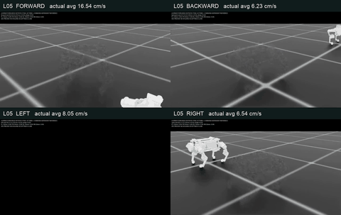
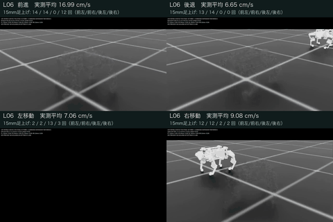
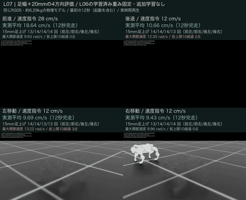
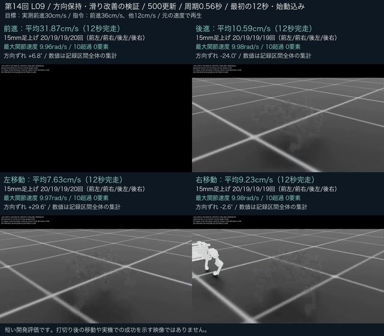
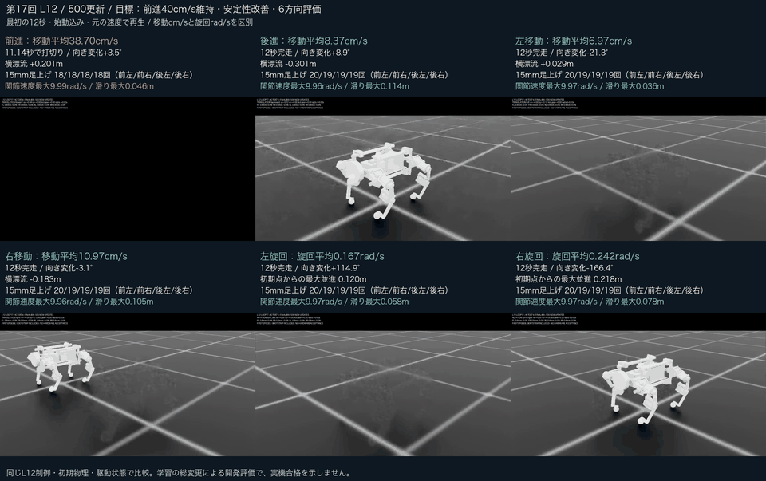
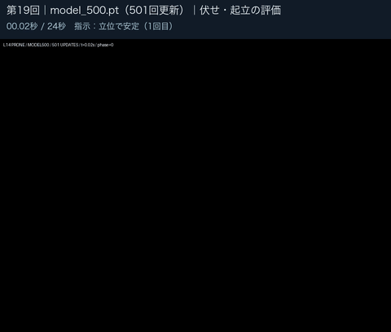

# 実際の録画で見る開発履歴

最初にユーザーが指定したCAD画像1点と録画5本を、既存プロジェクトの原本とSHAで照合して掲載しました。その後の結果動画を含め、現在は実録画・比較動画22本を公開しています。CAD画像は1点、実測チャートの再描画MP4は別枠です。ファイル名だけで実験を推測していません。各項目のリンクから元MP4と全区間のGIFプレビューを開けます。[README](../README.md#映像でたどる開発履歴)では最初の動画と5回おきのダイジェストを表示します。

## 対応する段階と結果

| 指定ファイル | 対応する段階 | 結果・解釈 |
|---|---|---|
| `type00.png` | 既存のCAD外観画像 [CAD画像](media/cad-type00.png) | 設計イメージ。実機写真・歩行結果・最新学習モデルの証拠ではない |
| `joystick_v3_iter2197_left (1).mp4` / `joystick_v3_iter2197_left.mp4` | 旧形状の保存番号2197・左移動 [元MP4](media/archive-joystick2197-left.mp4) · [GIF](media/archive-joystick2197-left.gif) | 2つの名前は同一内容。当時の別評価では速度・姿勢の9条件を満たしたが、後の足別診断は15mm以上の完了足上げが全脚0回 |
| `dev250_left_iter0250.mp4` | 形状・接触表現を更新した別モデルの保存番号250 [元MP4](media/archive-dev250-left.mp4) · [GIF](media/archive-dev250-left.gif) | 同じ方策の別4環境・12秒診断で、左指令5cm/sに対して平均約0.16cm/s。全脚の完了足上げ0回 |
| `left.mp4` | B0・初期立位基準の左移動指令 [元MP4](media/baseline-left.mp4) · [GIF](media/baseline-left.gif) | 立位を維持するが、全脚の完了足上げ0回 |
| `preview (1).mp4` | 第4回H04・保存番号599の前進評価 [元MP4](media/h04-forward.mp4) · [GIF](media/h04-forward.gif) | 12秒完走。世界X速度平均約0.85cm/s、15mm足上げ4/4/4/1回。H03に対して速度は退行 |
| `four_directions_final249_12s_labeled.mp4` | 第5回L00・保存番号249の4方向評価 [元MP4](media/l00-four-directions.mp4) · [GIF](media/l00-four-directions.gif) | 方向成分平均は前10.37・後5.90・左4.89・右7.98cm/s。後脚不足・滑り・偏向が残る |

先頭の旧2本について、診断の数値は動画そのものと同一サンプルではありません。原動画と診断が同一チェックポイント・方策に対応することを記録から確認しています。短い動画の見た目だけで、実機への移行や歩行の合格を主張しません。画像・録画に映る製品や部品の権利を、本プロジェクトの独自成果とは扱いません。

## 日付と回数

旧2本の対応実験記録日は2026-09-08（日本時間）ですが、元動画ファイルの正確な撮影時刻は未確定です。B0の評価は9月8日、H04は9月9日。L00は9月9日に動画結果を確認しました。CAD画像の作成日はここでは確定していません。

これらは開発順を示す参考履歴で、モデル・指令・物理設定が異なります。旧2197・旧250を現在の直近20回へ混ぜず、H04・L00を二重に数えません。B0とCAD画像も改善回数へ加算しません。2197・250・599・249は保存番号で、改善ループ回数とは別です。全開発の通算回数は引き続き未確定です。

## 動画の扱い

最初に指定された5本の元MP4は指定ファイルと完全に同じバイト列です。その5本はいずれも50fpsで、長さは順に5.98秒、11.98秒、12秒、12秒、12秒です。短い2本を12秒に伸ばしたり、見栄えのよい区間だけを切り出したりしていません。

最初の5本のGIFは480×270へ縮小し、原則5フレームごとと最後の1フレームを表示します。元の時刻間隔を表示時間へ反映し、全体の長さを維持しています。補間・再生速度の変更・画像の切り抜き・動作の描き直しはありません。細かい足上げや接地は50fpsの元MP4と評価記録で確認してください。MP4リンクはGitHubのファイルページへ進み、Rawから元ファイルを開けます。

原本・変換後のSHA、元フレーム番号、表示時間は[個別メディア台帳](../evidence/recording-publication.json)、実験との対応は[履歴JSON](../evidence/video-history.json)にあります。接続先、認証情報、編集可能なCADやモデルファイルは同梱していません。[公開範囲](publication-scope.md)を参照してください。

## L05・第10回の結果動画

[元MP4・600フレーム・50fps・12秒](media/l05-four-directions.mp4)。ユーザーが今回の結果動画のGitHub掲載を追加指定しました。最終499方策の前後左右を、全区間・等速のまま並べています。動画冒頭の2秒の始動を含み、成功部分だけの編集はしていません。

前16.54・後6.23・左8.05・右6.54cm/sは各12秒の固定世界軸変位から算出。L00の元速度平均と同じ算出法では、L05は前16.57・後6.20・左8.01・右6.60cm/sです。モデルと指令条件が異なる履歴比較で、20cm/sや歩行品質の合格とはしません。後左脚の足上げ不足、後進の後脚の滑り、右移動の約49.7度の向きずれが残ります。L05は既存の第10回に対応し、動画掲載で第11回とは数えません。

## L06・第11回の結果動画

[元MP4](media/l06-four-directions.mp4) · [評価結果とL05比較](l06-evaluation.md)。ユーザーが今回の評価動画とGitHubコミットを指定したため追加しました。前16.99・後6.65・左7.06・右9.08cm/s、前進の後左15mm足上げ0回。第11回の結果で、動画追加自体は新しい改善ループに数えません。

## L07・第12回の再設計評価

[4方向の元MP4](media/l07-wide20-four-directions.mp4) · [前進の足幅比較](media/l07-forward-stance-comparison.mp4) · [接触停止を含む歩幅比較](media/l07-forward-stride-failures.mp4) · [結果と判断](l07-evaluation.md)

今回の評価後、ユーザーがGitHub掲載を指定した3本です。学習済み方策を固定した15ケースを第12回L07としてまとめ、追加学習は0更新。前進18.64cm/sは従来形状の20mm足幅案の結果です。後退・左の仮速度上限超過を映像にも表示し、全方向共通の制御には採用していません。新形状の成果へ流用しません。

3本とも600フレーム・50fps・12秒を保ち、停止後のパネルを明示します。今回のGIFは480×390で、元の時刻間隔と最終フレームを保つ縮小版です。CAD・モデル・第三者部品データは追加公開しません。

## L08・第13回の学習評価

[4方向MP4](media/l08-four-directions.mp4)・[全区間GIF](media/l08-four-directions.gif)・[前進の学習前後比較](media/l08-forward-progress.mp4)。500更新後、前進29.93cm/s。30cm/s未達と左移動48.74°の偏向を表示しています。2本を改善2回とは数えません。[条件と測定値](l08-evaluation.md)。

## L09・第14回の学習評価

[4方向MP4](media/l09-four-directions.mp4) · [第14回の元評価](l09-evaluation.md)。500更新後、前31.87・後10.59・左7.63・右9.23cm/s。前進の短区間基準達成に加え、後進・左の向きと左右速度の未達を表示しています。L08と比べた後進・左右の初期状態差も結果に残しました。

モンタージュは元600フレーム・50fps・12秒を保っています。上端に残っていた前回の回数表記を第14回へ訂正し、初期の黒画面・描画残像は残しました。GIFは全区間の時間を保つ縮小プレビューです。

## L10・第15回の学習評価と比較用L09

[最終6方向MP4](media/l10-six-directions.mp4) · [同じ初期化のL09比較4方向MP4](media/l10-matched-l09-four-directions.mp4) · [条件・測定値・未達](l10-evaluation.md)

最終6方向は前32.16・後10.67・左8.36・右11.65cm/s。左右旋回の向き変化は+106.78°/−148.29°、指令方向の平均角速度は0.155/0.216rad/sです。前進・後進・右移動の3/6ケースが全開発基準を満たしました。左速度と左右旋回の位置保持は未達で、最大位置ずれ28.3/19.2cmも表示しています。

比較動画は、第15回内でリセット時の初期状態をそろえ、元L09制御・方策を評価し直した4方向です。**上の第14回の元L09動画とは別の評価**で、元結果を置き換えません。前進の前左足滑りはこの比較用L09から4.74→14.03cmへ増加しています。

2本とも600フレーム・50fps・12秒。元10動画の全6,000フレームを時間順に使い、始動2秒と冒頭の黒画面・薄い残像も残しました。最初・中間・最後の静止画で表示を確認していますが、全フレームの人による目視検査ではありません。6方向GIFは全区間の時間を保つ縮小版です。

L09の1本とL10の2本を加え、既存12本から計15本になりました。実測チャートの再描画動画は、この実録画・比較動画の本数と区別します。公開や比較動画の追加を新しい改善回数には数えません。

## L11・第16回の学習評価と同条件の親L10

[最終6方向MP4](media/l11-six-directions.mp4) · [同条件の親L10比較6方向MP4](media/l11-matched-l10-six-directions.mp4) · [条件・測定値・未達](l11-evaluation.md)

前42.0179・後12.1189・左6.9422・右11.5098cm/s。指令44cm/sに対し、前進40cm/sと前進の全開発基準を達成しました。前進・後進・右の3/6ケースが全基準達成。左移動の向き+29.5511°、前右滑り17.9163cmと、速度の未達を残しています。左右旋回は指令方向平均0.214110/0.261625rad/s、最大位置ずれ41.4868/24.7780cmで位置保持が未達です。

比較用の親L10は、L11と同じ制御・指令・初期状態で撮り直した6方向です。前進は同じ44cm/s指令で35.7555→42.0179cm/s。**第15回当時の指令36cm/s・前進32.1595cm/sとは別の比較群**で、元のL10結果を置き換えません。学習・評価を含むジョブは09/09 22:36:26 JSTに終了し、回収と映像等の後処理は09/10に完了しました。

2本とも600フレーム・50fps・12秒。元12動画の7,200フレームと、公開する合成2動画の1,200フレームを全てデコードしました。合成動画の最初・中間・最後、計6枚の静止画で表示を確認しています。冒頭の黒画面・残像・元の撮影端での機体切れは除去していません。全フレームの人による目視検査ではありません。GIFは全区間の時間を保つ縮小プレビューです。

今回2本を追加し、実録画・比較動画は15本から17本になりました。再描画チャートは別の本数です。第16回の学習・評価を一組として数え、比較撮り直し・動画の追加・第17回の準備を新たな完了回数には加えません。

## L12・第17回の評価と同条件の親L11

[最終MP4](media/l12-six-directions.mp4) · [同条件L11親MP4](media/l12-matched-l11-six-directions.mp4) · [結果](l12-evaluation.md)

各600フレーム・50fps・12秒の比較枠です。前進原本は557フレーム・11.14秒で終了し、残り43フレームは「以後の映像なし」。終端原本画像は自動リセット後描画の可能性があり、失敗判定はリセット前記録を使っています。GIFは終端557・最初の黒558を含め元の時刻で表示します。第17回の公開時点では、追加2本で実録画・比較動画は19本、結果を整理した有限試行は17回でした。

## L13・第18回：歩行6方向の評価

[最終6方向MP4](media/l13-six-directions.mp4) · [第18回の結果・確認範囲](l13-evaluation.md)

1000更新後の最初の12秒を、600フレーム・50fpsで示します。前進40.2521・後進10.0692・左10.0871・右11.3432cm/s、左右旋回0.238681／0.229853rad/s。既存の開発基準は6/6が通過しました。始動の2秒、冒頭の黒画面と半透明描画を保持しています。

追加の下腿床離隔5mm目標は最小4.783386mmで一部未達です。左移動の前後漂流23.4425cm、後進の横漂流14.7335cm、学習後の実測姿勢によるnative CAD検査の未実施も結果に残しています。短い動画の完走を、PLA部品や回収用取手の実機強度の検証には使いません。

## L14・第19回：指定model500の伏せ・起立評価

[伏せ・起立MP4](media/l14-model500-prone-rise.mp4) · [第19回の結果・残課題](l14-evaluation.md)

元の1000更新計画はユーザー指示で途中終了し、指定されたiteration500＝**501更新後**のモデルを評価しました。停止直前の最後のログiteration613や、600更新時点の進捗集計とは別のモデルです。評価での追加学習は0回。

全1200フレーム・50fps・24秒を収録し、元画像の上側に日本語の指示phase説明を加えました。伏せ2秒と起立後の四足保持2秒をそれぞれ2回達成し、禁止接触・速度超過は0標本。向き+47.0648°、平面位置11.4919cm、負荷モデルh≈1が残課題です。方位・位置は登録合否に含まれておらず、hは実測温度ではありません。

冒頭の黒フレームと最後の自動リセット後の立位を保持し、動画内でも終端リセットを明記しています。保持成功は、終端描画ではなくリセット前の400Hz記録で判定しました。字幕付きMP4の1200フレームを全復号済みで、GIFは24秒の時刻を保つ縮小プレビューです。

L13とL14のMP4を1本ずつ追加した時点で、実録画・比較動画は19本から21本、直近系列は19回でした。CAD画像1点と再描画チャートは別枠です。GIF、動画の公開、同じ学習の途中モデル評価を追加ループには数えません。次節は、その後に実施した第20回の記録です。

## L15・第20回：500更新後のその場での伏せ・起立評価

[最終model499・24秒MP4](media/l15-model499-stationary-prone.mp4) · [全区間GIFプレビュー](media/l15-model499-stationary-prone.gif) · [第20回の条件・測定値・未達](l15-evaluation.md)

L14の指定モデルを起点に500更新を実施し、最終iteration499を評価しました。学習終了は09/10 20:34:19 JST、24秒評価の終了は20:47:09 JSTです。前回のmodel500＝501更新後とは別の保存モデルで、今回追加した更新数は500です。

全1200フレーム・50fps・24秒の評価録画です。伏せ2秒保持を2回達成した一方、第2起立は元の高さ条件を満たす連続区間が1.9375秒／必要2秒でした。全区間の最大方位ずれ21.4577°と最大平面位置ずれ6.9344cmは、それぞれ5°・5cm以内の目標を超えました。起立保持中の最大傾き7.9249°も5°以内に届かず、強化した起立高さ条件と合わせて**その場動作の基準は未達**です。

判定は終端の描画から推測せず、リセット前の400Hz記録9600標本を使いました。この24秒評価中の禁止接触・速度超過は0標本ですが、学習中には速度超過1標本がありました。駆動負荷hは約1で、実測温度ではありません。72秒評価は24秒の基準未達により明示的にスキップし、長時間の達成結果はありません。

L15のMP4を1本追加し、実録画・比較動画は22本、H01〜H04とL00〜L15の直近系列は20回になりました。設計修正と次の学習は次回へ持ち越します。最新の配色指定や実物搭載部の検討を、この評価済みモデルの形状・強度検証済みの成果とは扱いません。ジャンプ・後ろ足2本立ちは未学習です。

READMEの映像ダイジェストは最初の掲載動画（旧形状・保存番号2197）と、第5・10・15・20回を表示します。最初の動画は直近20回より前の参考記録です。各回の詳細と元動画はこの履歴に保持します。第20回のGIFは全24秒を480×360で縮小表示する241フレームのプレビューで、冒頭の黒画面と終端のリセット注意表示を残しています。動画やプレビューの公開を新しい実験回数へ加算しません。
